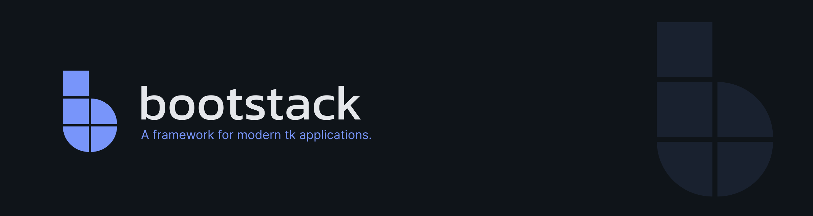

[](https://pepy.tech/project/bootstack)
[](https://pepy.tech/project/bootstack)


**bootstack** is a full UI framework for building desktop applications with Python and Tkinter.

It's a **framework**, not just themed widgets. bootstack provides conventions for layout, styling, state, and reactivity that work together—so you can focus on building applications instead of wrestling with low-level UI mechanics.

> **v2 is under active development.**
> See the [documentation](https://bootstack.readthedocs.io) for guides, API reference, and migration info.

## Installation

```bash
pip install bootstack
```

## Quick Start

```python
import bootstack as bs

app = bs.App(theme="dark")

bs.Label(app, text="Hello from bootstack!").pack(pady=10)
bs.Button(app, text="Primary", accent="primary").pack(pady=5)
bs.Button(app, text="Success", accent="success").pack(pady=5)
bs.Button(app, text="Danger Outline", accent="danger", variant="outline").pack(pady=5)

app.mainloop()
```

## Core Ideas

### Containers express layout intent

Build layouts with purpose-built containers, not scattered geometry calls:

```python
form = bs.GridFrame(app, columns=["auto", 1], gap=(12, 6), padding=12)
form.pack(fill="both", expand=True)

form.add(bs.Label(form, text="Name"))
form.add(bs.Entry(form))
form.add(bs.Label(form, text="Email"))
form.add(bs.Entry(form))
form.add(bs.Button(form, text="Submit", accent="primary"), columnspan=2)
```

### Styling is semantic

Widgets use semantic tokens — not hardcoded colors. Applications stay consistent across themes.

```python
bs.Button(app, text="Primary", accent="primary")
bs.Button(app, text="Outline", accent="success", variant="outline")
bs.Label(app, text="Heading", font="heading-lg")
```

### Reactivity is optional and explicit

Use simple callbacks when that's enough. Introduce signals when state needs to flow.

```python
counter = bs.Signal(0)

def increment():
    counter.set(counter.get() + 1)

label = bs.Label(app)
counter.subscribe(lambda v: label.configure(text=f"Count: {v}"))
```

## Features

- **Modern UI Defaults** — Consistent colors, typography, spacing, and theme variants
- **60+ Widgets** — Buttons, dialogs, forms, tables, navigation, and more
- **Layout Containers** — PackFrame and GridFrame for declarative, maintainable layouts
- **Reactive Signals** — Observable state management for declarative applications
- **Design Tokens** — Semantic colors and typography that adapt across themes
- **DataSource System** — Pagination, filtering, sorting, and CRUD for data-driven widgets
- **Built-in Validation** — Form validation without reinventing the wheel
- **Icons & Images** — First-class icon handling and image utilities
- **Localization** — i18n support for global applications
- **CLI Tools** — Project scaffolding, building, and packaging

## CLI

Scaffold new projects and add components quickly:

```bash
bootstack start MyApp          # Create new project
bootstack add view dashboard   # Add a view
bootstack add dialog settings  # Add a dialog
bootstack build                # Package for distribution
```

## Widget Categories

| Category | Widgets |
|----------|---------|
| **Actions** | Button, DropdownButton, MenuButton, ContextMenu, ButtonGroup |
| **Inputs** | TextEntry, PasswordEntry, PathEntry, NumericEntry, Scale, DateEntry, TimeEntry |
| **Selection** | CheckButton, RadioButton, ToggleGroup, OptionMenu, SelectBox, Calendar |
| **Data Display** | Label, ListView, TreeView, TableView, Badge, Progressbar, Meter, FloodGauge |
| **Layout** | Frame, PackFrame, GridFrame, LabelFrame, PanedWindow, ScrollView |
| **Navigation** | Notebook, PageStack |
| **Dialogs** | MessageDialog, ColorChooser, FontDialog, DateDialog, FormDialog, QueryDialog |
| **Overlays** | Toast, Tooltip |
| **Forms** | Form, Field with validation support |

## Why bootstack?

bootstack is for developers who want to:

- Build desktop apps that feel modern and intentional
- Move fast without reinventing UI patterns
- Maintain visual consistency across applications
- Apply reactive and declarative patterns in Tk
- Ship polished tools to end users

You don't need to deeply understand Tk or ttk internals to be productive with bootstack.

## Links

- **Documentation**: https://bootstack.readthedocs.io
- **GitHub**: https://github.com/israel-dryer/bootstack
- **Icons**: https://github.com/israel-dryer/ttkbootstrap-icons

## Support

This project is proudly developed with the support of the
<a href="https://www.jetbrains.com/pycharm/" target="_blank" rel="noopener">PyCharm IDE</a>, generously provided by JetBrains.

<a href="https://www.jetbrains.com/" target="_blank" rel="noopener"> <picture> <source media="(prefers-color-scheme: light)" srcset="https://github.com/user-attachments/assets/f6d4e79d-97f4-4368-a944-affd423aa922">  </picture> </a>

<sub> © 2025 JetBrains s.r.o. JetBrains and the JetBrains logo are registered trademarks of JetBrains s.r.o. </sub>
