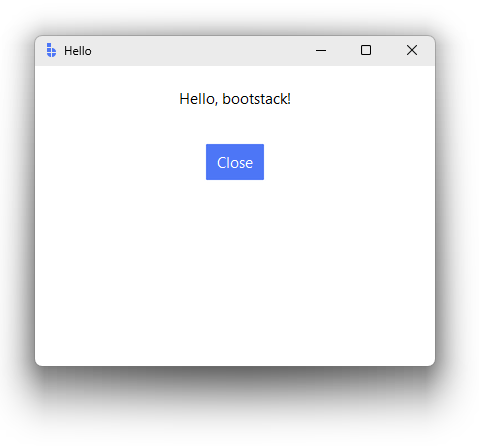
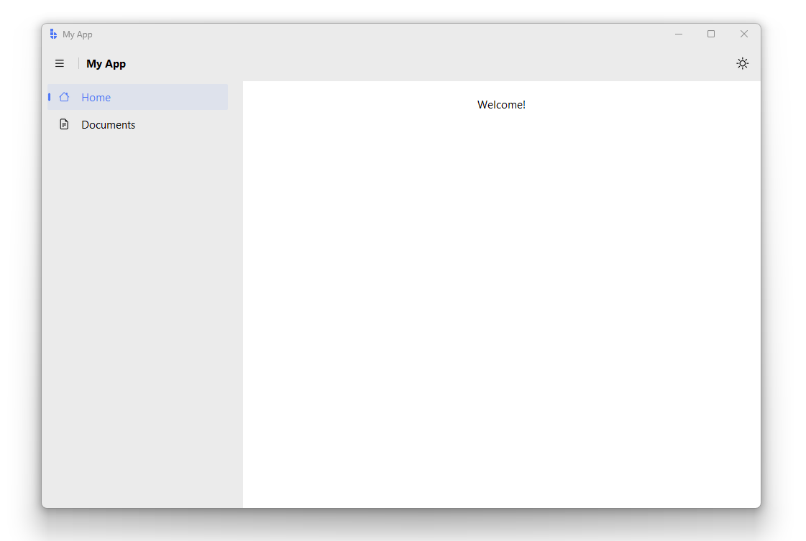
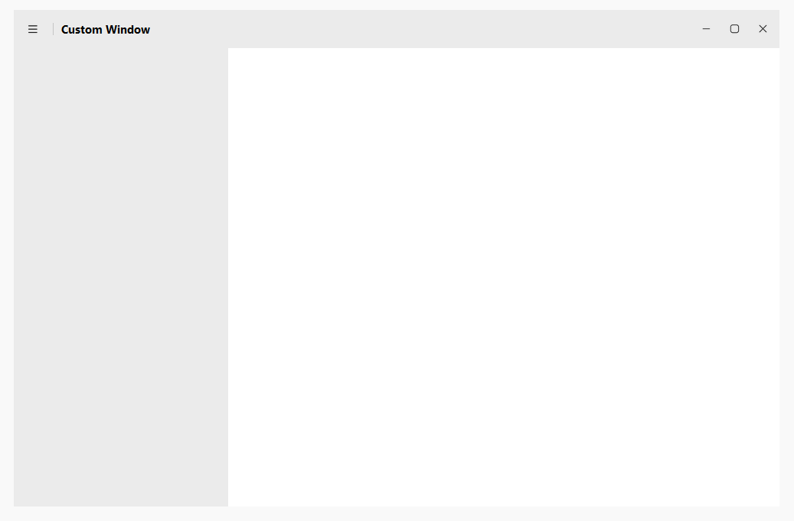

# App Structure

This guide explains how a bootstack application is organized—the `App` class, windows, layout, state, and lifecycle.

Use `bootstack start MyApp` to scaffold a new project with the recommended structure.

---

## The App Class

Every bootstack application starts with either `App` or `AppShell`:

- **`App`** — a blank window. You build the layout from scratch.
- **`AppShell`** — an `App` with a toolbar, sidebar navigation, and page stack already wired together.

```python
import bootstack as bs

# Option A: blank window
app = bs.App(title="My Application")

# Option B: window with built-in navigation
app = bs.AppShell(title="My Application", size=(1000, 650))
```

Both create the main window, initialize theming, set up the application context, and manage the event loop. You typically create one per process. Additional windows use `Toplevel`.

---

## Minimal Application

A complete, runnable application:

```python
import bootstack as bs

app = bs.App(title="Hello", size=(400, 300))

bs.Label(app, text="Hello, bootstack!").pack(padx=20, pady=20)
bs.Button(app, text="Close", command=app.destroy).pack(pady=10)

app.mainloop()
```

This demonstrates the core pattern:

1. Create the App
2. Add widgets to it
3. Run the event loop



---

## AppShell: Navigation Built In

Most desktop applications follow the same layout: toolbar at the top, sidebar on the left, page content on the right. `AppShell` gives you that in one call:

```python
import bootstack as bs

shell = bs.AppShell(title="My App", size=(1000, 650))

# Each add_page() creates a nav item and returns a Frame for content
home = shell.add_page("home", text="Home", icon="house")
bs.Label(home, text="Welcome!").pack(padx=20, pady=20)

# Add as many pages as you need
docs = shell.add_page("docs", text="Documents", icon="file-earmark-text")
bs.Label(docs, text="Your documents.").pack(padx=20, pady=20)

# Add toolbar buttons (they appear on the right side)
shell.toolbar.add_button(icon="sun", command=bs.toggle_theme)

shell.mainloop()
```



`AppShell` extends `App`, so everything that works on `App` works on `AppShell` too.

### Frameless window

Set `frameless=True` to remove OS window chrome and get a fully custom window. The toolbar automatically gains minimize/maximize/close buttons and becomes draggable:

```python
shell = bs.AppShell(
    title="Custom Window",
    size=(1000, 650),
    frameless=True,
)
```



### When to use App vs AppShell

| | `App` | `AppShell` |
|---|---|---|
| Layout | You build everything | Toolbar + sidebar + pages included |
| Best for | Custom layouts, simple tools, dialogs | Navigation-based apps |
| Navigation | Manual (wire your own) | Automatic (add_page wires nav to pages) |

---

## Application Options

Common `App` parameters:

```python
app = bs.App(
    title="My App",           # Window title
    theme="amber-light",      # Theme name
    size=(800, 600),          # Initial size (width, height)
    resizable=(True, True),   # Allow resize (width, height)
    alpha=1.0,                # Window transparency
)
```

!!! link "Themes"
    See [Design System → Custom Themes](../design-system/custom-themes.md) for available themes and customization.

---

## Project Structure

`bootstack start` generates one of two layouts depending on the template you
choose. The **basic** template (default) produces a single-view `App`:

```
myapp/                       # bootstack start MyApp
├── src/myapp/
│   ├── __init__.py
│   ├── main.py              # App entry point
│   └── views/
│       ├── __init__.py
│       └── main_view.py
├── assets/                  # Images, icons
├── bootstack.toml                # Project configuration
└── README.md
```

The **appshell** template produces an `AppShell` with sidebar navigation
and one file per page:

```
myapp/                       # bootstack start MyApp --template appshell
├── src/myapp/
│   ├── __init__.py
│   ├── main.py
│   └── pages/
│       ├── __init__.py
│       ├── home_page.py
│       └── settings_page.py
├── assets/
├── bootstack.toml
└── README.md
```

The chosen template is recorded in `bootstack.toml` as `[app].template`, so
`bootstack add view` and `bootstack add page` know which scaffold is appropriate for
the project.

As your project grows:

```
myapp/
├── src/myapp/
│   ├── __init__.py
│   ├── main.py
│   ├── settings.py      # AppSettings / defaults
│   ├── state.py         # Signals and shared state
│   ├── views/
│   │   ├── main_view.py
│   │   └── settings_view.py
│   └── services/        # IO, data, persistence
├── assets/
├── locales/             # Translation files
└── bootstack.toml
```

Use `bootstack start MyApp` to scaffold a new project with this structure.

!!! link "Project Structure"
    See [Tooling → Project Structure](../tooling/project-structure.md) for detailed guidance on file organization, packaging, and PyInstaller.

---

## Layout Hierarchy

bootstack applications follow a **container hierarchy**:

```
App (blank window)
└── PackFrame (main layout)
    ├── Frame (toolbar area)
    │   └── Button, Button, ...
    ├── PackFrame (content area)
    │   └── widgets...
    └── Frame (status bar)
        └── Label
```

With `AppShell`, the top-level structure is built for you:

```
AppShell (window)
├── Toolbar
│   └── hamburger, title, spacer, [your buttons]
└── Frame (body)
    ├── SideNav
    │   └── SideNavItem, SideNavGroup, ...
    └── PageStack
        ├── Frame (page "home")
        ├── Frame (page "docs")
        └── ...
```

Key principles:

- **Containers own layout** — each container manages its children
- **Widgets don't position themselves** — their parent decides placement
- **Nesting creates structure** — compose complex layouts from simple containers

!!! link "Layout Guide"
    See [Layout](layout.md) for details on Frame, PackFrame, and GridFrame.

---

## Application Settings

bootstack applications are configured through a centralized settings object
that defines application-wide behavior, rather than scattered flags and globals.

Configuration typically includes:

- theme and appearance
- localization settings
- default behaviors
- framework-level options

This configuration is applied at application startup and remains accessible
throughout the app lifecycle.

!!! link "See [App Settings](app-settings.md) for how settings are declared and applied using `AppSettings`."

---

## State Management

bootstack encourages **signals** for state that multiple widgets share:

```python
import bootstack as bs

app = bs.App()

# Shared state
username = bs.Signal("")

# Input updates the signal
entry = bs.TextEntry(app, signal=username)
entry.pack(padx=20, pady=10)

# Label reacts to the signal
label = bs.Label(app, textvariable=username)
label.pack(padx=20, pady=10)

app.mainloop()
```

When the entry changes, the label updates automatically. Neither widget knows about the other—they both connect to the signal.

For larger applications, group related signals in a `state.py` module:

```python
# src/myapp/state.py
import bootstack as bs

current_user = bs.Signal("")
is_logged_in = bs.Signal(False)
selected_item = bs.Signal(None)
```

!!! link "Reactivity Guide"
    See [Reactivity](reactivity.md) for signals, callbacks, and events.

---

## Window Lifecycle

The `App` lifecycle:

1. **Creation** — `App()` creates the window and initializes theming
2. **Building** — you add widgets and configure layout
3. **Running** — `mainloop()` processes events until the window closes
4. **Cleanup** — the window is destroyed

For additional windows:

```python
def open_settings():
    settings = bs.Toplevel(app, title="Settings")

    bs.Label(settings, text="Settings go here").pack(padx=20, pady=20)
    bs.Button(settings, text="Close", command=settings.destroy).pack(pady=10)

bs.Button(app, text="Settings", command=open_settings).pack(pady=10)
```

`Toplevel` creates a secondary window that:

- shares the event loop with `App`
- can be modal or non-modal
- is destroyed independently

---

## Theme Switching

`toggle_theme()` switches the app between its registered light and dark theme variants. By default it toggles between `docs-light` and `docs-dark`:

```python
import bootstack as bs

app = bs.App(title="Theme Toggle")

bs.Button(app, text="Toggle Theme", command=bs.toggle_theme).pack(pady=20)

app.mainloop()
```

To use a different theme pair, set `light_theme` and `dark_theme` in the app settings. The `"light"` and `"dark"` aliases used elsewhere (e.g. `theme="dark"`) resolve to whichever themes are registered here:

```python
app = bs.App(
    title="Theme Toggle",
    settings={
        "theme": "dark",          # starts on dark variant
        "light_theme": "ocean-light",
        "dark_theme": "ocean-dark",
    },
)
```

All widgets update automatically when the theme changes.

---

## Localization Setup

For internationalized applications:

```python
import bootstack as bs

app = bs.App(
    title="My App",
    locale="es",  # Spanish locale
)

# Widgets use message keys
bs.Label(app, text="greeting.hello").pack()  # Resolved from catalog
```

!!! link "Localization Guide"
    See [Localization](localization.md) for message catalogs and runtime language switching.

---

## Putting It Together

A structured application example:

```python
import bootstack as bs

# State
counter = bs.Signal(0)

def increment():
    counter.set(counter.get() + 1)

# App
app = bs.App(title="Counter", size=(300, 200))

# Layout
main = bs.PackFrame(app, direction="vertical", gap=10, padding=20)
main.pack(fill="both", expand=True)

# Display
display = bs.Label(main, font="display-xl[48]")
counter.subscribe(lambda v: display.configure(text=str(v)))
display.pack()

# Controls
controls = bs.PackFrame(main, direction="horizontal", gap=10)
controls.pack()

bs.Button(controls, text="+1", command=increment).pack()
bs.Button(controls, text="Reset", command=lambda: counter.set(0)).pack()

app.mainloop()
```

This demonstrates:

- Signal-based state
- PackFrame for layout
- Reactive label updates
- Clean separation of concerns

For navigation-based applications, `AppShell` replaces the manual layout wiring:

```python
import bootstack as bs

shell = bs.AppShell(title="My App", size=(900, 600))

# State
counter = bs.Signal(0)

# Pages
home = shell.add_page("home", text="Home", icon="house")
display = bs.Label(home, font="display-xl[48]")
counter.subscribe(lambda v: display.configure(text=str(v)))
display.pack(padx=20, pady=20)

controls = bs.PackFrame(home, direction="horizontal", gap=10)
controls.pack()
bs.Button(controls, text="+1", command=lambda: counter.set(counter.get() + 1)).pack()
bs.Button(controls, text="Reset", command=lambda: counter.set(0)).pack()

about = shell.add_page("about", text="About", icon="info-circle")
bs.Label(about, text="Counter App v1.0").pack(padx=20, pady=20)

shell.mainloop()
```

---

## Next Steps

- [Layout](layout.md) — building layouts with containers
- [Navigation](navigation.md) — tabs, stacks, and sidebar patterns
- [Reactivity](reactivity.md) — signals, callbacks, and events
- [Project Structure](../tooling/project-structure.md) — file organization and packaging
- [CLI](../tooling/cli.md) — scaffolding and build tools
