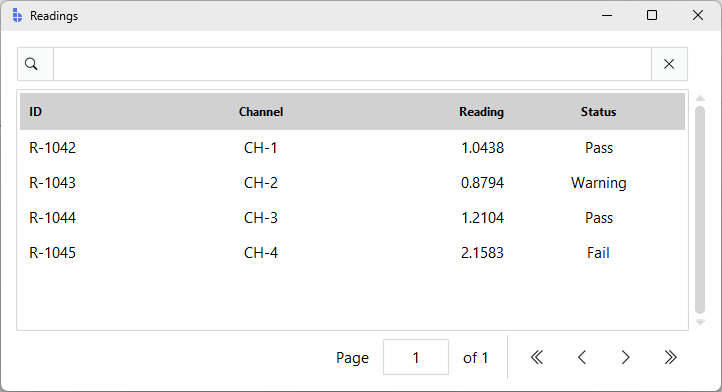
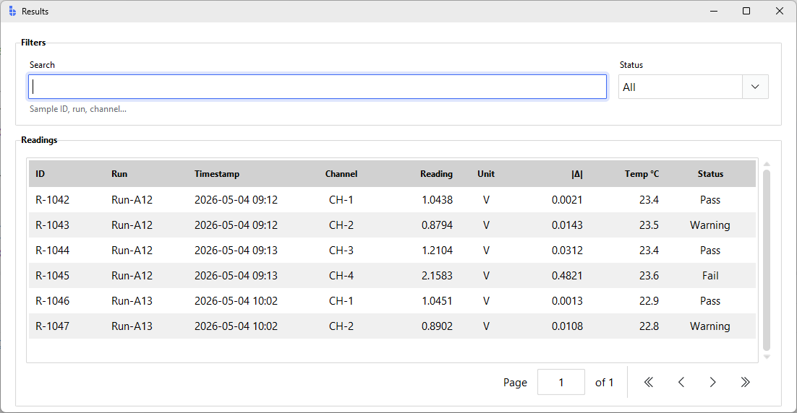

---
title: Data Tables
---

# Data Tables

`bs.TableView` is bootstack's high-density tabular widget. It pairs a built-in
toolbar (search, export), a sortable header, paginated rows, and an optional
status footer with a SQLite-backed datasource that handles filtering, sorting,
and pagination behind the scenes.

This guide shows how to wire data into a TableView, control what users can do
with it, and shape the values that appear in cells. The companion
[DataSource](datasource.md) guide covers the data layer itself; this guide is
about the widget.

---

## Quick start

The simplest way to populate a TableView is with `columns` + `rows`. TableView
creates an in-memory SQLite datasource for you.

```python
import bootstack as bs

app = bs.App(title="Readings", minsize=(720, 360))

bs.TableView(
    app,
    columns=[
        {"text": "ID",      "width": 90},
        {"text": "Channel", "width": 90,  "anchor": "center"},
        {"text": "Reading", "width": 100, "anchor": "e"},
        {"text": "Status",  "width": 100, "anchor": "center"},
    ],
    rows=[
        ("R-1042", "CH-1", "1.0438", "Pass"),
        ("R-1043", "CH-2", "0.8794", "Warning"),
        ("R-1044", "CH-3", "1.2104", "Pass"),
        ("R-1045", "CH-4", "2.1583", "Fail"),
    ],
    page_size=25,
).pack(fill="both", expand=True, padx=12, pady=12)

app.mainloop()
```

<div class="app-window">
    
</div>

Out of the box you get: clickable column headers (sort), a search box, a header
context menu (filter/group/hide), pagination buttons, and a status footer.

---

## Columns

`columns=` accepts a list of strings or a list of dicts. Strings give you a
column name and nothing else; dicts let you control width, alignment, and how
the column maps onto the underlying record key.

```python
bs.TableView(
    parent,
    columns=[
        {"text": "ID",        "key": "id",        "width": 90},
        {"text": "Run",       "key": "run",       "width": 110},
        {"text": "Timestamp", "key": "ts",        "width": 160},
        {"text": "Channel",   "key": "channel",   "width": 80,  "anchor": "center"},
        {"text": "Reading",   "key": "reading",   "width": 100, "anchor": "e"},
        {"text": "Δ",         "key": "delta",     "width": 90,  "anchor": "e"},
        {"text": "Status",    "key": "status",    "width": 110, "anchor": "center", "stretch": True},
    ],
    rows=records,
)
```

| Key | Purpose |
|-----|---------|
| `text` | Heading shown in the column header |
| `key` | Field name in the underlying record (defaults to `text`) |
| `width` | Initial pixel width |
| `anchor` / `align` | Text alignment: `"w"`, `"center"`, `"e"` |
| `stretch` | Whether the column expands when the table is resized |
| `dtype` | Storage hint (`"INTEGER"`, `"REAL"`, `"TEXT"`); affects default alignment |

If you omit the `dtype`, TableView samples the first page and right-aligns
columns whose values parse as numbers. Override with `anchor` when needed.

!!! tip "Provide explicit `key` values when headers aren't plain identifiers"
    When `key` is omitted, the column `text` is used as the SQLite column name.
    This is fine for simple headers like `"Channel"` or `"Status"`, but causes
    a silent empty-table failure for headers containing spaces or special
    characters — `"Temp °C"` and `"|Δ|"` are examples. It also matters when
    you pass filter SQL via `set_filters()`: the key is the name you use in
    the WHERE clause, so an explicit key keeps that predictable.

    Use short alphanumeric keys: `"run_id"`, `"channel"`, `"temp"`.

### Tuple rows vs dict rows

When `rows` is a list of tuples, the position-to-column mapping comes from the
order of `columns`. When `rows` is a list of dicts, each column's `key` selects
the field. Dict rows are easier to keep in sync as schemas grow:

```python
records = [
    {"id": "R-1042", "channel": "CH-1", "reading": 1.0438, "status": "Pass"},
    {"id": "R-1043", "channel": "CH-2", "reading": 0.8794, "status": "Warning"},
]

bs.TableView(parent, columns=columns, rows=records)
```

---

## Wiring to a DataSource

For anything beyond a quick demo, build the datasource yourself and pass it as
`datasource=`. TableView is specifically backed by `SqliteDataSource` —
in-memory for a working buffer, or pointed at a file for persistence.

```python
from bootstack.datasource import SqliteDataSource

ds = SqliteDataSource(":memory:", page_size=50)
ds.set_data(records)

tv = bs.TableView(
    parent,
    columns=columns,
    datasource=ds,
    page_size=50,
)
```

Other DataSource implementations (`MemoryDataSource`, `FileDataSource`) don't
plug into TableView directly — they expect different storage. To use a CSV file
with TableView, load it via `FileDataSource` and hand the records to TableView:

```python
from bootstack.datasource import FileDataSource

loader = FileDataSource("readings.csv", page_size=10_000)
loader.load()
all_records = loader.get_page_from_index(0, loader.total_count())

bs.TableView(parent, columns=columns, rows=all_records)
```

For richer record shapes (lists, hierarchical data) use [ListView](../widgets/data-display/listview.md)
or [TreeView](../widgets/data-display/treeview.md) instead — both accept any
`DataSourceProtocol` implementation.

### Refreshing data

Call `set_data(rows)` to replace the contents of the table. The current page
resets to 0 and any active filter/sort is preserved:

```python
def reload():
    fresh = fetch_records_from_api()
    tv.set_data(fresh)

bs.Button(parent, text="Refresh", icon="arrow-clockwise", command=reload).pack()
```

---

## Selection

`selection_mode` controls how rows can be selected:

- `"none"` — disabled (table is read-only display)
- `"single"` — one row at a time (default)
- `"multi"` — multiple rows; clicking with Ctrl/Shift extends the selection

Read the current selection via `selected_rows`:

```python
tv = bs.TableView(
    parent,
    columns=columns,
    rows=records,
    selection_mode="multi",
    allow_select_all=True,
)

def show_selection(_evt):
    rows = tv.selected_rows  # list[dict] of full records
    print(f"{len(rows)} selected")

tv.on_selection_changed(show_selection)
```

Other selection helpers:

- `tv.select_rows([iid, ...])` — select rows by internal id
- `tv.deselect_all()` — clear the selection
- `tv.select_all()` / `tv.deselect_all()` — bulk operations
- `tv.scroll_to_row(iid)` — bring a row into view

The `iid` strings come from event payloads (`event.data["iid"]`) — opaque
handles for the lifetime of the current page.

---

## Sorting and filtering

Column headers are clickable: a click toggles ascending/descending sort on that
column. The active sort indicator appears in the header. Right-clicking a
header opens a context menu with **Filter**, **Group by**, **Hide column**, and
related actions; right-clicking a row offers **Filter by this value** as a
shortcut.

Programmatic control:

```python
tv.set_sorting("reading", ascending=False)
tv.clear_sorting()

tv.set_filters("status = 'Fail' OR delta > 0.1")
tv.clear_filters()

tv.set_grouping("channel")
tv.clear_grouping()
```

The filter syntax is the same SQL-like dialect used everywhere in the
DataSource layer — see [DataSource → Filtering](datasource.md#filtering) for
the operator reference.

The built-in search box (top-left of the toolbar) runs a substring match
across all columns. Switch to advanced mode for explicit comparators:

```python
bs.TableView(
    parent,
    columns=columns,
    rows=records,
    enable_search=True,
    search_mode="advanced",   # adds an EQUALS / CONTAINS / SQL selector
    search_trigger="enter",   # or "input" for live search
)
```

To suppress the toolbar entirely, pass `enable_search=False` and
`enable_filtering=False`. The header and row context menus also disappear when
you set `context_menus="none"`.

---

## Pagination

TableView paginates by default. Use `page_size` to control how many rows
appear per page; the footer shows page navigation buttons and a row count.

```python
tv = bs.TableView(
    parent,
    columns=columns,
    rows=records,
    page_size=25,
    show_table_status=True,    # row counts and filter/sort status
    show_vscrollbar=True,
)

# Programmatic navigation
tv.first_page()
tv.next_page()
tv.previous_page()
tv.last_page()
tv.go_to_page(3)
```

For very large datasets, virtual paging skips the page footer and scrolls
continuously, fetching pages on demand:

```python
tv = bs.TableView(
    parent,
    columns=columns,
    datasource=large_sqlite_source,
    paging_mode="virtual",
    page_size=200,             # rows per fetch, not per page
    show_vscrollbar=True,
)
```

To hide pagination UI on small datasets — as the demo app's Results page does
because all 16 rows fit on one screen — combine `show_table_status=False` with
a `page_size` larger than the dataset:

```python
bs.TableView(
    parent,
    columns=columns,
    rows=results,
    show_table_status=False,
    page_size=len(results),
)
```

---

## Formatting cell values

Unlike input widgets, **TableView does not have a `value_format=` parameter on
columns.** Cells display whatever string representation the underlying values
have. To control how numbers and dates appear, format them when you build the
records:

```python
from datetime import datetime
from babel.numbers import format_decimal
from babel.dates import format_datetime

def format_record(raw):
    return {
        "id": raw["id"],
        "channel": raw["channel"],
        "reading": format_decimal(raw["reading"], format="0.0000"),
        "delta":   format_decimal(raw["delta"],   format="+0.0000;-0.0000"),
        "ts":      format_datetime(raw["ts"], "yyyy-MM-dd HH:mm"),
        "status":  raw["status"],
    }

records = [format_record(r) for r in raw_results]
bs.TableView(parent, columns=columns, rows=records)
```

The patterns are the same ones the [Formatting](formatting.md) guide documents
for input widgets — just applied to the data instead of the widget. Centralize
the formatter so the same record shape feeds the table, an export, and any
inline edit form.

### Status indication

TableView renders cells as plain text — there is no per-cell renderer hook for
inline badges. Three patterns work in practice:

1. **Decorate the status string** with a unicode glyph or short label that
   carries enough meaning on its own:
   ```python
   STATUS_TEXT = {"Pass": "✓ Pass", "Warning": "⚠ Warning", "Fail": "✗ Fail"}
   record["status"] = STATUS_TEXT[record["status"]]
   ```
2. **Show the count, not the row.** When users only need to know *how many*
   are failing, render a status banner above the table and keep the cells
   plain. See the demo app's Results footer (`{n} records`) for the pattern.
3. **Drop to `bs.TreeView`** when you genuinely need per-row coloring.
   TreeView's `tag_configure` lets you map status values to background colors
   — it lacks TableView's toolbar and pagination, but it scales well for
   small dashboards. See [TreeView](../widgets/data-display/treeview.md) and
   [Color & Theming](color-and-theming.md) for the available tokens.

---

## Editing and exporting

Pass `enable_adding`, `enable_editing`, and `enable_deleting` to surface a
toolbar add button, double-click-to-edit on rows, and a row-context-menu
delete. Edits open an automatically-generated `bs.FormDialog` whose fields are
inferred from the column definitions:

```python
tv = bs.TableView(
    parent,
    columns=columns,
    rows=records,
    enable_adding=True,
    enable_editing=True,
    enable_deleting=True,
    selection_mode="multi",
)

tv.on_row_inserted(lambda e: print("inserted:", e.data["records"]))
tv.on_row_updated (lambda e: print("updated:",  e.data["records"]))
tv.on_row_deleted (lambda e: print("deleted:",  e.data["records"]))
```

Export adds a download icon to the toolbar:

```python
bs.TableView(
    parent,
    columns=columns,
    rows=records,
    enable_exporting=True,
    export_scope="all",            # or "page" for just the current page
    export_formats=("csv", "json"),
    allow_export_selection=True,   # menu entry for "Export selection"
)
```

---

## Worked example: results browser

This mirrors the **Results** page in the Data Analysis Workbench demo
(`docs_scripts/demo_app.py`). It renders cross-run readings with a filter
toolbar above and an export footer below.

```python
import bootstack as bs
from bootstack.constants import BOTH, LEFT, RIGHT, X, YES, N

RESULTS = [
    ("R-1042", "Run-A12", "2026-05-04 09:12", "CH-1", "1.0438", "V", "0.0021", "23.4", "Pass"),
    ("R-1043", "Run-A12", "2026-05-04 09:12", "CH-2", "0.8794", "V", "0.0143", "23.5", "Warning"),
    ("R-1044", "Run-A12", "2026-05-04 09:13", "CH-3", "1.2104", "V", "0.0312", "23.4", "Pass"),
    ("R-1045", "Run-A12", "2026-05-04 09:13", "CH-4", "2.1583", "V", "0.4821", "23.6", "Fail"),
    ("R-1046", "Run-A13", "2026-05-04 10:02", "CH-1", "1.0451", "V", "0.0013", "22.9", "Pass"),
    ("R-1047", "Run-A13", "2026-05-04 10:02", "CH-2", "0.8902", "V", "0.0108", "22.8", "Warning"),
]

COLUMNS = [
    {"text": "ID",        "key": "run_id",  "width": 90},
    {"text": "Run",       "key": "run",     "width": 100},
    {"text": "Timestamp", "key": "ts",      "width": 150},
    {"text": "Channel",   "key": "channel", "width": 80,  "anchor": "center"},
    {"text": "Reading",   "key": "reading", "width": 100, "anchor": "e"},
    {"text": "Unit",      "key": "unit",    "width": 60,  "anchor": "center"},
    {"text": "|Δ|",       "key": "delta",   "width": 90,  "anchor": "e"},
    {"text": "Temp °C",   "key": "temp",    "width": 90,  "anchor": "e"},
    {"text": "Status",    "key": "status",  "width": 110, "anchor": "center", "stretch": True},
]

app = bs.App(title="Results", minsize=(1100, 540))

# --- Filter toolbar ---------------------------------------------------------
filters = bs.LabelFrame(app, text="Filters", padding=12)
filters.pack(fill=X, padx=20, pady=(20, 12))

fbar = bs.PackFrame(filters, direction="horizontal", gap=8, anchor_items=N)
fbar.pack(fill=X)

search = bs.TextEntry(fbar, label="Search", message="Sample ID, run, channel…")
search.pack(fill=X, expand=YES)

status = bs.SelectBox(
    fbar, label="Status",
    items=["All", "Pass", "Warning", "Fail"], value="All",
)
status.pack()

# --- Table ------------------------------------------------------------------
table_frame = bs.LabelFrame(app, text="Readings", padding=10)
table_frame.pack(fill=BOTH, expand=YES, padx=20, pady=(0, 8))

tv = bs.TableView(
    table_frame,
    columns=COLUMNS,
    rows=RESULTS,
    striped=True,
    enable_filtering=False,    # use external filter toolbar instead
    enable_search=False,
    show_table_status=False,
    page_size=len(RESULTS),
)
tv.pack(fill=BOTH, expand=YES)

# --- Apply external filters --------------------------------------------------
def apply_filters(_evt=None):
    clauses = []
    if (q := search.get().strip()):
        q = q.replace("'", "''")
        clauses.append(
            f"(run_id LIKE '%{q}%' OR run LIKE '%{q}%' OR channel LIKE '%{q}%')"
        )
    if (s := status.get()) and s != "All":
        clauses.append(f"status = '{s}'")
    tv.set_filters(" AND ".join(clauses) if clauses else "")

search.on_input(apply_filters)
status.bind("<<Change>>", apply_filters, add=True)

# --- Footer -----------------------------------------------------------------
footer = bs.Frame(app)
footer.pack(fill=X, padx=20, pady=(0, 20))
bs.Label(
    footer, text=f"{len(RESULTS)} records", font="body", accent="secondary",
).pack(side=LEFT)
bs.Button(
    footer, text="Export", icon="download", accent="secondary",
    variant="outline", command=lambda: None,
).pack(side=RIGHT)

app.mainloop()
```

<div class="app-window">
    
</div>

Two things worth noting in this example:

- The TableView's built-in toolbar is suppressed (`enable_search=False`,
  `enable_filtering=False`, `show_table_status=False`) because the page
  presents an external filter toolbar that styles the controls more richly.
  Filters are then applied via `tv.set_filters(where_sql)`.
- Filter values are escaped with `q.replace("'", "''")` before being
  interpolated into the SQL. The DataSource layer accepts a `where` string,
  not parameterised queries — sanitize anything that comes from the user.

---

## Common pitfalls

- **Headers with spaces or special characters need an explicit `key`.** When
  `key` is omitted, the column `text` is used as the SQLite column name.
  Headers like `"Temp °C"` or `"|Δ|"` produce invalid SQL identifiers and
  cause a silent empty-table failure. Use a plain alphanumeric `key` for any
  column whose header isn't a simple word.
- **`datasource=` requires `SqliteDataSource`.** The widget reads SQLite
  metadata for column-type inference, so `MemoryDataSource` and
  `FileDataSource` don't plug in directly. Use `rows=` for one-shot data, or
  preload via FileDataSource and hand the records to TableView.
- **No per-cell renderer.** Columns don't accept a `formatter=` callback or
  a `value_format=` token like input widgets do. Format your records before
  loading; see [Formatting](formatting.md) for the patterns.
- **Filter strings are SQL.** They run against the underlying SQLite WHERE
  clause. A user-supplied filter must be escaped; the safer path is to build
  the clause programmatically from validated form fields rather than
  concatenating raw input.
- **`reading > 1.0` may not match text-stored numbers.** SQLite stores values
  using the type SQLite inferred from the first row. If a column's first
  value was a string, comparisons coerce inconsistently. Set
  `dtype="REAL"` or `dtype="INTEGER"` on the column to force numeric storage.
- **Hidden toolbar still gets keyboard events.** When `enable_search=False`,
  Ctrl+F has no target. Bind your own search shortcut to the external entry
  if you suppress the toolbar.

---

## Related

- [DataSource](datasource.md) — filter syntax, sorting, custom backends
- [Formatting](formatting.md) — number, date, and time format patterns
- [TableView](../widgets/data-display/tableview.md) — full parameter reference
- [TreeView](../widgets/data-display/treeview.md) — hierarchical data and
  per-row tag coloring
- [ListView](../widgets/data-display/listview.md) — virtual scrolling for
  list-shaped (non-tabular) data
- [Color & Theming](color-and-theming.md) — accent and surface tokens for
  status indication
