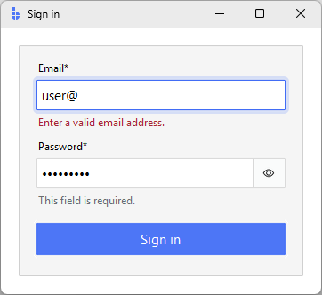
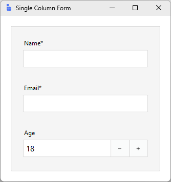
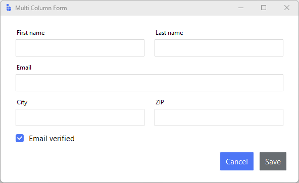
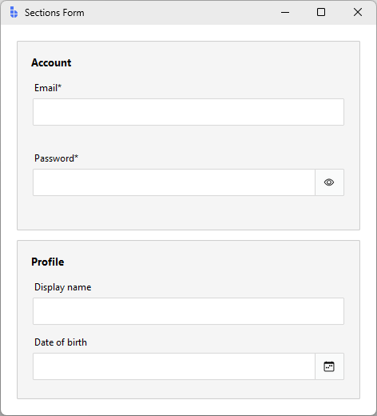
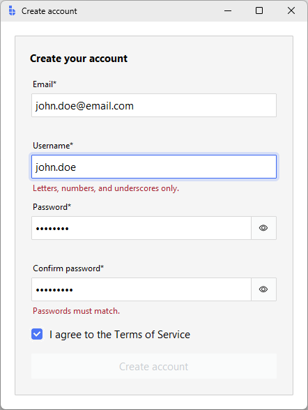

---
title: Forms & Input
---

# Forms & Input

This guide shows how to assemble input widgets into working forms — picking
the right widget for each field, wiring values, laying things out, validating,
and handling submit.

It builds on the [Validation](validation.md) and [Reactivity](reactivity.md)
guides; cross-link rather than re-read.

---

## Quick start

A two-field login form:

```python
import bootstack as bs

app = bs.App(title="Sign in", minsize=(360, 220))
form = bs.Card(app)
form.pack(fill="both", expand=True, padx=20, pady=20)

email = bs.TextEntry(form, label="Email", required=True)
email.add_validation_rule("email", message="Enter a valid email address.")
email.pack(fill="x")

password = bs.PasswordEntry(form, label="Password", required=True)
password.pack(fill="x", pady=(8, 12))

def submit():
    if email.validation(email.value, "manual") and password.value:
        print("signing in:", email.value)

bs.Button(form, text="Sign in", accent="primary", command=submit)\
    .pack(fill="x")

app.mainloop()
```

<div class="app-window">
    
</div>

The interesting bits:

- `required=True` adds the asterisk *and* the `required` rule.
- The email field validates on every keystroke; the password is only checked
  for emptiness on submit.
- `submit()` re-runs validation manually so the user sees errors even if they
  click submit without typing.

---

## Picking the right input

Most fields fit one of these patterns. Match the data shape to the widget
before reaching for the kitchen sink.

| Data shape                          | Use this                                    |
|-------------------------------------|---------------------------------------------|
| Free-form text (name, email, query) | `bs.TextEntry`                              |
| Secret (password, PIN)              | `bs.PasswordEntry`                          |
| Number with bounds and parsing      | `bs.NumericEntry`                           |
| Number adjusted by feel             | `bs.Scale` / `bs.LabeledScale`              |
| Number with prominent steppers      | `bs.SpinnerEntry`                           |
| Calendar date                       | `bs.DateEntry`                              |
| Time of day                         | `bs.TimeEntry`                              |
| Filesystem path                     | `bs.PathEntry`                              |
| Multi-line text                     | `bs.ScrolledText`                           |
| One value from a list (long)        | `bs.SelectBox` (`enable_search=True`)       |
| One value from a list (short menu)  | `bs.OptionMenu`                             |
| One value from visible options      | `bs.RadioGroup`                             |
| Independent on/off options          | `bs.CheckButton`                            |
| Single binary setting               | `bs.Switch`                                 |
| Connected option set (segmented)    | `bs.ToggleGroup`                            |

Each entry-style widget (`TextEntry`, `NumericEntry`, `PasswordEntry`,
`DateEntry`, `TimeEntry`, `SelectBox`) ships with a label, optional helper
message, validation surface, and consistent events. Reach for the lower-level
[`bs.Entry`](../widgets/primitives/entry.md) only when you're building a custom
composite.

!!! tip "Don't mix masking with `value_format`"
    Numeric inputs commit their parsed value on blur. If you need a *display*
    mask while typing (currency on every keystroke), drop to `bs.Entry` with a
    Tk validatecommand. `value_format` is commit-time formatting.

---

## Reading and writing values

Every entry-style field exposes the same shape:

```python
email = bs.TextEntry(form, label="Email")

# Read
current = email.value           # committed value
raw     = email.get()           # current text, even mid-edit

# Write
email.value = "ada@example.com" # commits and fires <<Changed>>

# Subscribe
email.on_input(lambda e: print("typing:", e.data["text"]))
email.on_changed(lambda e: print("commit:", e.data["value"]))
```

- `on_input` fires on every keystroke. Use it for live preview.
- `on_changed` fires when the committed value changes (blur or Enter). Use it
  for the value you'd save or send.

### Binding to signals

For shared state — the same value driving multiple widgets, or a value
computed from other widgets — bind to a `Signal`:

```python
query = bs.Signal("")

bs.TextEntry(app, label="Search", textsignal=query).pack(fill="x")
bs.Label(app, textsignal=query, font="body[muted]").pack(anchor="w")
```

Both widgets stay in sync without a callback. See
[Reactivity](reactivity.md) for the full signals model.

---

## Layout patterns

Pick the simplest layout that fits — most forms don't need a grid.

### Stacked single column

The most common form. Each field already includes its own label, so just pack
them vertically:

```python
form = bs.Card(app, padding=20)
form.pack(fill="both", expand=True, padx=20, pady=20)

bs.TextEntry(form, label="Name", required=True).pack(fill="x", pady=4)
bs.TextEntry(form, label="Email", required=True).pack(fill="x", pady=4)
bs.NumericEntry(form, label="Age", value=18, minvalue=0).pack(fill="x", pady=4)
```

<div class="app-window">
    
</div>

`bs.Card` gives you the padding and surface; `pady=4` between fields is enough
breathing room.

### Two columns with `bs.Form`

When you have eight fields and the form would otherwise be a tall scroll,
declare it instead and let `Form` lay it out:

```python
form = bs.Form(
    app,
    col_count=2,
    items=[
        {"key": "first",    "label": "First name", "editor": "textentry"},
        {"key": "last",     "label": "Last name",  "editor": "textentry"},
        {"key": "email",    "label": "Email",      "editor": "textentry",
         "columnspan": 2},
        {"key": "city",     "label": "City",       "editor": "textentry"},
        {"key": "zip",      "label": "ZIP",        "editor": "textentry"},
        {"key": "verified", "label": "Email verified",
         "editor": "checkbutton", "columnspan": 2},
    ],
    buttons=["Cancel", "Save"],
)
form.pack(fill="both", expand=True, padx=20, pady=20)
```
<div class="app-window">
    
</div>

`Form` handles the grid, the variable wiring, and the footer buttons. Use
`columnspan` for fields that should stretch full-width, and group related
fields with `{"type": "group", ...}` when sections start to matter.

### Sections with `bs.Card`

For longer ad-hoc forms, group fields into Cards instead of one big container:

```python
container = bs.PackFrame(app, gap=12, padding=20)
container.pack(fill="both", expand=True)

account = bs.Card(container)
account.pack(fill="x")
bs.Label(account, text="Account", font="heading-sm").pack(anchor="w", pady=(0, 8))
bs.TextEntry(account, label="Email", required=True).pack(fill="x", pady=4)
bs.PasswordEntry(account, label="Password", required=True).pack(fill="x", pady=4)

profile = bs.Card(container)
profile.pack(fill="x")
bs.Label(profile, text="Profile", font="heading-sm").pack(anchor="w", pady=(0, 8))
bs.TextEntry(profile, label="Display name").pack(fill="x", pady=4)
bs.DateEntry(profile, label="Date of birth").pack(fill="x", pady=4)
```

<div class="app-window">
    
</div>

---

## Submit handling

The end-to-end pattern: validate, gather, act.

### Manual layouts

When you packed the fields yourself, drive submit explicitly:

```python
fields = [email, password]

def submit():
    results = [f.validation(f.value, "manual") for f in fields]
    if not all(results):
        return
    payload = {"email": email.value, "password": password.value}
    create_account(payload)
```

Calling `field.validation(value, "manual")` on each field re-runs every rule
(including ones that default to manual trigger), updates the inline error UI,
and returns `True` only when the field passes.

### `bs.Form` layouts

`bs.Form` aggregates the same loop for you:

```python
def on_save():
    if form.validate():
        save(form.value)

bs.Button(parent, text="Save", accent="primary", command=on_save).pack()
```

`form.validate()` runs every field's `always` and `manual` rules, fires the
appropriate events (so inline errors update), focuses the first invalid
field, and returns a single boolean.

### Disabling submit until valid

For short forms, react to `<<Validated>>` and gate the button:

```python
submit = bs.Button(form, text="Submit", state="disabled")
submit.pack(fill="x", pady=(12, 0))

def refresh():
    ok = email.value and password.value and email.validation(email.value, "manual")
    submit.configure(state="normal" if ok else "disabled")

email.on_validated(lambda _: refresh())
password.on_input(lambda _: refresh())
```

For long forms, prefer the opposite — keep the button enabled, and surface
errors on click. A user who can't see why submit is greyed out gets stuck.

### Async submit and a busy state

Network calls block the UI loop. Push them to a worker and re-enable the
button with `app.after()`:

```python
from concurrent.futures import ThreadPoolExecutor
pool = ThreadPoolExecutor(max_workers=2)

def on_save():
    if not form.validate():
        return
    submit.configure(state="disabled", text="Saving…")
    future = pool.submit(api.save, form.value)
    def done():
        if future.done():
            submit.configure(state="normal", text="Save")
            if future.exception():
                bs.Toast.show(app, "Save failed", accent="danger")
            else:
                bs.Toast.show(app, "Saved", accent="success")
            return
        app.after(50, done)
    app.after(50, done)
```

See [Performance → Background work](performance.md) for the full off-loop
pattern.

---

## Surfacing errors

Field widgets handle inline errors automatically: a failing rule paints the
field's message area in the danger color and shows the rule's message; a
passing value restores the default helper text.

For form-level problems (a server says the email is taken, a network call
failed), show a banner above the form:

```python
banner = bs.Label(form, surface="danger", padding=8, foreground="on-danger")
# don't pack yet

def show_error(msg):
    banner.configure(text=msg)
    banner.pack(fill="x", pady=(0, 8), before=email)

def clear_error():
    banner.pack_forget()
```

Two rules of thumb:

- Field-level errors stay at the field. The user reads them while editing.
- Form-level errors live at the top so they're visible after submit, and they
  shouldn't duplicate the per-field messages.

---

## Worked example: signup form

A complete signup form combining everything: layout, validation, dependent
fields, submit handling, and disabled-until-valid.

```python
import bootstack as bs

app = bs.App(title="Create account", minsize=(440, 460))
card = bs.Card(app, padding=20)
card.pack(fill="both", expand=True, padx=20, pady=20)

bs.Label(card, text="Create your account", font="heading-md")\
    .pack(anchor="w", pady=(0, 12))

email = bs.TextEntry(card, label="Email", required=True)
email.add_validation_rule("email", message="Enter a valid email address.")
email.pack(fill="x", pady=4)

username = bs.TextEntry(card, label="Username", required=True)
username.add_validation_rule(
    "stringLength", min=3, max=20,
    message="Username must be 3–20 characters.",
)
username.add_validation_rule(
    "pattern", pattern=r"^[a-zA-Z0-9_]+$",
    message="Letters, numbers, and underscores only.",
)
username.pack(fill="x", pady=4)

password = bs.PasswordEntry(card, label="Password", required=True)
password.add_validation_rule(
    "stringLength", min=8, message="At least 8 characters.",
)
password.pack(fill="x", pady=4)

confirm = bs.PasswordEntry(card, label="Confirm password", required=True)
confirm.add_validation_rule(
    "custom",
    func=lambda v: v == password.value,
    message="Passwords must match.",
    trigger="always",
)
confirm.pack(fill="x", pady=4)
password.on_changed(lambda _: confirm.validation(confirm.value, "manual"))

terms = bs.CheckButton(card, text="I agree to the Terms of Service")
terms.pack(anchor="w", pady=(8, 12))

fields = [email, username, password, confirm]
submit = bs.Button(card, text="Create account", accent="primary",
                   state="disabled")
submit.pack(fill="x")

valid_state = {f: False for f in fields}

def refresh_submit():
    submit.configure(state="normal" if all(valid_state.values()) and terms.value else "disabled")

for f in fields:
    def make_handler(field):
        def handler(data):
            valid_state[field] = data["is_valid"]
            refresh_submit()
        return handler
    f.on_validated(make_handler(f))

terms.configure(command=refresh_submit)

def on_submit():
    if all(valid_state.values()):
        print("creating account for", username.value)

submit.configure(command=on_submit)
app.mainloop()
```

<div class="app-window">
    
</div>

Key patterns this combines:

- `required=True` on every field gives both the asterisk and an inline
  required rule.
- The `confirm` field is re-validated when the source `password` changes — the
  `on_changed` line wires that loop. Without it, fixing the password wouldn't
  clear the mismatch error.
- `valid_state` tracks each field's last validation outcome. `on_validated`
  receives `data["is_valid"]` directly — re-running `validation()` inside the
  callback would cause infinite recursion since validation fires more events.
- `on_submit` guards against the button being enabled while terms is unchecked
  via keyboard between events.

---

## Modal forms with `FormDialog`

When a form is part of a workflow ("New connection…", "Edit user…") and not
the main view, use `bs.FormDialog`:

```python
dlg = bs.FormDialog(
    app,
    title="New connection",
    items=[
        {"key": "host", "label": "Host", "editor": "textentry"},
        {"key": "port", "label": "Port", "editor": "numericentry",
         "editor_options": {"value": 5432, "minvalue": 1, "maxvalue": 65535}},
        {"key": "user", "label": "User", "editor": "textentry"},
    ],
    buttons=["Cancel", "Connect"],
)
dlg.show()
if dlg.result:
    connect(**dlg.result)
```

`dlg.show()` blocks until the dialog closes; afterwards `dlg.result` is the
form data dict on accept, or `None` on cancel. For one-value prompts use
[`QueryBox`](../widgets/dialogs/querybox.md); for multi-step flows reach for a
[`PageStack`](../widgets/views/pagestack.md).

---

## Common pitfalls

**Reading `field.get()` on submit.** `get()` returns the raw text, including
mid-edit content for fields where parsing happens on commit (numeric, date).
Use `field.value` for the parsed/committed value.

**Forgetting to re-validate on submit.** A user who clicks Submit without
touching a field never triggered any `always` or `blur` rules. Call
`field.validation(field.value, "manual")` (or `form.validate()`) before acting
on the data.

**Storing widgets in a state dict, then never reading them.** If you're
copying field values into a `state = {}` on every keystroke, you've reinvented
`bs.Form`. Use it instead.

**Showing the same error twice.** Inline field errors *and* a banner that
lists every field's error is noise. Keep field errors at the field; reserve
the banner for form-level failures (server rejected the request).

**Putting submit logic in a rule.** Validation rules are pure: value in,
result out. Network calls, navigation, toasts — those go in the submit
handler.

---

## Related

- [Validation](validation.md) — rules, triggers, and form-level validation
- [Reactivity](reactivity.md) — signals, callbacks, and events
- [Layout](layout.md) — Frame, PackFrame, GridFrame, Card
- [Formatting](formatting.md) — locale-aware `value_format` patterns
- [TextEntry](../widgets/inputs/textentry.md) — the most-used input widget
- [Form](../widgets/forms/form.md) — declarative form builder
- [FormDialog](../widgets/dialogs/formdialog.md) — modal form flow
