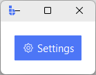
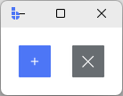
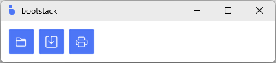

# Icons

This guide explains how to use icons effectively in bootstack applications—from simple buttons to state-aware toolbar actions.

---

## Icons as framework infrastructure

In bootstack, icons are **named resources**, not file paths.

When you specify an icon:

```python
bs.Button(app, text="Settings", icon="gear")
```

<div class="app-window">
    
</div>

The framework:

- resolves the name through an icon provider
- recolors the icon to match the widget's foreground
- scales it for the current DPI
- caches it for reuse
- updates it when the theme changes

You don't manage image files, recolor assets, or worry about resolution. The framework handles it.

---

## Where icons come from

bootstack ships with the full **[Bootstrap Icons](https://icons.getbootstrap.com/)**
catalog. Any icon name from that catalog works as the `icon=` value:

```python
bs.Button(app, icon="house")
bs.Button(app, icon="exclamation-triangle")
bs.Button(app, icon="bar-chart")
```

When you need to find an icon, browse the
[Bootstrap Icons catalog](https://icons.getbootstrap.com/) — search by keyword,
copy the name, paste it into your widget. There are over 2,000 icons covering
common UI metaphors (navigation, actions, status, charts, file types, devices).

The underlying provider is `ttkbootstrap_icons_bs`, but you don't need to
interact with it — bootstack wires the provider in for you. Treat that package
as an implementation detail.

### Icon explorer

bootstack ships a dedicated icon browser. Run it from anywhere:

```bash
bootstack icons
```

This delegates to the `ttkbootstrap-icons` tool, which provides a full
searchable browser of the Bootstrap Icons catalog. Any icon name you find
there works directly as the `icon=` value on any bootstack widget. See
[Tooling → CLI](../tooling/cli.md) for full CLI reference.

<div class="app-window">
    
</div>

---

## The mental model

Think of icons as **semantic identifiers**, similar to color tokens:

| Concept | You write | Framework resolves |
|---------|-----------|-------------------|
| Color | `accent="danger"` | `#dc3545` (or theme equivalent) |
| Icon | `icon="trash"` | Themed, scaled, cached image |

The same icon name works across light and dark themes. The icon adapts automatically—you don't maintain separate assets.

Icons also participate in **widget state**. When a button is disabled, its icon dims. When hovered, it can change. This happens without extra code.

---

## Basic usage

### Icon with text

```python
bs.Button(app, text="Save", icon="check")
bs.Button(app, text="Delete", icon="trash", accent="danger")
```

The icon appears to the left of the text by default.

### Icon only

```python
bs.Button(app, icon="plus", icon_only=True)
bs.Button(app, icon="x-lg", icon_only=True, accent="secondary")
```

<div class="app-window">
    
</div>

Use `icon_only=True` when the icon is self-explanatory. The widget adjusts its padding accordingly.

### Labels with icons

```python
bs.Label(app, text="Warning: unsaved changes", icon="exclamation-triangle")
```

Icons in labels reinforce the message without making it interactive.

---

## Common UI patterns

### Toolbar actions

Toolbars typically use icon-only buttons:

```python
toolbar = bs.PackFrame(app, direction="horizontal", padding=8, anchor_items="w").pack(fill='x')

bs.Button(toolbar, icon="folder2", icon_only=True).pack()
bs.Button(toolbar, icon="save", icon_only=True).pack()
bs.Button(toolbar, icon="printer", icon_only=True).pack()
```

<div class="app-window">
    
</div>

### Icon + text for clarity

Primary actions benefit from both:

```python
bs.Button(app, text="New Project", icon="plus-lg", accent="primary")
bs.Button(app, text="Export", icon="download")
```

### Contextual emphasis

Use color to reinforce icon meaning:

```python
bs.Button(app, text="Delete", icon="trash", accent="danger")
bs.Button(app, text="Success", icon="check-circle", accent="success")
bs.Label(app, text="Connection lost", icon="wifi-off", accent="warning")
```

### Menu items

Menus support icons for quick recognition:

```python
menu.add_command(label="Cut", icon="scissors")
menu.add_command(label="Copy", icon="copy")
menu.add_command(label="Paste", icon="clipboard")
```

---

## Icon specifications

A plain string is the simplest form. When you need more control, pass a dict:

```python
bs.Button(app, text="Settings", icon="gear")          # string — name only
bs.Button(app, text="Settings", icon={"name": "gear"})  # dict — same result
```

### `name`

The Bootstrap Icons identifier. Required in the dict form.

```python
bs.Button(app, icon={"name": "gear"})
```

### `size`

Size in pixels. Defaults to 20px, DPI-scaled automatically. Adjust when the default
doesn't balance visually with surrounding content:

```python
bs.Button(app, icon={"name": "gear", "size": 16})
bs.Label(app,  icon={"name": "exclamation-triangle", "size": 24})
```

### `color`

Override the icon color. Accepts a hex string. When omitted the framework derives the
color from the widget's foreground (and shifts it for state automatically):

```python
bs.Button(app, icon={"name": "heart-fill", "color": "#e74c3c"})
```

Use `color` sparingly — hardcoded colors bypass theme adaptation. Prefer letting the
framework derive the color from the accent and surface tokens.

### `state`

Per-state overrides as a list of `(state_expression, override)` pairs. Covered in
detail in the [Stateful icons](#stateful-icons) section below.

### Stateful icons

`CheckButton`, `CheckToggle`, and `RadioButton` can show different icons depending on
their selection state. The icon appears in the **label area** alongside the text; color
shifts automatically from foreground (unselected) to accent (selected).

#### Shorthand: `on_icon` / `off_icon`

For the common two-state case, use the `on_icon` and `off_icon` kwargs directly:

```python
# CheckButton — bell-slash when unchecked, bell-fill when checked
bs.CheckButton(app, text="Notifications", off_icon="bell-slash", on_icon="bell-fill")

# CheckToggle — different icon when toggled on
bs.CheckToggle(app, text="Bold", off_icon="type", on_icon="type-bold")

# RadioButton — filled icon when selected
bs.RadioButton(app, text="Grid", off_icon="grid", on_icon="grid-fill", signal=view, value="grid")
```

`off_icon` is the default (unselected) icon. `on_icon` shows when the widget is
selected or checked. A plain `icon=` with no `on_icon`/`off_icon` uses the same icon
for both states — only the color changes:

```python
bs.CheckButton(app, text="Notifications", icon="bell")   # same icon, color shifts
```

#### Full spec: `state` list

For finer control — custom colors per state, more than two states — pass a dict with a
`state` list:

```python
bs.CheckButton(app, text="Notifications", icon={
    "name": "bell-slash",
    "state": [
        ("selected", "bell-fill"),
        ("disabled", {"name": "bell-slash", "color": "#aaaaaa"}),
    ],
})
```

Each entry is a `(state_expression, override)` pair. The override can be a plain icon
name string or a dict with `name` and/or `color`. Any TTK state expression is valid:

| Expression | Meaning |
|------------|---------|
| `"selected"` | Widget is selected/checked |
| `"disabled"` | Widget is disabled |
| `"hover !disabled"` | Mouse over, not disabled |
| `"pressed !disabled"` | Being clicked |
| `"focus !disabled"` | Has keyboard focus |

The `on_icon`/`off_icon` shorthand and the full `state` dict are equivalent. Use
whichever is clearer for the situation.

For non-selection widgets (Button, etc.) the same `state` dict applies:

```python
bs.Button(app, text="Play", icon={
    "name": "play",
    "state": [
        ("hover !disabled",   {"name": "play-fill"}),
        ("pressed !disabled", {"color": "#ffffff"}),
    ]
})
```

### Hiding the checkbox or radio indicator

`CheckButton` and `RadioButton` show a standard indicator (checkbox square or radio
circle) independently of any icon. Use `show_indicator=False` to hide it:

```python
# Icon only, no checkbox square
bs.CheckButton(app, off_icon="bell-slash", on_icon="bell-fill", show_indicator=False)

# Standard indicator alongside a decorative label icon (default behavior)
bs.CheckButton(app, text="Notifications", icon="bell", show_indicator=True)
```

`RadioGroup` forwards `show_indicator` to all child buttons — useful for icon-only
radio groups that mimic a segmented control:

```python
group = bs.RadioGroup(app, orient="horizontal", show_indicator=False)
group.add("Grid", "grid", off_icon="grid", on_icon="grid-fill")
group.add("List", "list", off_icon="list", on_icon="list-check")
```

Individual `add()` calls can override the group default per button.

### When to use specs

Use the dict form when you need to:

- adjust size for visual balance
- override color for emphasis
- target more than two states

For most cases, `on_icon`/`off_icon` or a plain string is sufficient.

---

## DPI and scaling

bootstack handles icon scaling automatically.

When you specify `size=16`, the framework:

- detects the display's DPI
- scales the icon appropriately
- maintains crisp rendering

You write the same code for standard and high-DPI displays. No manual asset management, no `@2x` variants.

---

## Icons and themes

Icons adapt to theme changes automatically:

```python
# Same code works for both themes
bs.Button(app, text="Edit", icon="pencil")
```

In a light theme, the icon renders dark. In a dark theme, it renders light. The framework derives icon color from the widget's foreground, which the theme controls.

If you override `color` in an icon spec, that color is used instead—but this is rarely necessary.

---

## Icons and localization

Icons reinforce meaning but shouldn't replace text for critical actions:

```python
# Good: icon reinforces label
bs.Button(app, text="Delete", icon="trash")

# Use carefully: icon-only requires universal recognition
bs.Button(app, icon="x-lg", icon_only=True)  # Close button - widely understood
```

For localized applications:

- pair icons with translated labels
- reserve icon-only for universally understood symbols (close, minimize, search)
- test icon meaning across target cultures

!!! link "Localization Guide"
    See [Localization](localization.md) for internationalization patterns.

---

## What not to do

Avoid Tkinter habits that bypass the icon system:

| Don't | Why |
|-------|-----|
| Use file paths for icons | Bypasses theming and caching |
| Manually recolor images | Framework handles state colors |
| Maintain light/dark asset sets | Icons adapt automatically |
| Hardcode icon colors | Use color token or let theme decide |
| Resize images yourself | DPI scaling is automatic |

The icon system exists to handle these concerns. Use it.

---

## Summary

- Icons are **named resources**, not files
- The framework handles **theming, scaling, and caching**
- Use `icon="name"` for simple cases, `icon={...}` for control
- Icons adapt to **widget state** automatically
- Pair icons with text for **clarity and accessibility**

---

## Related resources

- [Design System: Icons](../design-system/icons.md) — design philosophy and principles
- [Color & Theming](color-and-theming.md) — color tokens, surfaces, theme configuration and switching
- [Localization](localization.md) — internationalization patterns