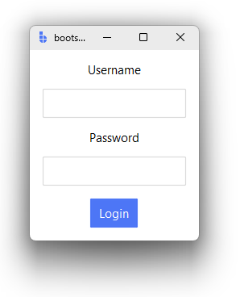
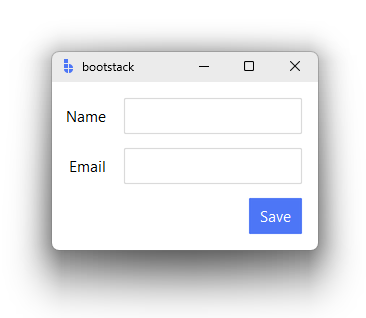
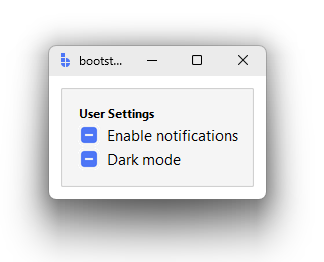

# Layout

This guide explains how to organize widgets on the screen—grouping, alignment, spacing, and resizing using bootstack's layout containers.

bootstack takes an **opinionated approach to layout**. Instead of asking you to manage low‑level geometry flags everywhere,
it encourages expressing **layout intent** using purpose‑built containers.

---

## Recommended approach

For most applications, you should start with bootstack's layout containers:

- **PackFrame** — for linear layouts (vertical or horizontal)
- **GridFrame** — for structured, row/column layouts

These containers are built on Tk's geometry managers, but remove much of the repetitive and error‑prone configuration
required when using `pack()` or `grid()` directly.

They are not required — but they are strongly recommended.

---

## Choosing a layout container

### PackFrame

Use **PackFrame** when your layout flows primarily in one direction.

Common examples:

- forms stacked vertically
- horizontal toolbars
- sidebars
- panels with simple ordering

PackFrame lets you describe *what you want*:

- direction (`vertical` or `horizontal`)
- spacing between children
- whether children expand to fill available space

Instead of *how* to pack each widget.

```python
import bootstack as bs

app = bs.App()

form = bs.PackFrame(app, direction="vertical", gap=8, padding=12)
form.pack(fill="both", expand=True)

bs.Label(form, text="Username").pack()
bs.Entry(form).pack()
bs.Label(form, text="Password").pack()
bs.Entry(form, show="*").pack()
bs.Button(form, text="Login", accent="primary").pack()

app.mainloop()
```

PackFrame is ideal when alignment between columns is not important.



---

### GridFrame

Use **GridFrame** when widgets need to align across rows and columns.

Common examples:

- label–value forms
- settings panels
- dashboards
- inspector or property views

GridFrame allows you to declare:

- row and column structure
- gaps between rows and columns
- default sticky alignment
- spanning behavior
- **auto-placement** — row/column positions are inferred from the column count

without manually configuring every cell.

```python
import bootstack as bs

app = bs.App()

grid = bs.GridFrame(app, columns=["auto", 1], gap=(12, 6), padding=12, sticky_items="e")
grid.pack(fill="both", expand=True)

# Auto-placement: wraps to next row after filling columns
bs.Label(grid, text="Name").grid()
bs.Entry(grid).grid()
bs.Label(grid, text="Email").grid()
bs.Entry(grid).grid()
bs.Button(grid, text="Save", accent="primary").grid(columnspan=2)

app.mainloop()
```

GridFrame is the recommended choice when visual alignment matters.



---

## Card

Use **Card** to group related content in a visually elevated container with a border.

Card is a convenience wrapper around Frame with `accent='card'`, `show_border=True`, and `padding=16` by default.

```python
import bootstack as bs

app = bs.App()

card = bs.Card(app)
card.pack(fill="x", padx=12, pady=12)

bs.Label(card, text="User Settings", font="label").pack(anchor="w")
bs.CheckButton(card, text="Enable notifications").pack(anchor="w")
bs.CheckButton(card, text="Dark mode").pack(anchor="w")

app.mainloop()
```

Cards are ideal for:

- grouping related form fields or controls
- visually separating sections of content
- creating panel-style layouts



---

## Using Frame with pack or grid

Standard Tk layout using `Frame` with `pack()` or `grid()` is fully supported.

You may choose this approach when:

- porting existing Tkinter code
- implementing highly custom geometry behavior
- debugging layout edge cases
- learning or teaching raw Tk geometry

This approach gives you maximum control — but requires deeper knowledge of geometry flags and interactions.

```python
frame = bs.Frame(app)
frame.pack(fill="both", expand=True)

label = bs.Label(frame, text="Hello")
label.grid(row=0, column=0, sticky="w", padx=8, pady=4)
```

!!! link "See [Spacing & Alignment](spacing-and-alignment.md) for a deep dive into how `pack`, `grid`, padding, and alignment work in Tk."

---

## Nesting containers

Nested containers are normal and expected.

Use nesting to:

- separate layout regions
- control spacing at the container level
- isolate scrolling or resizing behavior

Prefer **shallow, intentional nesting** over deeply nested widget‑level configuration.

```python
grid = bs.GridFrame(app, columns=[1, 1], gap=12, padding=12, sticky_items="nsew")
grid.pack(fill="both", expand=True)

# Left column
left = bs.PackFrame(grid, direction="vertical", gap=6)
left.grid()
bs.Label(left, text="General", font="label").pack()
bs.CheckButton(left, text="Enable feature").pack()

# Right column
right = bs.PackFrame(grid, direction="vertical", gap=6)
right.grid()
bs.Label(right, text="Advanced", font="label").pack()
bs.CheckButton(right, text="Verbose logging").pack()
```

---

## Method chaining

Both `pack()` and `grid()` return the widget for method chaining:

```python
form = bs.PackFrame(app, direction="vertical", gap=8)
form.pack(fill="both", expand=True)

# Create and pack in one line, store reference
entry = bs.Entry(form).pack()

# Chain further calls
bs.Button(form, text="Submit").pack().configure(command=submit)
```

---

## Scrollable layout

Scrolling is a **container responsibility**, not a widget responsibility.

bootstack provides composite containers such as `ScrollView` that:

- manage viewport and content sizing
- coordinate scrollbars
- adapt to dynamic content

Widgets placed inside scroll containers should not manage scrolling themselves.

---

## What layout containers do *not* hide

PackFrame and GridFrame do **not** replace Tk's geometry system.

They:

- sit on top of `pack` and `grid`
- apply structured defaults
- reduce boilerplate

You can always drop down to raw geometry managers when needed.

Understanding the underlying system remains valuable — but it does not need to be your starting point.

---

## Common layout mistakes

- mixing `pack` and `grid` in the same container
- managing spacing on every widget instead of at the container level
- over‑nesting containers without intent
- querying widget size before layout is realized

Most layout issues disappear when containers are used intentionally.

---

## Next steps

- [Spacing & Alignment](spacing-and-alignment.md) - how padding, margins, `sticky`, and expansion
  behave under the hood when using raw `pack` and `grid`.
- [ScrollView](../widgets/layout/scrollview.md) - how scrolling is handled as a container responsibility.

If you're new to bootstack layout, start with **PackFrame** or **GridFrame**, then return to Spacing & Alignment
only when you need finer control.
