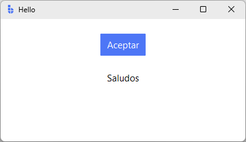
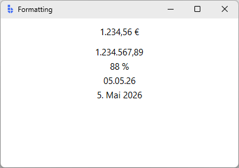

# Localization

bootstack apps localize at the framework level. Set a locale on your `App`,
drop translation catalogs into `locales/`, and widgets re-render their text
when the locale changes. Numbers, currencies, and dates pick up regional
formatting from the same locale setting.

This guide covers the practical path: framework strings, your own strings,
locale-aware value formatting, and runtime language switching.

---

## How localization works

bootstack uses **gettext** catalogs (`.po` source files compiled to `.mo`
binary files). Three pieces fit together:

1. **`MessageCatalog`** owns the active locale, looks up translations, and
   emits `<<LocaleChanged>>` on the root window when the locale switches.
2. **Widget mixins** subscribe to `<<LocaleChanged>>` and re-resolve any
   text or value spec they hold. You don't wire this up yourself —
   `bs.Label`, `bs.Button`, `bs.Field`, etc. all participate.
3. **`L()` and `LV()`** are the two spec constructors. `L("key")` produces
   a translatable text spec; `LV(value, format_spec)` produces a
   locale-aware value-formatting spec (currency, decimal, percent, date).

Catalogs live at `locales/<lang>/LC_MESSAGES/<domain>.mo` (the standard
gettext layout that `msgfmt` and Babel produce).

---

## Built-in language support

bootstack ships translations for its own widget strings (dialog buttons,
calendar months, validation defaults) in 22 languages — including `de`,
`es`, `fr`, `it`, `ja`, `ko`, `nl`, `pl`, `pt`, `pt_BR`, `zh_CN`, `zh_TW`,
and more. These live under the framework's `bootstack` gettext domain and
are loaded automatically.

To use them, set the locale on `App`:

```python
import bootstack as bs

app = bs.App(title="Hello", minsize=(400, 200), settings=bs.AppSettings(locale="es_ES"))

bs.Button(app, text="OK").pack(pady=20)
bs.Label(app, text="Saludos").pack()

app.mainloop()
```

<div class="app-window">
   
</div>

Built-in dialogs, calendar widgets, and validation messages will appear in
Spanish without further configuration. If you omit `locale` from settings,
bootstack auto-detects the system locale (falling back to `en_US`).

---

## Adding your own translations

For application-specific strings, use the `bootstack add i18n` scaffold:

```text
bootstack add i18n --languages en es de
```

This creates:

```text
locales/
├── en/LC_MESSAGES/messages.po
├── es/LC_MESSAGES/messages.po
└── de/LC_MESSAGES/messages.po
```

Edit each `.po` file with your translations:

```po
msgid "Welcome"
msgstr "Bienvenido"

msgid "Save"
msgstr "Guardar"

msgid "Hello, %s!"
msgstr "¡Hola, %s!"
```

Compile to `.mo` files:

```text
msgfmt locales/es/LC_MESSAGES/messages.po -o locales/es/LC_MESSAGES/messages.mo
```

Or, if you have Babel installed:

```text
pybabel compile -d locales -D messages
```

### Pointing the catalog at your domain

The scaffold uses the gettext domain `messages` (the Babel default). The
framework's auto-init uses domain `bootstack` so its built-in strings load.
To make your own catalog active, re-initialize after creating the App:

```python
import bootstack as bs
from bootstack import MessageCatalog

app = bs.App(title="MyApp", minsize=(600, 400), settings=bs.AppSettings(locale="es_ES"))

# Switch to your application's domain
MessageCatalog.init(
    locales_dir="locales",
    domain="messages",
    default_locale="es_ES",
)

bs.Label(app, text="Welcome").pack(pady=20)  # → "Bienvenido"
bs.Button(app, text="Save").pack()            # → "Guardar"

app.mainloop()
```

After this re-init, `MessageCatalog.translate("Welcome")` consults your
`locales/es/LC_MESSAGES/messages.mo`. The built-in `bootstack` domain is
no longer active — built-in dialogs revert to English. If you need both,
the simplest path is to copy the strings you care about into your own
catalog.

---

## Auto-translation of widget text

Widgets with text accept a `localize=` parameter that controls whether
plain string literals are wrapped into translation specs:

```python
# Auto: literal strings become translation lookups (default)
bs.Label(app, text="Welcome")  # equivalent to text=L("Welcome")

# Force on: same as auto for strings; lets you be explicit
bs.Label(app, text="Welcome", localize=True)

# Off: pass through verbatim
bs.Label(app, text="Welcome", localize=False)
```

`localize="auto"` is the project-wide default. Override per-widget when a
string is intentionally untranslatable (a user-entered name, a code
identifier, etc.).

Application-wide override:

```python
# Disable auto-localization globally; opt in per widget with localize=True
app = bs.App(localize=False)
```

When auto-localization is on, an empty catalog falls back to the literal
string itself, so undeveloped translations still display sensibly.

---

## Explicit translations with `L()`

Use `L()` when you need format arguments or a key that differs from the
displayed fallback:

```python
import bootstack as bs
from bootstack import L

app = bs.App(title="Greeter", minsize=(400, 200), settings=bs.AppSettings(locale="es_ES"))

# Positional %-style formatting
bs.Label(app, text=L("Hello, %s!", "Alice")).pack(pady=20)

# Multiple args
bs.Label(app, text=L("%d items in %s", 5, "cart")).pack()

app.mainloop()
```

`L(key, *fmtargs)` returns a `LocalizedTextSpec`. Widgets that accept
`text=` resolve specs automatically. Format placeholders use Python's
`%`-style operators (`%s`, `%d`, `%.2f`) — **not** f-string `{name}`
braces. The catalog entry must use the same placeholder style:

```po
msgid "Hello, %s!"
msgstr "¡Hola, %s!"

msgid "%d items in %s"
msgstr "%d artículos en %s"
```

If the key is missing from the catalog, `L()` falls back to the key
itself (formatted with the args), so partial translations still render
something useful.

---

## Locale-aware value formatting with `LV()`

`L()` is for **text translation**. `LV()` is for **value formatting** —
showing a number, date, or currency in the active locale's conventions:

```python
import bootstack as bs
from bootstack import LV
from datetime import date

app = bs.App(title="Formatting", minsize=(400, 250), settings=bs.AppSettings(locale="de_DE"))

# Currency (uses locale's currency symbol and conventions)
bs.Label(app, text=LV(1234.56, "currency")).pack(pady=10)
# → "1.234,56 €" in de_DE; "$1,234.56" in en_US

# Decimal (locale-aware separators)
bs.Label(app, text=LV(1234567.89, "decimal")).pack()
# → "1.234.567,89" in de_DE

# Percent
bs.Label(app, text=LV(0.875, "percent")).pack()
# → "87,5 %" in de_DE

# Short date
bs.Label(app, text=LV(date.today(), "shortDate")).pack()
# → "05.05.26" in de_DE; "5/5/26" in en_US

# Long date
bs.Label(app, text=LV(date.today(), "longDate")).pack()
# → "5. Mai 2026" in de_DE; "May 5, 2026" in en_US

app.mainloop()
```

<div class="app-window">
   
</div>

Common format presets:

| Preset | Use for | Example output (en_US) |
|---|---|---|
| `"decimal"` | Plain numbers with grouping | `1,234,567.89` |
| `"currency"` | Money values | `$1,234.56` |
| `"percent"` | Ratios as percentages | `87.5%` |
| `"thousands"` / `"millions"` | Compact magnitudes | `1.5K` / `2.3M` |
| `"shortDate"` / `"longDate"` | Calendar dates | `5/5/26` / `May 5, 2026` |
| `"shortTime"` / `"longTime"` | Times of day | `2:15 PM` / `2:15:30 PM` |
| `"shortDateShortTime"` | Combined date and time | `5/5/26 2:15 PM` |

For finer control, pass a dict instead of a preset name:
`LV(0.875, {"type": "percent", "precision": 2})`. See the
[Formatting guide](formatting.md) for the full spec catalog.

---

## Switching locale at runtime

Call `MessageCatalog.locale("de_DE")`. This fires `<<LocaleChanged>>` on the
root window — every widget holding a translation or value-format spec
re-resolves itself immediately.

`value_format=` is the easiest way to see this live, because number and date
formatting reacts to locale without any catalog setup:

```python
import bootstack as bs
from bootstack import MessageCatalog
from datetime import date

app = bs.App(title="Switcher", minsize=(400, 200), settings=bs.AppSettings(locale="en_US"))

bs.Label(app, text=1234.56,      value_format="currency", font="heading-md").pack(pady=10)
bs.Label(app, text=date.today(), value_format="longDate").pack()

bar = bs.PackFrame(app, direction="horizontal", gap=8)
bar.pack(pady=10)
bs.Button(bar, text="English", command=lambda: MessageCatalog.locale("en_US")).pack(side="left")
bs.Button(bar, text="Español", command=lambda: MessageCatalog.locale("es_ES")).pack(side="left")
bs.Button(bar, text="Deutsch", command=lambda: MessageCatalog.locale("de_DE")).pack(side="left")

app.mainloop()
```

Click a button and the currency symbol, decimal separator, and date order
all update immediately. Translated strings (`L()` specs) re-resolve the same
way, but you won't see a change unless a catalog with the target translations
is loaded — see [Pointing the catalog at your domain](#pointing-the-catalog-at-your-domain)
for that setup.

To listen for locale changes yourself:

```python
def refresh_my_view(event):
    print(f"locale is now {MessageCatalog.locale()}")

app.bind("<<LocaleChanged>>", refresh_my_view, add="+")
```

---

## Reactive signals with `value_format=`

Widgets that take a `Signal` for their value also accept a `value_format=`
kwarg. The signal stays in its raw type (a number, a date) and the widget
displays it formatted for the current locale:

```python
import bootstack as bs

app = bs.App(title="Live price", minsize=(400, 200), settings=bs.AppSettings(locale="fr_FR"))

price = bs.Signal(0.0)

# Display the signal as currency in the active locale
bs.Label(app, textsignal=price, value_format="currency").pack(pady=20)
#   price=12.5 → "12,50 €" in fr_FR; "$12.50" in en_US

bs.Button(app, text="Add 5", command=lambda: price.set(price.get() + 5)).pack()

app.mainloop()
```

When the locale switches, the displayed string re-formats automatically;
when the signal updates, it formats with the current locale. This is the
right tool for live-updating numeric displays (prices, counters,
percentages).

---

## Locale-aware widgets

Several input widgets honor the locale settings out of the box:

| Widget | What honors locale |
|---|---|
| `bs.DateEntry` | Display format (`settings.date_format`), first day of week |
| `bs.TimeEntry` | Display format (`settings.time_format`), 12/24-hour |
| `bs.NumericEntry` | Decimal separator, thousands separator |
| `bs.Calendar` | Month and weekday names |

These pick up format strings from `app.settings` (auto-derived from the
locale via Babel), so setting the locale typically gives you correct
formatting without further config. Override individual format strings via
`bs.AppSettings` if you need to:

```python
app = bs.App(settings=bs.AppSettings(locale="en_GB", date_format="d MMM yyyy"))
```

---

## Patterns

### Language switcher in the title bar

The switcher calls `MessageCatalog.locale()` — but you need locale-sensitive
content on the page to see it work. `LV()` date and number formatting responds
immediately without any catalog setup:

```python
import bootstack as bs
from bootstack import MessageCatalog
from datetime import date

app = bs.AppShell(title="Languages", minsize=(600, 300), settings=bs.AppSettings(locale="en_US"))

page = app.add_page("main", text="Main", icon="house")
app.navigate("main")

bs.Label(page, text=1234.56,      value_format="currency", font="heading-md").pack(pady=10)
bs.Label(page, text=date.today(), value_format="longDate",  font="body").pack()

LANGS = [("English", "en_US"), ("Español", "es_ES"), ("Deutsch", "de_DE")]
for label, code in LANGS:
    app.toolbar.add_button(text=label, command=lambda c=code: MessageCatalog.locale(c))

app.mainloop()
```

Clicking a language button re-formats the amount and date immediately — the
currency symbol, decimal separator, and date order all update. For translated
strings (`L()` specs), you also need `MessageCatalog.init()` pointing at your
`.mo` files (see [Pointing the catalog at your domain](#pointing-the-catalog-at-your-domain)).

### Localized form

With `localize="auto"` in effect (the default), every `label` and `text`
string in a declarative form becomes a translation lookup. No `L()`
needed on the labels — your catalog `msgid`s match the literals:

```python
import bootstack as bs

app = bs.App(title="Sign up", minsize=(420, 320), settings=bs.AppSettings(locale="es_ES"))

form = bs.Form(
    app,
    col_count=2,
    items=[
        {"key": "username", "label": "Username"},
        {"key": "password", "label": "Password", "editor": "passwordentry"},
        {"key": "email", "label": "Email"},
    ],
    buttons=[{"text": "Sign up", "command": lambda f: print(f.value)}],
)
form.pack(fill="both", expand=True, padx=20, pady=20)

app.mainloop()
```

`messages.po` for Spanish:

```po
msgid "Username"
msgstr "Usuario"

msgid "Password"
msgstr "Contraseña"

msgid "Email"
msgstr "Correo"

msgid "Sign up"
msgstr "Registrarse"
```

Switch locale at runtime via `MessageCatalog.locale("en_US")` and every
label, plus the button, re-renders together.

---

## Pitfalls

**Domain mismatch.** If `bootstack add i18n` scaffolded `messages.po` and
your translations don't show up, you probably haven't re-initialized
`MessageCatalog` with `domain="messages"`. App auto-init uses the framework's
`bootstack` domain. Re-init after `bs.App(...)` (see the section above).

**Format placeholders are positional.** `L("Hello, %s!", name)` works;
`L("Hello, {name}!", name=name)` does not. Catalog `msgid` and `msgstr`
must use the same placeholder style.

**`L()` vs `LV()`.** `L()` is for translatable text. `LV()` is for
formatting values (numbers, dates) per locale. They are not
interchangeable — passing a number to `L()` won't format it, and passing
a string key to `LV()` won't translate it.

**Compile your `.po` files.** Editing `.po` is not enough — gettext reads
`.mo`. Re-run `msgfmt` or `pybabel compile` after every edit.

**Empty translations.** If a catalog has no translation for a key, the
key itself is displayed (formatted, if `L()` had args). This is by design
— it means partial catalogs degrade gracefully — but it also means typos
in your `msgid` show through as untranslated text in production.

**`localize=False` for proper nouns.** A literal string that should never
be translated (a user's name, a product code, an environment label)
should pass `localize=False` so the auto-wrap doesn't accidentally try
to look it up.

---

## Next steps

- [Formatting](formatting.md) — number, date, and currency format specs in detail
- [Reactivity](reactivity.md) — signals and reactive bindings
- [Forms & Input](forms-and-input.md) — pairing translated labels with input widgets
- [App Structure](app-structure.md) — where locale fits into App settings
