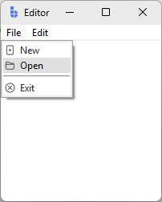
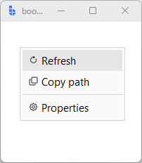
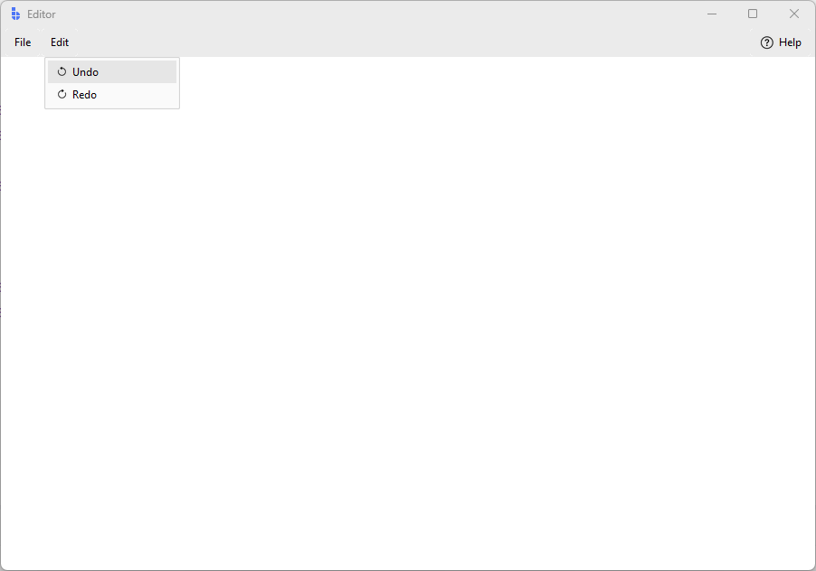

# Menus

bootstack provides four menu surfaces, split across two APIs depending on
whether you want native platform behavior or fully themed widgets.

| Surface | API | Use when |
|---------|-----|----------|
| **Window menubar** | `create_menu` + `app['menu']` | Classic File/Edit/View bar at the top of a window |
| **MenuButton** | `create_menu` | Compact command group in a button with nested submenus |
| **ContextMenu** | `ContextMenu` / `ContextMenuItem` | Right-click menus, or any menu that pops up near a widget |
| **MenuBar widget** | `MenuBar` | Themed toolbar-style menubar with before/center/after regions |

The first two use the **item dict** format and build native `tk.Menu` objects.
The last two are widget-backed and have their own API.

---

## Item dict format

`bs.create_menu` and `bs.create_menu_items` both take lists of dicts.
All supported keys:

| Key | Type | Description |
|-----|------|-------------|
| `label` | str | Display text. Message tokens are auto-translated. |
| `icon` | str or dict | Bootstrap icon name (`"folder2-open"`) or `{"name": "folder2-open", "size": 18}`. |
| `items` | list | Sub-items — makes this entry a cascade (submenu). |
| `command` | callable | Callback for command items. |
| `type` | str | `'command'` (default), `'checkbutton'`, `'radiobutton'`, or `'separator'`. |
| `variable` | Variable | Tk variable for checkbutton / radiobutton. |
| `value` | Any | Value for radiobutton items. |
| `shortcut` | str | Platform-aware accelerator display. See [Shortcuts](#shortcuts). |
| `accelerator` | str | Literal accelerator string, passed straight to `tk.Menu` (no translation). |
| `name` | str | Tcl widget name for a cascade. On macOS, `'apple'`, `'window'`, and `'help'` trigger system-native menu integration. |

Icons and their colors update automatically when the theme changes.

---

## Window menubar

Attach a menu to a window with `app['menu']`.  Use `bs.create_menu` to build
the cascade structure — each top-level dict becomes a submenu group.

```python
import bootstack as bs

def new_file(): ...
def open_file(): ...

app = bs.App(title="Editor")

app['menu'] = bs.create_menu([
    {
        "label": "File",
        "items": [
            {"label": "New",  "icon": "file-plus",    "command": new_file},
            {"label": "Open", "icon": "folder2-open", "command": open_file},
            {"type": "separator"},
            {"label": "Exit", "icon": "x-circle",     "command": app.destroy},
        ],
    },
    {
        "label": "Edit",
        "items": [
            {"label": "Undo", "icon": "arrow-counterclockwise", "shortcut": "Mod+Z"},
            {"label": "Redo", "icon": "arrow-clockwise",        "shortcut": "Mod+Shift+Z"},
        ],
    },
])

app.mainloop()
```

<div class="app-window">
    
</div>

For a secondary window, pass `parent=` explicitly so icon theme-tracking
stays on the correct window:

```python
dlg = bs.Toplevel(app)
dlg['menu'] = bs.create_menu(items, parent=dlg)
```

---

## MenuButton

`MenuButton` is for nested menu structures where the button label names the
menu group.  Pass the result of `bs.create_menu` directly to `menu=`.

```python
items = [
    {
        "label": "File",
        "items": [
            {"label": "New",  "icon": "file-plus",    "command": new_file},
            {"label": "Open", "icon": "folder2-open", "command": open_file},
            {
                "label": "Recent",
                "icon": "clock-history",
                "items": [
                    {"label": "report.pdf"},
                    {"label": "budget.xlsx"},
                ],
            },
            {"type": "separator"},
            {"label": "Exit", "icon": "x-circle", "command": app.destroy},
        ],
    },
]

bs.MenuButton(app, text="File", menu=bs.create_menu(items)).pack()
```

For a flat list of options without nesting, use
[DropdownButton](../widgets/actions/dropdownbutton.md) instead.

### create_menu_items

When you need flat or mixed items (commands at the top level, with optional
nested cascades), use `bs.create_menu_items`:

```python
items = [
    {"label": "Cut",   "icon": "scissors", "command": cut},
    {"label": "Copy",  "icon": "copy",     "command": copy},
    {"label": "Paste", "icon": "clipboard","command": paste},
]

bs.MenuButton(app, text="Edit", menu=bs.create_menu_items(items)).pack()
```

---

## ContextMenu

`ContextMenu` is a fully themed, widget-backed menu.  On Win/Linux it renders
as a themed `Toplevel`; on macOS it falls back to a native `tk.Menu`.

Build items with `add_command`, `add_checkbutton`, `add_radiobutton`, and
`add_separator`, or pass `ContextMenuItem` objects at construction time.

### Right-click menu

```python
import bootstack as bs

app = bs.App(size=(200, 200))
frame = bs.PackFrame(app).pack(fill="both", expand=True)

def refresh(): pass
def copy_path(): pass
def show_props(): pass

ctx = bs.ContextMenu(frame, trigger="right-click")
ctx.add_command(text="Refresh",   icon="arrow-clockwise", command=refresh)
ctx.add_command(text="Copy path", icon="copy",            command=copy_path)
ctx.add_separator()
ctx.add_command(text="Properties", icon="gear",           command=show_props)

app.mainloop()
```

<div class="app-window">
    
</div>

`trigger="right-click"` binds the platform-correct gesture automatically
(Button-3 on Win/Linux, Button-2 and Ctrl+Button-1 on macOS).

### Manual show / hide

Set `trigger=None` to manage display yourself:

```python
ctx = bs.ContextMenu(app, trigger=None)
ctx.add_command(text="Action", command=do_action)

some_button.bind("<Button-1>", lambda e: ctx.show())
```

### Checkbuttons and radiobuttons

```python
toolbar_var = bs.BooleanVar(value=True)
theme_var   = bs.StringVar(value="light")

ctx = bs.ContextMenu(app)
ctx.add_checkbutton(text="Show toolbar", value=toolbar_var.get(),
                    command=lambda: toolbar_var.set(not toolbar_var.get()))
ctx.add_separator()
ctx.add_radiobutton(text="Light", value="light", variable=theme_var)
ctx.add_radiobutton(text="Dark",  value="dark",  variable=theme_var)
```

### Reacting to any item click

```python
def on_select(info):
    print(info['text'], info['value'])

ctx.on_item_click(on_select)
```

### ContextMenuItem

Use `ContextMenuItem` to build item lists declaratively — useful when passing
items to `MenuBar.add_menu` or constructing a `ContextMenu` in one call:

```python
items = [
    bs.ContextMenuItem("command",   text="Open",  icon="folder2-open", command=open_file),
    bs.ContextMenuItem("command",   text="Save",  icon="floppy",       command=save_file),
    bs.ContextMenuItem("separator"),
    bs.ContextMenuItem("command",   text="Exit",  icon="x-circle",     command=app.destroy),
]

ctx = bs.ContextMenu(app, items=items, trigger="right-click")
```

---

## MenuBar widget

`MenuBar` is a themed toolbar-style menubar with three layout regions:
`before` (left), `center`, and `after` (right).  It uses `DropdownButton`
under the hood, so menus open as `ContextMenu` popovers.

```python
import bootstack as bs

app = bs.App(title="Editor", minsize=(900, 600))

def new_file(): pass
def open_file(): pass
def undo(): pass
def redo(): pass
def show_help(): pass

bar = bs.MenuBar(app)
bar.pack(fill="x")

bar.add_menu("File", items=[
    bs.ContextMenuItem("command", text="New",  icon="file-plus",    command=new_file),
    bs.ContextMenuItem("command", text="Open", icon="folder2-open", command=open_file),
    bs.ContextMenuItem("separator"),
    bs.ContextMenuItem("command", text="Exit", icon="x-circle",     command=app.destroy),
])

bar.add_menu("Edit", items=[
    bs.ContextMenuItem("command", text="Undo", icon="arrow-counterclockwise", command=undo),
    bs.ContextMenuItem("command", text="Redo", icon="arrow-clockwise",        command=redo),
])

bar.add_button("Help", icon="question-circle", region="after", command=show_help)

app.mainloop()
```
<div class="app-window">
    
</div>

### Regions

```python
bar.add_menu("File",   region="before")   # default — left side
bar.add_label("v1.0",  region="center")   # stays visually centered
bar.add_button("Help", region="after")    # right side
```

### Surface

`MenuBar` defaults to `surface='chrome'`.  Use `surface='titlebar'` if the
bar sits at the very top of the window:

```python
bs.MenuBar(app, surface="titlebar").pack(fill="x")
```

---

## Shortcuts

The `shortcut=` key in item dicts and `add_command(shortcut=...)` on
`ContextMenu` both accept:

- A **registered key** — `"save"` if you called `Shortcuts.register("save", ...)`
- A **modifier pattern** — `"Mod+S"`, `"Ctrl+Shift+N"`, `"F5"`

`Mod` translates to `Ctrl` on Win/Linux and `⌘` on macOS.
`Alt` translates to `Alt` on Win/Linux and `⌥` on macOS.

```python
shortcuts = bs.get_shortcuts()
shortcuts.register("save",    "Mod+S",       save_file)
shortcuts.register("save-as", "Mod+Shift+S", save_as)
shortcuts.bind_to(app)   # activates key bindings on this window
```

Then reference the key in menu items:

```python
{"label": "Save",    "icon": "floppy", "command": save_file, "shortcut": "save"},
{"label": "Save As", "icon": "floppy", "command": save_as,   "shortcut": "save-as"},
```

The accelerator display (`⌘S` / `Ctrl+S`) is resolved automatically at
render time.  The actual keypress binding comes from `shortcuts.bind_to(app)`,
not from the menu item itself.

!!! link "See [App Structure](app-structure.md) for how `Shortcuts` fits into the application lifecycle."

---

## Localization

Labels in item dicts and `add_command(text=...)` calls accept message tokens —
they are resolved through `MessageCatalog` automatically.

```python
app['menu'] = bs.create_menu([
    {
        "label": "menu.file",
        "items": [
            {"label": "menu.file.new",  "icon": "file-plus",    "command": new_file},
            {"label": "menu.file.open", "icon": "folder2-open", "command": open_file},
        ],
    },
])
```

`MenuButton` text and `ContextMenu` item text follow the same rule.

!!! link "See [Localization](localization.md) for how message tokens are resolved and how language switching works."

---

## Additional resources

### Related widgets

- [MenuButton](../widgets/actions/menubutton.md)
- [DropdownButton](../widgets/actions/dropdownbutton.md)
- [ContextMenu](../widgets/actions/contextmenu.md)

### API reference

- [`bootstack.create_menu`](../reference/app/create_menu.md)
- [`bootstack.MenuManager`](../reference/app/MenuManager.md)
- [`bootstack.Shortcuts`](../reference/app/Shortcuts.md)