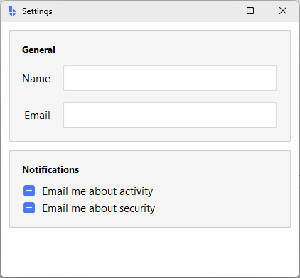
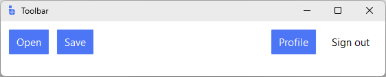
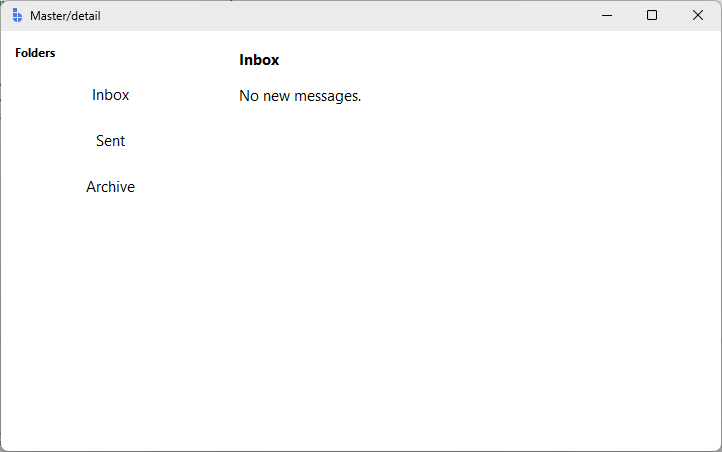
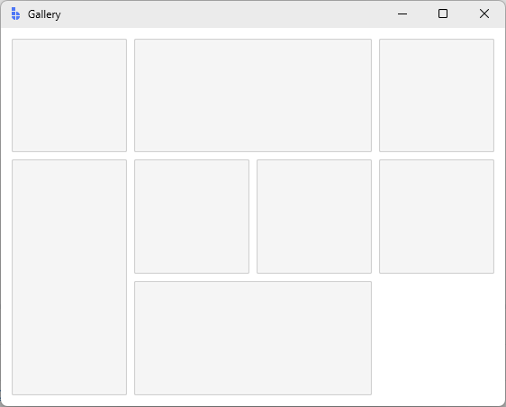

# Spacing & Alignment

This guide is the practical reference for arranging widgets in bootstack:
how to add space between things, how to line them up, and how to control which
parts of the layout grow when the window resizes.

It is organized around the bootstack vocabulary you actually use day to day —
`padding`, `gap`, `sticky_items`, `fill_items`, column/row size specs,
`auto_flow`. The Tk-level mechanics (`padx`, `pady`, `sticky`, `fill`,
`expand`) are covered near the end as background, for when you need to drop
into raw `pack()` or `grid()`.

If you have not yet picked a container, start with [Layout](layout.md) — that
guide explains *which* container fits your shape. This guide explains how to
fine-tune the spacing and alignment inside it.

---

## Spacing

There are two spacing controls you reach for first: **`padding`** (space
*inside* a container, around its children) and **`gap`** (space *between*
children).

### `padding`

`padding` is a container property. Use it to keep children from touching the
container's edge.

```python
import bootstack as bs

app = bs.App(title="Padding", minsize=(320, 200))

panel = bs.PackFrame(app, padding=16)
panel.pack(fill="both", expand=True)

bs.Label(panel, text="16px of breathing room on every side").pack()

app.mainloop()
```

`padding` accepts an `int` for uniform padding or a tuple for asymmetric
padding (`padding=(left_right, top_bottom)` or
`padding=(left, top, right, bottom)`). It works on every bootstack frame —
`Frame`, `PackFrame`, `GridFrame`, `Card`, `LabelFrame`.

### `gap`

`gap` is a container property that sets the space *between* children. Set it
once on the container instead of repeating `padx`/`pady` on every child.

```python
form = bs.PackFrame(app, direction="vertical", gap=8, padding=16)
form.pack(fill="both", expand=True)

bs.Label(form, text="Username").pack(anchor="w")
bs.Entry(form).pack(fill="x")
bs.Label(form, text="Password").pack(anchor="w")
bs.Entry(form, show="*").pack(fill="x")
bs.Button(form, text="Sign in", accent="primary").pack(anchor="e")
```

`PackFrame` applies `gap` along its direction (vertical → between rows,
horizontal → between columns). `GridFrame` accepts either an `int` (same gap
in both directions) or a `(column_gap, row_gap)` tuple:

```python
grid = bs.GridFrame(app, columns=["auto", 1], gap=(12, 6), padding=16)
```

### `Card` defaults

`Card` is the bootstack idiom for a grouped block with built-in spacing. Its
defaults — `padding=16`, `accent='card'`, `show_border=True` — are what most
panels want, so you rarely need to set padding yourself when you reach for a
card.

```python
card = bs.Card(app)
card.pack(fill="x", padx=12, pady=12)

bs.Label(card, text="Display", font="heading-sm").pack(anchor="w")
bs.CheckButton(card, text="Reduce motion").pack(anchor="w")
bs.CheckButton(card, text="Show hidden files").pack(anchor="w")
```

Override `padding=` only when the card content has its own internal layout
that already provides breathing room.

### Worked example: settings panel

A typical pattern: a vertical stack of cards, each with its own grid form
inside. Container-level `gap` and `padding` mean no per-widget spacing flags.

```python
import bootstack as bs

app = bs.App(title="Settings", minsize=(420, 360))

page = bs.PackFrame(app, direction="vertical", gap=12, padding=12)
page.pack(fill="both", expand=True)

# General card
general = bs.Card(page)
general.pack(fill="x")

bs.Label(general, text="General", font="heading-sm").pack(anchor="w")

form = bs.GridFrame(general, columns=["auto", 1], gap=(12, 8))
form.pack(fill="x", pady=(8, 0))

bs.Label(form, text="Name").grid(sticky="e")
bs.Entry(form).grid(sticky="ew")
bs.Label(form, text="Email").grid(sticky="e")
bs.Entry(form).grid(sticky="ew")

# Notifications card
notifications = bs.Card(page)
notifications.pack(fill="x")

bs.Label(notifications, text="Notifications", font="heading-sm").pack(anchor="w")
bs.CheckButton(notifications, text="Email me about activity").pack(anchor="w", pady=(8, 0))
bs.CheckButton(notifications, text="Email me about security").pack(anchor="w")

app.mainloop()
```

<div class="app-window">
  
</div>

Notice spacing decisions live on the *containers*: the page sets `gap=12`
between cards, each card uses its default `padding=16`, and the inner grid
uses `gap=(12, 8)` to space label/value pairs. No widget below the
container level sets `padx`/`pady`.

---

## Alignment

Alignment is about *where in its allotted space* a widget sits when there is
extra room. The relevant container properties are `sticky_items`,
`fill_items`, `anchor_items`, and `direction`.

### `sticky_items` (GridFrame)

`sticky_items` sets the default stickiness for every child of a `GridFrame`.
Stickiness is a string of compass directions describing which sides of the
cell the widget is anchored to. Combinations stretch the widget:

| Value    | Behaviour                                    |
| -------- | -------------------------------------------- |
| `"w"`    | Pinned to the left of its cell               |
| `"e"`    | Pinned to the right of its cell              |
| `"ew"`   | Stretched horizontally to fill the cell      |
| `"ns"`   | Stretched vertically to fill the cell        |
| `"nsew"` | Filled in both directions                    |

```python
grid = bs.GridFrame(app, columns=["auto", 1], gap=(12, 6),
                    sticky_items="ew")
grid.pack(fill="x", padx=12, pady=12)

bs.Label(grid, text="Host").grid(sticky="e")     # override default for label
bs.Entry(grid).grid()                             # uses sticky_items="ew"
bs.Label(grid, text="Port").grid(sticky="e")
bs.Entry(grid).grid()
```

Per-widget `sticky=` overrides the container default — useful for a single
right-aligned label in an otherwise stretching grid.

### `fill_items` and `anchor_items` (PackFrame)

`fill_items` is the `PackFrame` equivalent of `sticky_items`. It applies
`fill="x"`, `fill="y"`, `fill="both"`, or `fill="none"` to every child.

```python
sidebar = bs.PackFrame(app, direction="vertical", gap=2, padding=8, fill_items="x")
sidebar.pack(side="left", fill="y")

bs.Button(sidebar, text="Inbox").pack()
bs.Button(sidebar, text="Sent").pack()
bs.Button(sidebar, text="Drafts").pack()
```

Because `fill_items="x"` is set, every button stretches to the sidebar's
width without per-widget `pack(fill="x")` calls.

`anchor_items` controls *where* a non-filling widget sits along the cross
axis — `"w"`, `"center"`, `"e"` for vertical packs; `"n"`, `"center"`, `"s"`
for horizontal.

```python
header = bs.PackFrame(app, direction="vertical", padding=12, anchor_items="w")
```

### `direction` (PackFrame)

`direction` controls both the flow axis and the order of insertion:

| Direction         | Flow                       |
| ----------------- | -------------------------- |
| `"vertical"` / `"column"`         | Top → bottom (default)     |
| `"horizontal"` / `"row"`          | Left → right               |
| `"row-reverse"`   | Right → left               |
| `"column-reverse"`| Bottom → top               |

`row-reverse` is the natural fit for groups that should hug the right edge —
toolbars, status bars, dialog button rows.

### Worked example: toolbar with left/right groups

A common shape: actions on the left, account controls on the right. Use a
plain `Frame` as the bar, then two `PackFrame`s with `side="left"` and
`side="right"`.

```python
import bootstack as bs

app = bs.App(title="Toolbar", minsize=(560, 80))

bar = bs.Frame(app, padding=8)
bar.pack(fill="x")

left = bs.PackFrame(bar, direction="row", gap=4)
left.pack(side="left")
bs.Button(left, text="Open").pack()
bs.Button(left, text="Save", accent="primary").pack()

right = bs.PackFrame(bar, direction="row", gap=4)
right.pack(side="right")
bs.Button(right, text="Profile").pack()
bs.Button(right, text="Sign out", variant="ghost").pack()

app.mainloop()
```

<div class="app-window">
  
</div>

The two groups define their own internal flow with `direction="row"`;
right-alignment of the *group* is handled by `side="right"` on the outer bar.

---

## Sizing & expansion

Spacing and alignment decide where a widget sits *inside* its slot. Sizing
decides how big the slot is and how leftover space is shared.

### Column and row size specs (GridFrame)

`GridFrame` accepts a list for `rows=` or `columns=` where each entry is a
*size spec*:

| Spec       | Meaning                                      |
| ---------- | -------------------------------------------- |
| `"auto"`   | Hug the content; never grows                 |
| `"100px"`  | Fixed minimum size (still grows if weighted) |
| `1` (int)  | Weight — share of the leftover space         |

If any column has weight `0` (the default for `"auto"` and `"100px"`), it
does not absorb extra space. If multiple columns have positive weights, they
share extra space proportionally — `[1, 2]` gives the second column twice
the leftover width of the first.

```python
# Sidebar: 220px, content: takes the rest.
shell = bs.GridFrame(app, columns=["220px", 1], rows=[1], sticky_items="nsew")
shell.pack(fill="both", expand=True)

# Form: label hugs its text, value takes the rest.
form = bs.GridFrame(app, columns=["auto", 1], gap=(12, 6), sticky_items="ew")
```

For vertical layouts the same ideas apply to `rows=`. A common shape is
`rows=["auto", 1, "auto"]` — fixed-size header, scrollable middle, fixed-size
footer.

### `expand_items` (PackFrame)

In a `PackFrame`, *expansion* (does this widget claim leftover space along
the flow direction?) is separate from *fill* (does this widget stretch to
fill the slot it has?). `expand_items=True` makes every child expand:

```python
columns = bs.PackFrame(app, direction="row", gap=8, padding=8,
                       fill_items="both", expand_items=True)
columns.pack(fill="both", expand=True)

bs.Card(columns)  # left
bs.Card(columns)  # middle
bs.Card(columns)  # right — three equal-width cards
```

### `fill` vs `expand`

These two flags do different things and you usually want both for a
component that should grow with the window:

- **`fill`** — stretch *the widget* to occupy the slot it was assigned.
- **`expand`** — give *the slot* extra space when there is any.

A button with `fill="x"` but `expand=False` stretches across its slot but
never claims leftover space. A button with `fill="x"` and `expand=True` keeps
growing as the window grows.

### Worked example: master-detail pane

A fixed-width sidebar plus a content area that absorbs all leftover space —
the canonical desktop-app shape.

```python
import bootstack as bs

app = bs.App(title="Master/detail", minsize=(720, 420))

shell = bs.GridFrame(app, columns=["220px", 1], rows=[1], sticky_items="nsew")
shell.pack(fill="both", expand=True)

# Sidebar: stacked buttons, all the same width.
sidebar = bs.PackFrame(shell, direction="vertical", gap=2, padding=12, fill_items="x")
sidebar.grid()

bs.Label(sidebar, text="Folders", font="label").pack(anchor="w", pady=(0, 8))
bs.Button(sidebar, text="Inbox", variant="ghost").pack()
bs.Button(sidebar, text="Sent", variant="ghost").pack()
bs.Button(sidebar, text="Archive", variant="ghost").pack()

# Detail: a card that fills the rest of the window.
detail = bs.PackFrame(shell, direction="vertical", gap=12, padding=16)
detail.grid()

bs.Label(detail, text="Inbox", font="heading-md").pack(anchor="w")
bs.Label(detail, text="No new messages.").pack(anchor="w")

app.mainloop()
```

<div class="app-window">
  
</div>

Three things make this work:

1. `columns=["220px", 1]` — the sidebar gets a fixed slot, the detail column
   absorbs the rest.
2. `rows=[1]` — the single row has weight, so vertical resizing flows to the
   children.
3. `sticky_items="nsew"` — children fill their cells, so the panes follow the
   window as it grows.

---

## Auto-flow

When you have many same-shape children — a gallery, a tag list, a card grid —
you don't want to assign `row=` and `column=` by hand. `GridFrame.auto_flow`
controls how children get placed automatically.

| Value             | Behaviour                                            |
| ----------------- | ---------------------------------------------------- |
| `"row"` (default) | Fill row by row, wrap to next row when full          |
| `"column"`        | Fill column by column, wrap to next column when full |
| `"row-dense"`     | Like `"row"`, but back-fill earlier gaps             |
| `"column-dense"`  | Like `"column"`, but back-fill earlier gaps          |
| `"none"`          | All children stack at `(0, 0)` — useful for overlays |

The dense variants matter when some children span multiple cells. Without
`-dense`, gaps that appear before a tall or wide tile stay empty. With
`-dense`, later children back-fill those gaps.

### Worked example: dense gallery

```python
import bootstack as bs

app = bs.App(title="Gallery", minsize=(560, 420))

gallery = bs.GridFrame(app, columns=4, gap=8, padding=12,
                       sticky_items="nsew", auto_flow="row-dense")
gallery.pack(fill="both", expand=True)

# Make each row stretch evenly. Rows are created on demand by auto-flow,
# so we configure weights on the GridFrame after-the-fact.
for r in range(3):
    gallery.configure_row(r, weight=1)
for c in range(4):
    gallery.configure_column(c, weight=1)

bs.Card(gallery).grid()
bs.Card(gallery).grid(columnspan=2)   # wide tile
bs.Card(gallery).grid()
bs.Card(gallery).grid(rowspan=2)      # tall tile
bs.Card(gallery).grid()
bs.Card(gallery).grid()
bs.Card(gallery).grid(columnspan=2)
bs.Card(gallery).grid()

app.mainloop()
```

<div class="app-window">
  
</div>

`row-dense` packs the small tiles around the wide and tall ones instead of
leaving holes. Switch to `auto_flow="row"` to see the difference.

---

## Under the hood

`PackFrame` and `GridFrame` are built on Tk's `pack` and `grid` geometry
managers. The container properties above are higher-level vocabulary for the
same Tk options. When you need to drop down — porting old code, building a
custom container, debugging an unfamiliar layout — these are the underlying
controls.

### External padding (`padx`, `pady`)

Per-widget padding *outside* the widget. Affects the distance to neighbours.
This is what `gap` is built on top of.

```text
[ padx ][ widget ][ padx ]
```

```python
bs.Button(parent, text="OK").pack(side="right", padx=8, pady=4)
```

`padx`/`pady` accept an `int` for symmetric padding or a `(left, right)` /
`(top, bottom)` tuple.

### Internal padding (`ipadx`, `ipady`)

Per-widget padding *inside* the widget — increases the widget's drawn size.
Use `padding=` on the *widget* (when supported) before reaching for these.

```text
[ widget ( ipadx | content | ipadx ) ]
```

### `sticky` (grid)

A string of compass directions describing which sides of the cell a widget is
anchored to. Combined directions stretch the widget. This is what
`sticky_items` is built on; per-widget `sticky=` overrides the default.

```python
bs.Entry(frame).grid(row=0, column=1, sticky="ew")
```

Note: a child only stretches when its **column or row has weight**. Without
`columnconfigure(N, weight=...)`, `sticky="ew"` has nothing extra to absorb.
`GridFrame`'s `columns=[...]` size specs configure these weights for you.

### `side`, `fill`, `expand` (pack)

`pack`'s three primary controls:

- `side="top"|"bottom"|"left"|"right"` — which edge of the remaining space
  the widget is packed against. `direction` picks the default for a
  `PackFrame`'s children.
- `fill="x"|"y"|"both"|"none"` — stretch the widget to fill its slot.
- `expand=True|False` — make the widget claim leftover space along the pack
  axis.

```python
bs.Frame(parent).pack(fill="both", expand=True)
```

### `anchor` (pack)

Where a non-filling widget sits inside its slot — `"n"`, `"e"`, `"s"`, `"w"`,
their corners (`"ne"` etc.), or `"center"`. `anchor_items` is the container
default.

---

## When to drop to raw Tk

Reach for `pack()`/`grid()` directly when:

- You are porting existing Tk code and want to keep the original geometry
  calls.
- You are inside a custom widget and need full control over a small,
  hand-tuned layout.
- You are debugging an existing layout and want to see exactly which Tk
  options are in play.
- A specific child needs an option (`ipadx`, `before`, `after`, `in_`) that
  the container abstractions do not surface as a default.

`PackFrame` and `GridFrame` accept all standard `pack`/`grid` options as
per-widget overrides — you can mix container-level defaults with one-off raw
options on individual children.

---

## Common pitfalls

- **Setting `sticky="ew"` but the widget doesn't stretch.** The column has
  no weight. Either pass a numeric weight in `columns=[...]`, or call
  `frame.configure_column(index, weight=1)`.
- **Setting `fill="x"` but the widget doesn't stretch.** It does — to its
  *slot*. If you want the slot itself to grow, also set `expand=True`.
- **Mixing `pack` and `grid` in the same container.** Tk forbids it. Each
  container picks one. Use nested frames if you need both.
- **Spacing scattered across every child.** Move spacing to container
  properties (`gap`, `padding`) so changing a value is a single edit.
- **Reading widget size in `__init__`.** Geometry is resolved on the next
  event-loop tick. Use `widget.update_idletasks()` or a `<Configure>` binding
  if you need post-layout dimensions.

---

## Next steps

- [Layout](layout.md) — choosing between `PackFrame`, `GridFrame`, `Card`,
  and `Frame`.
- [PackFrame](../widgets/layout/packframe.md) and
  [GridFrame](../widgets/layout/gridframe.md) — full parameter references.
- [ScrollView](../widgets/layout/scrollview.md) — how spacing interacts with
  scrolling content.
- [Geometry & Layout](../platform/geometry-and-layout.md) — Tk-level
  background on geometry managers and layout resolution timing.