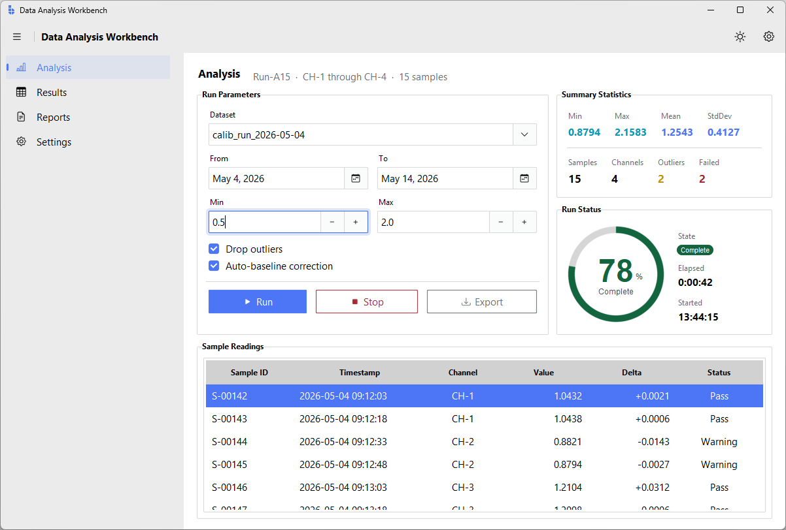
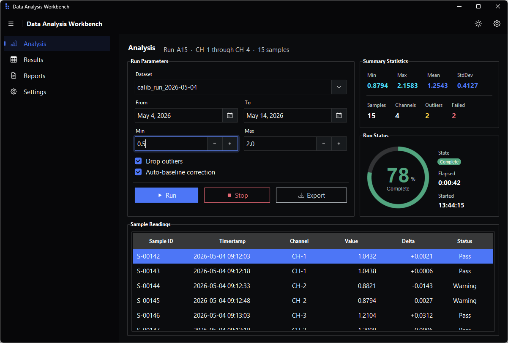

  
From the maker of ttkbootstrap.

  <h1 class="bs-hero__title">Tk, finally batteries-included.</h1>
  
60+ themed widgets. Reactive state. Declarative layout. Built-in icons and localization. A CLI that scaffolds, builds, and ships. Everything ttkbootstrap was missing.

  
  

  <a href="getting-started/installation/" class="bs-hero__btn bs-hero__btn--primary">Get started</a>
  <a href="guides/" class="bs-hero__btn bs-hero__btn--ghost">Read the docs</a>

  

    <h3 class="bs-feature__title">Themed widgets</h3>
    
Six accent colors, three variants, light and dark themes — every widget styled the same way without writing a line of theme code.

  

  

    <h3 class="bs-feature__title">Bootstrap Icons built in</h3>
    
Bootstrap Icons ship with the framework — first-class in Buttons, Labels, nav, and toolbars. Sized, themed, and recolored to match.

  

  

    <h3 class="bs-feature__title">Reactive signals</h3>
    
Bind state to UI without <code>StringVar</code>s or trace callbacks — values propagate automatically.

  

  

    <h3 class="bs-feature__title">Declarative layout</h3>
    
Direction, gaps, alignment, and weights — declared on the container and broadcast to every child.

<pre class="bs-feature__code"><code>PackFrame(direction="row", gap=8)
GridFrame(columns=3, gap=16)</code></pre>
  

  

    <h3 class="bs-feature__title">Localization</h3>
    
Translate UI strings, format numbers and dates, and switch locales at runtime.

  

  

    <h3 class="bs-feature__title">Scaffold-to-ship CLI</h3>
    
<code>bootstack start</code> scaffolds. <code>bootstack build</code> packages. From zero to .exe in minutes.

  

