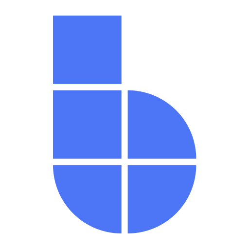

  

    <h1 class="bs-hero__title">Modern desktop apps in pure Python.</h1>
    
bootstack is a batteries-included Tk framework — themed widgets, reactive state, layout containers, and a CLI that takes you from scaffold to ship.

    
bootstack is the successor to <a href="https://github.com/israel-dryer/ttkbootstrap">ttkbootstrap</a>.

    

      <a href="getting-started/installation/" class="bs-hero__btn bs-hero__btn--primary">Get started</a>
      <a href="guides/" class="bs-hero__btn bs-hero__btn--ghost">Read the docs</a>
    

  

  

    
    
  

