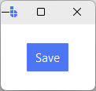
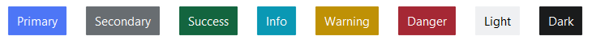
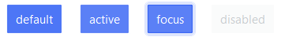
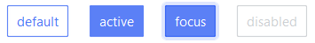
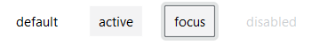
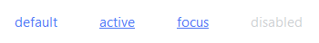
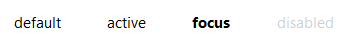
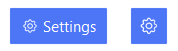
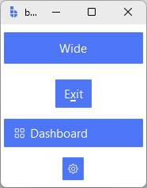

# Button

Buttons allow users to take actions with a single click. They communicate available actions and are commonly used throughout an interface — such as in dialogs, forms, and toolbars.

## Quick start

Create a button by providing `text` and a `command` callback.

```python
import bootstack as bs

app = bs.App()

def on_save():
    print("Saved!")

bs.Button(app, text="Save", command=on_save).pack(padx=20, pady=20)

app.mainloop()
```

<div class="app-window">
    
</div>

---

## When to use

Use a button when the user needs to **trigger an action immediately**, such as submitting a form, saving a change, or opening a dialog.

### Consider a different control when...

- the value is a persistent on/off state — use [CheckToggle](../selection/checktoggle.md)
- the user is choosing one option from a set — use [RadioButton](../selection/radiobutton.md) or [RadioGroup](../selection/radiogroup.md)
- you want compact single or multi selection (segmented control) — use [ToggleGroup](../selection/togglegroup.md)
- the action reveals a menu of choices — use [MenuButton](menubutton.md) or [DropdownButton](dropdownbutton.md)

---

## Appearance

Buttons are styled using **semantic colors** and **variant** tokens. Variants describe visual weight and interaction style, not meaning.

!!! link "See [Design System → Variants](../../design-system/variants.md) for how variants map consistently across widgets."

### Accents

The `accent` parameter accepts semantic color tokens:

<figure markdown>

</figure>

```python
bs.Button(app, text="Primary", accent="primary").pack(pady=4)
bs.Button(app, text="Outline", accent="primary", variant="outline").pack(pady=4)
bs.Button(app, text="Ghost",   accent="primary", variant="ghost").pack(pady=4)
bs.Button(app, text="Link",    accent="primary", variant="link").pack(pady=4)
bs.Button(app, text="Text",    accent="secondary", variant="text").pack(pady=4)
```

### Variants

The supported variants for Button are: **solid** (default), **outline**, **ghost**, **link**, and **text**.

**Solid (default)**
Use for the primary, highest-emphasis action on a view (e.g., "Save", "Submit", "Continue").

<figure markdown>

</figure>

```python
bs.Button(app, text="Solid")
```

**Outline**
Use for secondary actions that should stay visible but clearly defer to the primary button (e.g., "Cancel", "Back").

<figure markdown>

</figure>

```python
bs.Button(app, text="Outline", variant="outline")
```

**Ghost**
Use for low-emphasis, contextual actions embedded in panels, lists, or toolbars where the UI should stay visually quiet until hover or press.

<figure markdown>

</figure>

```python
bs.Button(app, text="Ghost", variant="ghost")
```

**Link**
Use for navigation or "take me somewhere" actions that should read like text (e.g., "View details", "Open settings").

<figure markdown>

</figure>

```python
bs.Button(app, text="Link", variant="link")
```

**Text**
Use for the lowest-emphasis utility actions — especially in dense UIs — where you want minimal chrome but still want button semantics (e.g., "Edit", "Clear", "Dismiss").

<figure markdown>

</figure>

```python
bs.Button(app, text="Text", variant="text")
```

---

## Examples & patterns

### Using icons

Icons are integrated into the button widget and provide theme-aware and state-enabled icons. The `compound` parameter controls where the icon is positioned relative to the label — `"left"` by default.

<figure markdown>

</figure>

```python
# button with label & icon
bs.Button(app, text="Settings", icon="gear").pack(pady=6)

# icon-only button
bs.Button(app, icon="gear", icon_only=True).pack(pady=6)
```

!!! link "See [Icons & Images](../../guides/icons.md) for icon sizing, DPI handling, and recoloring behavior."

!!! tip "Custom Icons"
    You can pass an icon spec instead of a string to customize the color, size, and state of the icon.
    See [Design System → Icons](../../design-system/icons.md).

### Disable until ready (`state`)

Disable a button until the user has completed a step.

```python
btn = bs.Button(app, text="Continue", accent="primary", state="disabled")
btn.pack()

# later…
btn.configure(state="normal")
```

### Size, layout, and density

```python
# fixed width and padding
bs.Button(app, text="Wide", width=18, padding=(12, 6)).pack(pady=6)

# underline a keyboard shortcut character
bs.Button(app, text="Exit", underline=1).pack(pady=6)

# left-aligned content — useful for nav-item style buttons
bs.Button(app, text="Dashboard", icon="grid", anchor="w").pack(fill="x")

# compact density for toolbars
bs.Button(app, icon="gear", icon_only=True, density="compact").pack(pady=6)
```

<div class="app-window">
    
</div>

Use `surface=` when the button sits on a non-default background (e.g., inside a card or overlay):

```python
bs.Button(app, text="Action", surface="card")
```

---

## Behavior

Buttons support keyboard focus and activation.

- **Tab / Shift+Tab** moves focus.
- **Space / Enter** activates the button.
- Disabled buttons do not receive focus or emit events.

!!! link "See [State & Interaction](../../guides/reactivity.md) for focus, hover, and disabled behavior across widgets."

---

## Localization

If localization is enabled, any string passed as `text` is used as a gettext key and resolved through the active message catalog.

```python
bs.Button(app, text="button.save").pack()
```

!!! link "See [Localization](../../guides/localization.md) for how message tokens are resolved and how language switching works."

---

## Reactivity

Use a signal when the label should update dynamically at runtime (for example, Start/Stop, Connect/Disconnect).

```python
label = bs.Signal("Start")
bs.Button(app, textsignal=label).pack()

label.set("Stop")
```

!!! link "See [Signals](../../guides/reactivity.md) for how signal-backed widget values and text updates work."

---

## Additional resources

### Related widgets

- [CheckButton](../selection/checkbutton.md)
- [RadioButton](../selection/radiobutton.md)
- [ToggleGroup](../selection/togglegroup.md)
- [MenuButton](menubutton.md)
- [DropdownButton](dropdownbutton.md)
- [Dialog](../dialogs/dialog.md)
- [MessageDialog](../dialogs/messagedialog.md)

### Framework concepts

- [Design System → Variants](../../design-system/variants.md)
- [Design System → Icons](../../design-system/icons.md)
- [Icons & Imagery](../../guides/icons.md)
- [Reactivity](../../guides/reactivity.md)
- [Localization](../../guides/localization.md)

### API reference

- [`bootstack.Button`](../../reference/widgets/Button.md)