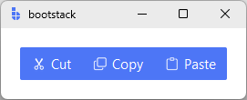

# ButtonGroup

`ButtonGroup` groups related actions into a connected row or column of buttons.
It is most common in toolbars, segmented controls, and compact action clusters where buttons should read as a unit.

---

## Quick start

Create a group and add buttons. The group handles spacing, connection visuals, and consistent styling.

```python
import bootstack as bs

app = bs.App()

bg = bs.ButtonGroup(app, accent="primary")
bg.pack(padx=20, pady=20)

bg.add(text="Cut",   icon="scissors",  command=lambda: print("Cut"))
bg.add(text="Copy",  icon="copy",      command=lambda: print("Copy"))
bg.add(text="Paste", icon="clipboard", command=lambda: print("Paste"))

app.mainloop()
```

<div class="app-window">
    
</div>

---

## When to use

Use `ButtonGroup` when:

- you have multiple actions that are conceptually related
- you want a compact toolbar cluster without separate spacing between buttons
- you want segmented visuals without managing per-button layout

### Consider a different control when...

- you need a single/multi selection model — use [ToggleGroup](../selection/togglegroup.md)
- you need unrelated actions that should not look connected — use separate [Button](button.md) widgets

---

## Appearance

`accent` and `variant` set the default style for all buttons in the group.

```python
bs.ButtonGroup(app, accent="primary").pack(pady=4)
bs.ButtonGroup(app, accent="primary", variant="outline").pack(pady=4)
bs.ButtonGroup(app, accent="primary", variant="ghost").pack(pady=4)
```

Use `density='compact'` for toolbar contexts where space is tight:

```python
bg = bs.ButtonGroup(app, accent="secondary", variant="ghost", density="compact")
```

!!! link "See [Design System → Variants](../../design-system/variants.md) for how variants map consistently across widgets."

---

## Orientation

`orient` controls the layout direction. The default is `'horizontal'`; pass `'vertical'`
for sidebar action stacks.

```python
bg = bs.ButtonGroup(app, accent="primary", orient="vertical")
bg.pack(padx=20, pady=20)

bg.add(text="New",    icon="file-plus",  command=on_new)
bg.add(text="Open",   icon="folder",     command=on_open)
bg.add(text="Save",   icon="floppy",     command=on_save)
```

Orientation can also be changed at runtime and repacks all children automatically:

```python
bg.configure(orient="vertical")
```

---

## Examples & patterns

### Icon-only toolbar group

```python
bg = bs.ButtonGroup(app, accent="secondary", variant="ghost", density="compact")
bg.pack(pady=10)

bg.add(icon="undo",  icon_only=True, command=lambda: print("Undo"))
bg.add(icon="redo",  icon_only=True, command=lambda: print("Redo"))
bg.add(icon="trash", icon_only=True, command=lambda: print("Delete"))
```

!!! link "See [Icons & Imagery](../../guides/icons.md) for icon sizing, DPI handling, and recoloring behavior."

### Disabling a group

Disable the entire group at construction, or toggle it at runtime. The state propagates
to all child buttons.

```python
bg = bs.ButtonGroup(app, accent="primary", state="disabled")
bg.add(text="Save",   command=on_save)
bg.add(text="Export", command=on_export)

# Re-enable later
bg.configure(state="normal")
```

!!! link "See [State & Interaction](../../guides/reactivity.md) for focus, hover, and disabled behavior across widgets."

---

## Item management

Give buttons a `key=` to retrieve or modify them after creation.

```python
bg.add(text="Save",   command=on_save,   key="save")
bg.add(text="Delete", command=on_delete, key="delete")

# Retrieve by key
btn = bg.item("delete")

# All keys in order
bg.keys()    # ('save', 'delete')

# All widgets
bg.items()   # (Button, Button)

# Disable one button
bg.configure_item("delete", state="disabled")

# Remove a button
bg.remove("save")

# Membership and iteration
"delete" in bg         # True
for btn in bg: ...
len(bg)                # 1
```

---

## Runtime reconfiguration

`accent`, `variant`, `density`, `orient`, and `state` all propagate to child buttons
when set via `configure()`.

```python
# Switch the whole group to a danger style
bg.configure(accent="danger", variant="outline")
```

---

## Additional resources

### Related widgets

- [Button](button.md)
- [ToggleGroup](../selection/togglegroup.md)
- [RadioGroup](../selection/radiogroup.md)

### Framework concepts

- [Design System → Variants](../../design-system/variants.md)
- [Icons & Imagery](../../guides/icons.md)
- [State & Interaction](../../guides/reactivity.md)
