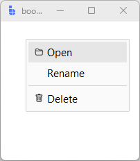

# ContextMenu

`ContextMenu` is a widget-backed pop-up menu for right-click and contextual actions.

Unlike Tk's native `Menu`, it is composed of bootstack widgets. This makes it fully
themeable (light/dark), enables icons, and allows richer layout and interaction patterns.

---

## Quick start

Create a menu and add items. `ContextMenu` auto-binds right-click to its target by
default — no manual binding needed.

```python
import bootstack as bs

app = bs.App(size=(200, 200))

menu = bs.ContextMenu(app)
menu.add_command(text="Open", icon="folder2-open", command=lambda: print("Open"))
menu.add_command(text="Rename", command=lambda: print("Rename"))
menu.add_separator()
menu.add_command(text="Delete", icon="trash", command=lambda: print("Delete"))

app.mainloop()
```

<div class="app-window">
    
</div>

`target` defaults to `master` and `trigger='right-click'` is the default activation, so
right-clicking `app` shows the menu without any additional binding.

---

## When to use

Use `ContextMenu` when:

- actions are contextual to a widget, list row, or region
- you want theme-consistent menus across platforms
- you want icons or richer item styling

### Consider a different control when…

- you want a button-first action with a small menu → use [DropdownButton](dropdownbutton.md)
- you want a persistent menu button in a toolbar → use [MenuButton](menubutton.md)

---

## Menu items

### Command items

Use command items for standard actions.

```python
menu.add_command(text="Open", command=on_open)
```

Use `disabled=True` to make an item non-interactive at creation time:

```python
menu.add_command(text="Export", command=on_export, disabled=True)
```

Use `shortcut=` to display a keyboard shortcut hint. Pass a registered Shortcuts service
key for automatic platform-correct rendering, or a literal string as a fallback:

```python
menu.add_command(text="Save", command=on_save, shortcut="save")    # e.g. "Ctrl+S" / "⌘S"
menu.add_command(text="Undo", command=on_undo, shortcut="Ctrl+Z")  # literal
```

### Check items

Use check items for independent on/off options.

```python
menu.add_checkbutton(text="Show hidden files", value=True)
menu.add_checkbutton(text="Pin to sidebar", value=False)
```

### Radio items

Use radio items for selecting one option from a set.

```python
sort_var = bs.StringVar(value="name")
menu.add_radiobutton(text="Sort by name", value="name", variable=sort_var)
menu.add_radiobutton(text="Sort by date", value="date", variable=sort_var)
```

---

## Behavior

- `show(position=(x, y))` displays the menu at a screen coordinate.
- `show()` with no argument positions the menu relative to `target` using `anchor` and `attach`.
- `hide()` programmatically closes the menu.
- The menu hides automatically when the user clicks outside.
- Item commands fire on click and close the menu.
- Keyboard: arrow keys navigate items, Enter activates, Escape dismisses.

!!! link "See [State & Interaction](../../guides/reactivity.md) for focus, hover, and disabled behavior across widgets."

---

## Activation

`ContextMenu` auto-binds to its target widget using the `trigger` parameter.

| Value | Binding |
|---|---|
| `'right-click'` (default) | Portable right-click: `Button-3` on Win/Linux, `Button-2` + `Ctrl+click` on macOS |
| `'click'` | Left click |
| `'double-click'` | Double left click |
| `'shift-click'` | Shift+click |
| `'ctrl-click'` | Ctrl+click |
| `None` / `'manual'` | No auto-binding — call `show()` yourself |

Use `trigger=None` when activation is conditional or driven by other logic:

```python
menu = bs.ContextMenu(app, trigger=None)

def on_right_click(event):
    if app.has_selection():
        menu.show(position=(event.x_root, event.y_root))

app.bind("<Button-3>", on_right_click)
```

---

## Icons

Menu items use the same icon system as other bootstack widgets.

```python
menu.add_command(text="Settings", icon="gear", command=on_settings)
```

!!! link "See [Icons & Imagery](../../guides/icons.md) for icon sizing, DPI handling, and recoloring behavior."

---

## Localization

If localization is enabled, menu item labels can be message tokens.

```python
menu.add_command(text="menu.open", command=on_open)
menu.add_command(text="menu.delete", command=on_delete)
```

!!! link "See [Localization](../../guides/localization.md) for how message tokens are resolved and language switching works."

---

## Positioning patterns

### Attach to a target widget

Set `target`, `anchor`, and `attach` at construction time. Calling `show()` with no
argument positions the menu relative to the target: `anchor` is the point on the menu,
`attach` is the point on the target to align to.

```python
menu = bs.ContextMenu(
    app,
    target=my_button,
    anchor="nw",
    attach="se",
    offset=(5, 5),
    trigger=None,
)

my_button.configure(command=menu.show)
```

### Show at pointer location

Pass a screen coordinate to override `target`/`anchor`/`attach`:

```python
menu.show(position=(event.x_root, event.y_root))
```

---

## Item management

Give items a `key=` to retrieve or modify them after creation.

```python
menu.add_command(text="Open",   command=on_open,   key="open")
menu.add_command(text="Delete", command=on_delete, key="delete")

# Retrieve by key or index
item = menu.item("delete")
item = menu.item(0)

# All keys in order
menu.keys()   # ('open', 'delete')

# Reconfigure after creation
menu.configure_item("delete", text="Delete permanently")

# Remove
menu.remove_item("open")
```

Insert at a specific position:

```python
menu.insert_item(1, "command", text="Duplicate", command=on_duplicate)
```

Replace all items at once by passing a list of dicts or `ContextMenuItem` objects:

```python
menu.items([
    {"type": "command", "text": "Open",   "command": on_open},
    {"type": "separator"},
    {"type": "command", "text": "Delete", "command": on_delete},
])
```

Or pass items at construction for a declarative setup:

```python
menu = bs.ContextMenu(app, items=[
    bs.ContextMenuItem("command",   text="Open",   command=on_open),
    bs.ContextMenuItem("separator"),
    bs.ContextMenuItem("command",   text="Delete", command=on_delete),
])
```

---

## Advanced patterns

### Dynamic menus

For context-sensitive menus, replace items on a reused menu instance rather than
creating a new one on each activation.

```python
menu = bs.ContextMenu(app, trigger=None)

def on_right_click(event):
    items = [{"type": "command", "text": "Open", "command": on_open}]
    if can_delete():
        items.append({"type": "command", "text": "Delete", "command": on_delete})
    menu.items(items)
    menu.show(position=(event.x_root, event.y_root))

app.bind("<Button-3>", on_right_click)
```

### Centralized item handling

Register a single callback to route all menu actions rather than wiring individual
`command=` handlers.

```python
def on_item_click(info):
    # info keys: 'type', 'text', 'value'
    if info["type"] == "command":
        dispatch(info["text"])
    elif info["type"] == "checkbutton":
        toggle(info["text"], info["value"])

menu.on_item_click(on_item_click)
menu.off_item_click()  # remove when no longer needed
```

!!! link "See [API Reference → ContextMenu](../../reference/widgets/ContextMenu.md) for full item management and callback APIs."

---

## Additional resources

### Related widgets

- [DropdownButton](dropdownbutton.md)
- [MenuButton](menubutton.md)
- [Button](button.md)

### Framework concepts

- [Icons & Imagery](../../guides/icons.md)
- [Localization](../../guides/localization.md)
- [State & Interaction](../../guides/reactivity.md)

### API reference

- [`bootstack.ContextMenu`](../../reference/widgets/ContextMenu.md)
- [`bootstack.ContextMenuItem`](../../reference/widgets/ContextMenuItem.md)