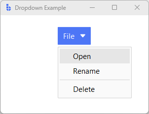
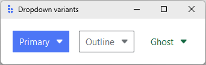

# DropdownButton

`DropdownButton` is a **button-first** control that opens a menu of related actions.
Use it when the primary action is still a button click, but you want a secondary list of choices available on demand.

---

## Quick start

Provide menu items as `ContextMenuItem` entries. The button can also have its own `command` for the "main" action.

```python
import bootstack as bs

app = bs.App(title="Dropdown Example", minsize=(300, 200))

items = [
    bs.ContextMenuItem("command", text="Open", command=lambda: print("Open")),
    bs.ContextMenuItem("command", text="Rename", command=lambda: print("Rename")),
    bs.ContextMenuItem("separator"),
    bs.ContextMenuItem("command", text="Delete", command=lambda: print("Delete")),
]

btn = bs.DropdownButton(app, text="File", items=items)
btn.pack(padx=20, pady=20)

app.mainloop()
```

<div class="app-window">
    
</div>

---

## When to use

Use `DropdownButton` when:

- you have a **primary action** plus a small set of related actions
- you want the options to be **discoverable**, but not always visible
- the control belongs in a **toolbar** or dense header area

### Consider a different control when…

- you want a *single* action → use [Button](button.md)
- the control is primarily "a menu" (not a button) → use [MenuButton](menubutton.md)
- the menu must be shown on right-click / contextual interaction → use [ContextMenu](contextmenu.md)

---

## Appearance

`DropdownButton` supports semantic colors and variants through `accent` and `variant`.

!!! link "See [Design System → Variants](../../design-system/variants.md) for how variants map consistently across widgets."

```python
bs.DropdownButton(app, text="Primary", accent="primary", items=[]).pack(pady=4)
bs.DropdownButton(app, text="Outline", accent="primary", variant="outline", items=[]).pack(pady=4)
bs.DropdownButton(app, text="Ghost", accent="primary", variant="ghost", items=[]).pack(pady=4)
```

<div class="app-window">
    
</div>

---

## Examples & patterns

### Adding icons to items

`ContextMenuItem` supports icons per entry.

```python
items = [
    bs.ContextMenuItem(text="Settings", icon="gear", command=lambda: print("Settings")),
    bs.ContextMenuItem(text="Help", icon="circle-help", command=lambda: print("Help")),
]
bs.DropdownButton(app, text="More", items=items).pack(pady=10)
```

!!! link "See [Icons & Imagery](../../guides/icons.md) for icon sizing, DPI handling, and recoloring behavior."

### Handling item clicks

You can attach callbacks at item creation time, or subscribe to item-click events on the widget.

```python
btn = bs.DropdownButton(app, text="Actions", items=items).pack(pady=10)

# Optional: listen for item clicks at the widget level
# (useful if you want centralized routing/logging).
btn.on_item_click(lambda item: print("Clicked:", item.text))
```

!!! link "See [Callbacks](../../guides/reactivity.md) for how bootstack command callbacks are structured."

---

## Behavior

- The dropdown opens relative to the button and closes when the user clicks away.
- Item commands fire on click, and the menu closes afterward (typical desktop behavior).

!!! link "See [State & Interaction](../../guides/reactivity.md) for focus, hover, and disabled behavior across widgets."

---

## Localization

If localization is enabled, menu labels can be message tokens just like widget `text`.

```python
items = [
    bs.ContextMenuItem(text="menu.open", command=lambda: ...),
    bs.ContextMenuItem(text="menu.delete", command=lambda: ...),
]
bs.DropdownButton(app, text="button.file", items=items).pack()
```

!!! link "See [Localization](../../guides/localization.md) for how message tokens are resolved and how language switching works."

---

## Additional resources

### Related widgets

- [Button](button.md)
- [MenuButton](menubutton.md)
- [ContextMenu](contextmenu.md)

### Framework concepts

- [Design System → Variants](../../design-system/variants.md)
- [Design System → Icons](../../design-system/icons.md)
- [Icons & Imagery](../../guides/icons.md)
- [Callbacks](../../guides/reactivity.md)
- [State & Interaction](../../guides/reactivity.md)
- [Localization](../../guides/localization.md)

### API reference

- [`bootstack.DropdownButton`](../../reference/widgets/DropdownButton.md)
- [`bootstack.ContextMenuItem`](../../reference/widgets/ContextMenuItem.md)