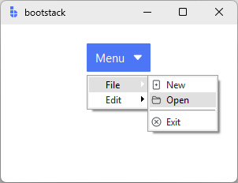
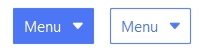
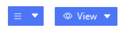

# MenuButton

`MenuButton` is a **native-menu control**: it looks like a button but opens a
hierarchical `bs.Menu` — supporting cascading submenus, keyboard navigation,
and platform menu conventions.

Use it when your options have **nested structure** or when you need native
platform menu behavior. For a flat list of choices, use
[DropdownButton](dropdownbutton.md) instead.

---

## Quick start

Build the menu declaratively with `bs.create_menu`, then pass it to `MenuButton`.
Icons and theme-color updates are handled automatically.

```python
import bootstack as bs

app = bs.App(minsize=(300, 200))

items = [
    {
        "label": "File",
        "items": [
            {"label": "New",  "icon": "file-plus",    "command": lambda: print("New")},
            {"label": "Open", "icon": "folder2-open", "command": lambda: print("Open")},
            {"type": "separator"},
            {"label": "Exit", "icon": "x-circle",     "command": app.destroy},
        ],
    },
    {
        "label": "Edit",
        "items": [
            {"label": "Undo", "icon": "arrow-counterclockwise", "command": lambda: print("Undo")},
            {"label": "Redo", "icon": "arrow-clockwise",        "command": lambda: print("Redo")},
        ],
    },
]

bs.MenuButton(app, text="Menu", menu=bs.create_menu(items)).pack(padx=20, pady=20)

app.mainloop()
```

<div class="app-window">
    
</div>

`bs.create_menu` returns a `bs.Menu` populated with cascade entries — pass it
directly to `menu=`. Each top-level dict becomes a submenu group; items inside
`"items"` are the actual commands. Nesting is unlimited.

!!! link "See [Menus](../../guides/menus.md) for the full item dict format, shortcuts, icons, and how to build flat and nested menus."

`parent` defaults to the current app and can be omitted in single-window apps.
When building a menu for a secondary window or dialog, pass the `Toplevel`
explicitly so icon theme-tracking stays on the correct window:

```python
dlg = bs.Toplevel(app)
bs.MenuButton(dlg, text="Menu", menu=bs.create_menu(items, parent=dlg)).pack()
```

---

## When to use

Use `MenuButton` when:

- your options have **two or more levels** (groups, submenus, or both)
- you need native platform menu conventions (keyboard navigation, accelerators)
- the menu is the primary interaction, not a secondary affordance

### Consider a different control when...

- you want a flat list of options, or a primary action plus a small menu — use [DropdownButton](dropdownbutton.md)
- you want a fully themed, widget-backed popup menu — use [ContextMenu](contextmenu.md)
- you want a single action — use [Button](button.md)

---

## Appearance

`MenuButton` supports semantic colors and variants through `accent` and `variant`.

!!! link "See [Design System → Variants](../../design-system/variants.md) for how variants map consistently across widgets."

```python
bs.MenuButton(app, text="Menu", accent="primary").pack(pady=4)
bs.MenuButton(app, text="Menu", accent="primary", variant="outline").pack(pady=4)
```



Use `icon=` to add an icon, `icon_only=True` for icon-only buttons, and
`density='compact'` for toolbar contexts:



```python
bs.MenuButton(app, icon="list",  icon_only=True, density="compact", menu=m).pack()
bs.MenuButton(app, text="View",  icon="eye",     density="compact", menu=m).pack()
```

Use `direction=` to control which side the menu posts relative to the button:

```python
bs.MenuButton(app, text="Menu", direction="above", menu=m).pack()
```

---

## Behavior

- `MenuButton` opens the associated `bs.Menu` on click.
- Keyboard navigation and platform conventions are handled by Tk.
- A second click on an open menu closes it.

!!! link "See [Menus](../../guides/menus.md) for the full item dict format, shortcuts, localization, and how `MenuButton` fits alongside `ContextMenu` and `MenuBar`."

!!! link "See [State & Interaction](../../guides/reactivity.md) for focus, hover, and disabled behavior across widgets."

---

## Localization

Pass message tokens as labels when building the menu — `bs.create_menu`
resolves them through `MessageCatalog` automatically. The button's own `text=`
kwarg is also localized the same way.

```python
items = [
    {
        "label": "menu.file",
        "items": [
            {"label": "menu.file.open", "icon": "folder2-open", "command": open_file},
            {"label": "menu.file.exit", "icon": "x-circle",     "command": app.destroy},
        ],
    },
]
bs.MenuButton(app, text="menu.file", menu=bs.create_menu(items)).pack()
```

!!! link "See [Localization](../../guides/localization.md) for how message tokens are resolved and how language switching works."

---

## Additional resources

### Related widgets

- [DropdownButton](dropdownbutton.md)
- [ContextMenu](contextmenu.md)
- [Button](button.md)

### Framework concepts

- [Design System → Variants](../../design-system/variants.md)
- [State & Interaction](../../guides/reactivity.md)
- [Localization](../../guides/localization.md)

### API reference

- [`bootstack.MenuButton`](../../reference/widgets/MenuButton.md)
- [`bootstack.create_menu`](../../reference/app/create_menu.md)
- [`bootstack.MenuManager`](../../reference/app/MenuManager.md)