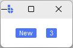

# Badge

`Badge` is a compact **status indicator** built on top of `Label`.

It's designed for short, scannable values like **counts**, **statuses**, and **tags** — for example: "New", "Beta", "3", "Offline".

---

## Quick start

```python
import bootstack as bs

app = bs.App()

frm = bs.PackFrame(app, direction='horizontal', padding=16, gap=16).pack()

bs.Badge(frm, text="New").pack()
bs.Badge(frm, text="3", accent="primary").pack()

app.mainloop()
```

<div class="app-window">
    
</div>

---

## When to use

Use `Badge` when:

- you need a small, high-contrast label for status or counts
- the value is short (typically 1-12 characters)
- you want a consistent visual pill across the UI

### Consider a different control when...

- text is long or multi-line — use [Label](label.md)
- content should blend into the surrounding layout — use [Label](label.md) for less visual emphasis
- you need transient feedback that disappears automatically — use [Toast](../overlays/toast.md)

---

## Appearance

### Styling with `accent`

`Badge` uses its own dedicated badge styling automatically. Use `accent` to convey meaning:

```python
bs.Badge(app, text="Beta")                   # default styling
bs.Badge(app, text="Beta", accent="primary") # primary colored badge
bs.Badge(app, text="Beta", accent="success") # success colored badge
bs.Badge(app, text="Beta", accent="danger")  # danger colored badge
```

!!! link "See [Design System](../../design-system/index.md) for color tokens and theming guidelines."

---

## Examples & patterns

!!! note "Text-only by design"
    Badge does not render icons or embedded images. The TBadge style layout
    is text-only — `icon=`, `icon_only=`, `image=`, and `compound=` are
    silently dropped. Use [Label](label.md) when you need an icon alongside
    text.

### Common options

Badge accepts standard `Label` options, including:

- `text`, `textsignal` — static or reactive text
- `font`, `foreground`
- `padding`, `width`, `wraplength`
- `localize`, `value_format`
- `accent`, `variant` (`"square"` default or `"pill"`)

---

## Behavior

Badge is a static display widget. It does not respond to user interaction by default.

---

## Localization

```python
bs.Badge(app, text="status.new", localize=True)
```

!!! link "See [Localization](../../guides/localization.md) for translation setup."

---

## Reactivity

Use `textsignal=` to bind a signal for live count or status updates:

```python
count = bs.Signal(5)
badge = bs.Badge(app, textsignal=count)
count.set(10)   # badge updates automatically
```

!!! link "See [Reactivity](../../guides/reactivity.md) for reactive programming patterns."

---

## Additional resources

### Related widgets

- [Label](label.md) — general-purpose read-only text
- [Toast](../overlays/toast.md) — non-blocking feedback
- [Progressbar](progressbar.md) — continuous progress indicators
- [Meter](meter.md) — dashboard-style gauges
- [FloodGauge](floodgauge.md) — capacity indicators

### Framework concepts

- [Design System](../../design-system/index.md) — colors, typography, and theming
- [Reactivity](../../guides/reactivity.md) — reactive data binding
- [Localization](../../guides/localization.md) — translation support

### API reference

- [`bootstack.Badge`](../../reference/widgets/Badge.md)