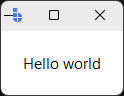
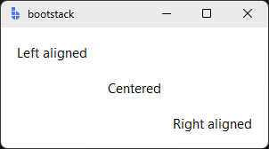
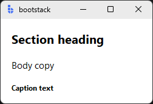
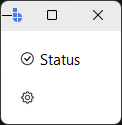
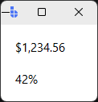

# Label

`Label` displays **read-only text, icons, or images**.

It's a fundamental building block used for headings, captions, instructions, and status text throughout an interface.

---

## Quick start

```python
import bootstack as bs

app = bs.App()

bs.Label(app, text="Hello world").pack(padx=20, pady=20)

app.mainloop()
```

<div class="app-window">
    
</div>

---

## When to use

Use Label when:

- displaying static text or images
- providing context or instructions
- showing status information that doesn't require user interaction

### Consider a different control when...

- user input is required — use [TextEntry](../inputs/textentry.md)
- you need a compact status indicator — use [Badge](badge.md)
- you need interactive text — use [Button](../actions/button.md)

---

## Appearance

### Styling with `accent`

```python
bs.Label(app, text="Info",    accent="info")
bs.Label(app, text="Muted",   accent="secondary")
bs.Label(app, text="Warning", accent="warning")
```

Use `variant=` for alternative rendering such as inverted text-on-accent:

```python
bs.Label(app, text="Tag", accent="primary", variant="inverse")
```

!!! link "See [Design System](../../design-system/index.md) for color tokens and theming guidelines."

---

## Examples & patterns

### Common options

| Option | Purpose |
|---|---|
| `text` | The text content to display |
| `textsignal` | A `Signal[str]` for reactive text updates |
| `icon`, `icon_only` | Theme-aware icon alongside or instead of text |
| `font` | Bootstack font token (e.g. `"heading-lg[bold]"`, `"body"`, `"label[9]"`) |
| `value_format` | Format spec for displaying numeric/date values (e.g. `"currency"`, `"shortDate"`) |
| `compound` | How to combine text and icon/image (`"left"`, `"right"`, `"top"`, `"bottom"`) |
| `anchor` | Content alignment within the label |
| `justify` | Text alignment (`"left"`, `"center"`, `"right"`) |
| `wraplength` | Maximum line width before wrapping |

### Text alignment

```python
bs.Label(app, text="Left aligned",  anchor="w").pack(fill="x")
bs.Label(app, text="Centered",      anchor="center").pack(fill="x")
bs.Label(app, text="Right aligned", anchor="e").pack(fill="x")
```

<div class="app-window">
    
</div>


### Typography

Use bootstack font tokens via `font=`:

```python
bs.Label(app, text="Section heading", font="heading-lg[bold]")
bs.Label(app, text="Body copy",       font="body")
bs.Label(app, text="Caption text",    font="label[9]")
```

<div class="app-window">
    
</div>

### Icons

```python
bs.Label(app, text="Status", icon="check-circle", compound="left")
bs.Label(app, icon="gear", icon_only=True)
```

<div class="app-window">
    
</div>

### Formatted values

Use `value_format=` to display numbers or dates with locale-aware formatting:

```python
bs.Label(app, text=1234.56, value_format="currency")
bs.Label(app, text=0.42,    value_format="percent")
```

<div class="app-window">
    
</div>

!!! link "See [Formatting](../../guides/formatting.md) for all presets and custom patterns."

---

## Behavior

Label is a static display widget. It does not respond to user interaction by default, but can be updated programmatically via `configure(text=...)` or a signal.

---

## Localization

Any string passed as `text=` is used as a gettext key when localization is active.

```python
bs.Label(app, text="greeting.hello", localize=True)
```

!!! link "See [Localization](../../guides/localization.md) for translation setup."

---

## Reactivity

Use `textsignal=` to bind a signal for live text updates:

```python
message = bs.Signal("Initial text")
label = bs.Label(app, textsignal=message)
message.set("Updated text")   # label updates automatically
```

!!! link "See [Reactivity](../../guides/reactivity.md) for reactive programming patterns."

---

## Additional resources

### Related widgets

- [Button](../actions/button.md) — interactive clickable element
- [Badge](badge.md) — compact status indicator
- [Tooltip](../overlays/tooltip.md) — contextual hover information

### Framework concepts

- [Design System](../../design-system/index.md) — colors, typography, and theming
- [Formatting](../../guides/formatting.md) — value_format presets and patterns
- [Reactivity](../../guides/reactivity.md) — reactive data binding
- [Localization](../../guides/localization.md) — translation support
