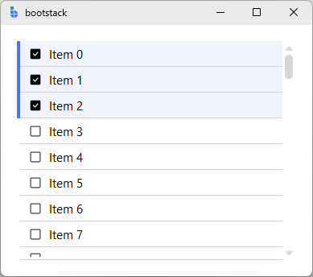

# ListView

`ListView` is a **virtual scrolling list** for displaying large datasets efficiently.

It renders only the visible rows (plus a small overscan), making it suitable for thousands of records while still supporting selection, deletion, dragging, and custom row layouts.

---

## Quick start

```python
import bootstack as bs

app = bs.App()

items = [
    {"id": 1, "title": "Item 1", "text": "Description 1"},
    {"id": 2, "title": "Item 2", "text": "Description 2"},
    {"id": 3, "title": "Item 3", "text": "Description 3"},
    {"id": 4, "title": "Item 4", "text": "Description 4"},
]

lv = bs.ListView(app, items=items)
lv.pack(fill="both", expand=True, padx=20, pady=20)

app.mainloop()
```

<div class="app-window">
    
</div>

---

## When to use

Use `ListView` when:

- you need to display a long list efficiently (virtual scrolling)
- rows can include rich content (icon/title/text/badge)
- you need selection, deletion, or drag reordering

### Consider a different control when...

- **Data is strongly column-based** — use [TableView](tableview.md)
- **Your data is hierarchical** — use [TreeView](treeview.md)
- **You have a small, static list** — a simple frame with labels may suffice

---

## Appearance

### Common display options

```python
lv = bs.ListView(
    app,
    items=data,
    striped=True,
    striped_background="background[+1]",
    show_separator=True,
    scrollbar_visibility="always",   # or 'never' (mousewheel only)
    density="compact",               # 'default' or 'compact'
)
```

<div class="app-window">
    
</div>


Use `show_chevron=True` for navigation-list patterns where each row implies drilling down:

```python
lv = bs.ListView(app, items=data, show_chevron=True)
```

!!! link "See [Design System](../../design-system/index.md) for color tokens and theming guidelines."

---

## Examples & patterns

### Data model

`ListView` accepts either:

- `items=[...]` — a simple list of dicts, or
- `datasource=...` — a [DataSource](../../guides/datasource.md) implementing the `DataSourceProtocol`

#### Recognized fields

Records with an `id` field enable selection, deletion, and moving.

The default `ListItem` recognizes:

- `title` — main heading
- `text` — body text
- `caption` — small caption (hidden in `density="compact"`)
- `icon` — icon spec shown on the left
- `badge` — small text on the right

### Selection

```python
lv = bs.ListView(
    app,
    items=[{"id": i, "text": f"Item {i}"} for i in range(2000)],
    selection_mode="multi",
    show_selection_controls=True,
)

def on_sel(_):
    print("selected:", lv.get_selected())

lv.on_selection_changed(on_sel)
```

<div class="app-window">
    
</div>


`selection_mode` options: `"none"`, `"single"`, `"multi"`.

`select_on_click` defaults to `True` when `selection_mode` is `"single"` or `"multi"`.

### Removing and dragging

```python
lv = bs.ListView(
    app,
    items=data,
    enable_removing=True,
    enable_dragging=True,
)
```

<div class="app-window">
    
</div>

### Selection appearance

```python
lv = bs.ListView(
    app,
    items=data,
    selection_mode="single",
    selected_background="primary",   # accent token for selected rows
    enable_focus=True,               # allow keyboard focus on rows
    enable_hover=True,               # show hover state on rows
)
```

<div class="app-window">
    
</div>

### Custom row layouts

Provide `row_factory=` to use your own row widget. The factory receives the row container and keyword arguments from the datasource record:

```python
def make_row(master, **kwargs):
    return bs.ListItem(master, **kwargs)   # or your custom widget subclass

lv = bs.ListView(app, datasource=my_source, row_factory=make_row)
```

!!! tip "Custom rows"
    Your row widget needs an `update_data(record)` method. Bootstack calls it when the virtual window scrolls to map the row to a new record.

---

## Behavior

### Events

```python
# <<SelectionChange>>: event.data is None — read selection via get_selected()
lv.on_selection_changed(lambda e: print(lv.get_selected()))

# <<ItemClick>>: event.data = {'record': dict}
lv.on_item_click(lambda e: print("clicked:", e.data["record"]))
```

Available events:

- `<<SelectionChange>>` — selection changed (`event.data = None`)
- `<<ItemClick>>` — row clicked (`event.data = {'record': dict}`)
- `<<ItemDelete>>` / `<<ItemDeleteFail>>` — item removed (no event data currently)
- `<<ItemInsert>>` / `<<ItemUpdate>>` — item added/updated (no event data currently)
- `<<ItemDragStart>>` / `<<ItemDrag>>` / `<<ItemDragEnd>>` — drag lifecycle

All `on_*` methods return a bind ID for unsubscribing:

```python
bid = lv.on_selection_changed(on_sel)
lv.off_selection_changed(bid)
```

### Public API

```python
lv.get_selected()              # list of selected records
lv.clear_selection()
lv.select_all()                # multi mode only

lv.insert_item({"id": 99, "title": "New"})
lv.update_item(record_id, {"title": "Updated"})

lv.scroll_to_top()
lv.scroll_to_bottom()

ds = lv.get_datasource()       # access the underlying DataSource
ds.reload()                    # reload from datasource
ds.set_data(new_list)          # replace all data
```

---

## Dynamic data

ListView has no signal binding for `items=`. Drive dynamic updates through the datasource:

```python
lv = bs.ListView(app, items=[])
ds = lv.get_datasource()

# Add a record
ds.create_record({"id": 1, "title": "New item"})

# Or replace all data
ds.set_data(new_list)
```

---

## Additional resources

### Related widgets

- [TableView](tableview.md) — tabular record display
- [TreeView](treeview.md) — hierarchical record display
- [ScrollView](../layout/scrollview.md) — scrolling containers

### Framework concepts

- [Data Tables](../../guides/data-tables.md) — when to pick TableView over ListView
- [Design System](../../design-system/index.md) — colors, typography, and theming
- [DataSource](../../guides/datasource.md) — data management with filtering, sorting, pagination

### API reference

- [`bootstack.ListView`](../../reference/widgets/ListView.md)