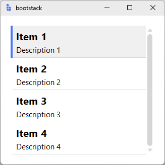
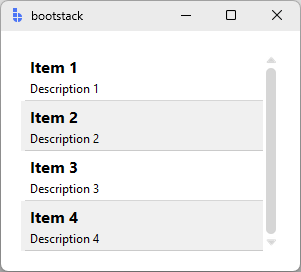
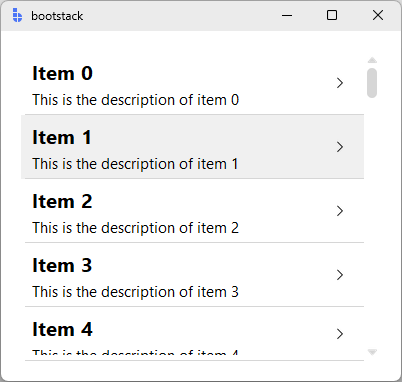
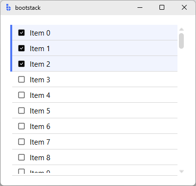
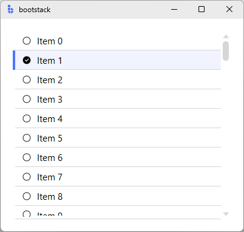
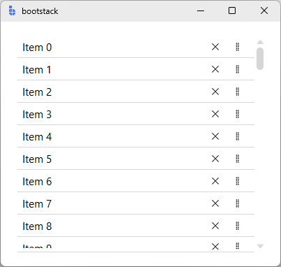
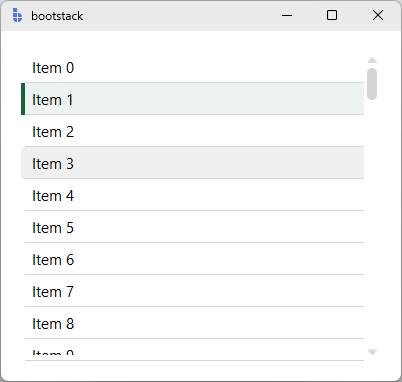

# ListView

`ListView` is a **virtual scrolling list** for displaying large datasets efficiently.

It renders only the visible rows (plus a small overscan), making it suitable for thousands of records while still supporting selection, deletion, dragging, and custom row layouts.

---

## Quick start

```python
import bootstack as bs

app = bs.App(size=(400, 350))

files = [
    {
        "id": i,
        "title": f"Item {i}",
        "text": f"This is the description of item {i}",
        "caption": f"Created: 2024-0{(i % 9) + 1}-{(i % 28) + 1:02d}"
    }
    for i in range(1000)
]

lv = bs.ListView(
    app,
    items=files,
    show_separator=True,
    selection_mode="single",
)
lv.pack(fill="both", expand=True, padx=20, pady=20)

app.mainloop()
```

<div class="app-window">
    
</div>

---

## When to use

Use `ListView` when:

- you need to display a long list efficiently (virtual scrolling)
- rows can include rich content (icon/title/text/badge)
- you need selection, deletion, or drag reordering

### Consider a different control when...

- **Data is strongly column-based** — use [TableView](tableview.md)
- **Your data is hierarchical** — use [TreeView](treeview.md)
- **You have a small, static list** — a simple frame with labels may suffice

---

## Appearance

### Common display options

```python
lv = bs.ListView(
    app,
    items=data,
    striped=True,
    striped_background="background[+1]",
    show_separator=True,
    scrollbar_visibility="always",   # or 'never' (mousewheel only)
    density="compact",               # 'default' or 'compact'
)
```

<div class="app-window">
    
</div>


Use `show_chevron=True` for navigation-list patterns where each row implies drilling down:

```python
lv = bs.ListView(app, items=data, show_chevron=True)
```

<div class="app-window">
    
</div>

!!! link "See [Design System](../../design-system/index.md) for color tokens and theming guidelines."

---

## Examples & patterns

### Data model

`ListView` accepts either:

- `items=[...]` — a simple list of dicts, or
- `datasource=...` — a [DataSource](../../guides/datasource.md) implementing the `DataSourceProtocol`

#### Recognized fields

Records with an `id` field enable selection, deletion, and moving.

The default `ListItem` recognizes:

- `title` — main heading
- `text` — body text
- `caption` — small caption (hidden in `density="compact"`)
- `icon` — icon spec shown on the left
- `badge` — small text on the right

### Selection

`selection_mode` options: `"none"`, `"single"`, `"multi"`.

`select_on_click` defaults to `True` when `selection_mode` is `"single"` or `"multi"`.

```python
lv = bs.ListView(
    app,
    items=files,
    selection_mode="multi",  # or 'single'
    show_selection_controls=True,
    show_separator=True
)
```

<div class="app-window">
    
</div>

<div class="app-window">
    
</div>


### Removing and dragging

```python
lv = bs.ListView(
    app,
    items=data,
    enable_removing=True,
    enable_dragging=True,
)
```

<div class="app-window">
    
</div>

During a drag, an indicator line shows the drop position and the list auto-scrolls
when the cursor nears the top or bottom edge.

To persist a reorder, hook `<<ItemDragEnd>>` and read the index payload:

```python
def on_drag_end(event):
    if event.data["moved"]:
        save_order(
            record_id=event.data["id"],
            from_index=event.data["source_index"],
            to_index=event.data["target_index"],
        )

lv.on_item_drag_end(on_drag_end)
```

If the datasource implements `move_record`, `ListView` calls it before firing
`<<ItemDragEnd>>` and the `moved` flag reflects the result. `MemoryDataSource`
supports this out of the box.

### Selection appearance

```python
lv = bs.ListView(
    app,
    items=data,
    selection_mode="single",
    selected_background="primary",   # accent token for selected rows
    focus_color="primary",           # accent token for the focus ring
    enable_focus=True,               # allow keyboard focus on rows
    enable_hover=True,               # show hover state on rows
)
```

<div class="app-window">
    
</div>

### Custom datasource

For larger datasets — a database table, a paginated API, a filtered view — pass a
custom datasource instead of `items=`:

```python
lv = bs.ListView(app, datasource=my_source)
```

`ListView` calls the datasource on demand as the virtual window scrolls, so only the
visible page is ever materialized.

!!! link "See the [DataSource guide](../../guides/datasource.md)"
    The guide covers the built-in `MemoryDataSource`, `SqliteDataSource`, and
    `FileDataSource`, the filtering/sorting/pagination API, and how to implement a
    custom datasource (extending `BaseDataSource` or implementing the protocol
    directly).

---

## Behavior

### Events

```python
# <<SelectionChange>>: event.data is None — read selection via get_selected()
lv.on_selection_changed(lambda e: print(lv.get_selected()))

# <<ItemClick>>: event.data is the record dict
lv.on_item_click(lambda e: print("clicked:", e.data))
```

Available events:

- `<<SelectionChange>>` — selection changed; `event.data = None` (use `get_selected()`)
- `<<ItemClick>>` — row clicked; `event.data = dict` (the record, with `selected`,
  `focused`, `item_index` injected)
- `<<ItemDelete>>` — item removed; `event.data = dict` (the deleted record, with at
  least `id`)
- `<<ItemDeleteFail>>` — removal failed; `event.data = dict` (the record plus an
  `error: str` key)
- `<<ItemInsert>>` — item added via `lv.insert_item(...)`; `event.data = dict` (the
  inserted record, with `id` populated)
- `<<ItemUpdate>>` — item changed via `lv.update_item(...)`; `event.data = dict` (the
  patch dict, with `id`)
- `<<ItemDragStart>>` — `event.data = dict` (the record)
- `<<ItemDrag>>` — `event.data = dict` (record + `source_index`, `target_index`,
  `y_current`)
- `<<ItemDragEnd>>` — `event.data = dict` (record + `source_index`, `target_index`,
  `moved`, `y_start`, `y_end`)

All `on_*` methods return a bind ID for unsubscribing:

```python
bid = lv.on_selection_changed(on_sel)
lv.off_selection_changed(bid)
```

### Keyboard navigation

When `enable_focus=True` (the default), arrow keys navigate between rows:

| Key | Action |
|---|---|
| `<Down>` | Move focus to the next item; scrolls if needed |
| `<Up>` | Move focus to the previous item; scrolls if needed |
| `<Space>` | Activate the focused item (fires `<<ItemClick>>` and toggles selection in `single`/`multi` mode) |

Focus is tracked at the data layer (by record ID), so a focused record stays focused
even when its row widget is recycled during scroll.

Use `focus_color=` to set the indicator color, or `enable_focus=False` to disable
keyboard navigation.

### Runtime configuration

A handful of constructor parameters are also mutable at runtime via `.configure(...)`:

```python
lv.configure(selection_mode="multi")
lv.configure(scrollbar_visibility="never")
lv.configure(striped=True, striped_background="background[+1]")
```

Changing `selection_mode` rebuilds the row pool so rows pick up the new behavior.

### Public API

```python
lv.get_selected()              # list of selected record dicts
lv.clear_selection()
lv.select_all()                # multi mode only

lv.insert_item({"title": "New"})
lv.update_item(record_id, {"title": "Updated"})
lv.delete_item(record_id)

lv.scroll_to_top()
lv.scroll_to_bottom()

lv.reload()                    # refresh visible rows from the datasource

ds = lv.get_datasource()       # access the underlying DataSource
```

---

## Dynamic data

`ListView` has no signal binding for `items=`. Drive dynamic updates through the
widget API:

```python
lv = bs.ListView(app, items=[])

lv.insert_item({"title": "New item"})
lv.update_item(record_id, {"title": "Renamed"})
lv.delete_item(record_id)

lv.reload()                    # after external changes to the datasource
```

For bulk replacement, work with the datasource directly and refresh:

```python
ds = lv.get_datasource()
ds.set_data(new_list)          # MemoryDataSource only
lv.reload()
```

---

## Additional resources

### Related widgets

- [TableView](tableview.md) — tabular record display
- [TreeView](treeview.md) — hierarchical record display
- [ScrollView](../layout/scrollview.md) — scrolling containers

### Framework concepts

- [Data Tables](../../guides/data-tables.md) — when to pick TableView over ListView
- [Design System](../../design-system/index.md) — colors, typography, and theming
- [DataSource](../../guides/datasource.md) — data management with filtering, sorting, pagination

### API reference

- [`bootstack.ListView`](../../reference/widgets/ListView.md)