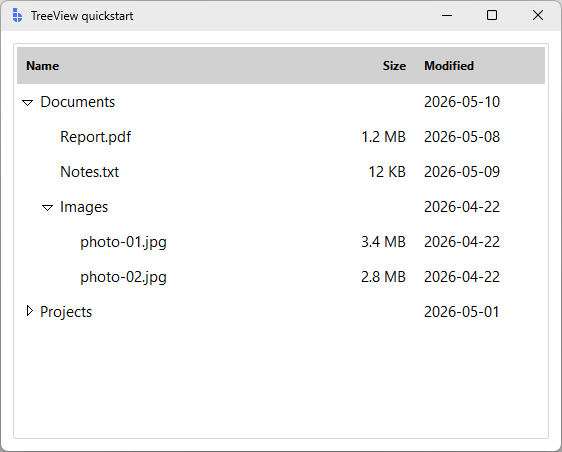
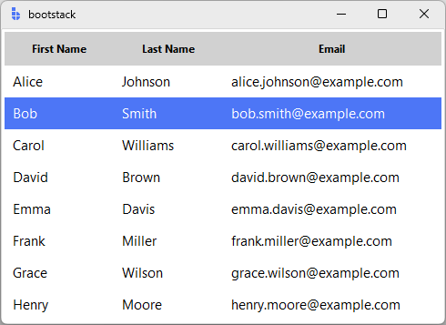
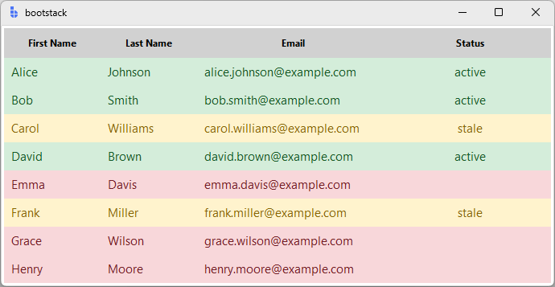

# TreeView

`TreeView` displays **hierarchical data** in an expandable tree structure.

It's the right choice for parent/child data (folders, categories, outlines) and
for tabular views that need **per-row color coding** — `tag_configure` lets you
map data values to background or foreground colors row by row, which the
high-density [TableView](tableview.md) does not support.

---

## Quick start

```python
import bootstack as bs

app = bs.App(title="TreeView quickstart", size=(560, 420))

tree = bs.TreeView(app, columns=("size", "modified"))

tree.heading("#0",       text="Name",     anchor="w")
tree.heading("size",     text="Size",     anchor="e")
tree.heading("modified", text="Modified", anchor="w")

tree.column("#0",       width=260, anchor="w")
tree.column("size",     width=90,  anchor="e", stretch=False)
tree.column("modified", width=130, anchor="w", stretch=False)

documents = tree.insert("", "end", text="Documents", open=True,  values=("",      "2026-05-10"))
tree.insert(documents, "end", text="Report.pdf",                 values=("1.2 MB", "2026-05-08"))
tree.insert(documents, "end", text="Notes.txt",                  values=("12 KB",  "2026-05-09"))

images = tree.insert(documents, "end", text="Images", open=True, values=("",       "2026-04-22"))
tree.insert(images, "end", text="photo-01.jpg",                  values=("3.4 MB", "2026-04-22"))
tree.insert(images, "end", text="photo-02.jpg",                  values=("2.8 MB", "2026-04-22"))

projects = tree.insert("", "end", text="Projects",               values=("",       "2026-05-01"))
tree.insert(projects, "end", text="bootstack",                   values=("",       "2026-05-11"))
tree.insert(projects, "end", text="experiments",                 values=("",       "2026-03-14"))

tree.pack(fill="both", expand=True, padx=12, pady=12)

app.mainloop()
```

<div class="app-window">
    
</div>

A few things worth noting in the example above:

- The tree column is identified by `"#0"`. Data columns are passed via `columns=`
  and referenced by the name you gave them.
- `open=True` on `insert` makes a parent start expanded.
- An item's first cell is its `text`; the rest come from `values` and map
  positionally onto `columns`.

---

## When to use

Use `TreeView` when:

- data has a natural hierarchy and users need to expand/collapse branches
- you need per-row color coding driven by data values (`tag_configure`)
- you need a simple tabular grid without TableView's toolbar, search, and
  pagination overhead

### Consider a different control when...

- data is flat, column-oriented, and benefits from sorting/filtering/search — use [TableView](tableview.md)
- data is a flat list of records with rich content (icon/title/text/badge) — use [ListView](listview.md)
- you only need to display a single value — use [Label](label.md) or [Badge](badge.md)

---

## Appearance

### Bootstack-specific options

| Option | Type | Purpose |
|---|---|---|
| `surface` | str | Surface token for the tree background. Inherited from the parent if omitted. |
| `density` | `"default"` \| `"compact"` | Row height, font, and padding profile. |
| `show_border` | bool | Draw a border around the widget (default `True`). |
| `border_color` | str | Color token for the border. Falls back to the surface border. |
| `select_background` | str | Color token for the selected-row highlight. Default `"primary"`. |
| `header_background` | str | Color token for the column header row. |
| `open_icon` / `close_icon` | str \| dict | Bootstrap Icon name used for the expand/collapse indicator. **Only applied on Tk < 8.6.13** — newer Tk versions use the native triangle indicator (see note below). |

```python
tree = bs.TreeView(
    app,
    density="compact",
    select_background="success[subtle]",
    header_background="background[+1]",
    show_border=True,
)
```

!!! note "Indicator icons on modern Tk"
    Tk 8.6.13 introduced a regression that prevents custom image elements from
    working with the user1/user2 states `TreeView` uses for open/closed
    indicators. On Tk ≥ 8.6.13, bootstack falls back to the native
    `Treeitem.indicator` triangle and `open_icon` / `close_icon` are ignored.

!!! link "See [Design System](../../design-system/index.md) for color tokens and theming guidelines."

### Standard ttk options

`bs.TreeView` is a thin wrapper around `ttk.Treeview`, so all the usual options
are available:

| Option | Purpose |
|---|---|
| `columns` | Sequence of data column identifiers (excludes the tree column `#0`) |
| `displaycolumns` | Subset and ordering of data columns to display, or `"#all"`. Refers to entries from `columns=` only — use `show` to hide the tree column |
| `show` | `"tree headings"` (default), `"tree"` (no headings), or `"headings"` (no tree column, gives you a plain table) |
| `selectmode` | `"browse"`, `"extended"`, or `"none"` |
| `height` | Number of visible rows |
| `padding` | Extra padding around the widget |

---

## Examples & patterns

### Building a tree

```python
tree = bs.TreeView(app)
tree.pack(fill="both", expand=True)

root = tree.insert("", "end", text="Documents", open=True)
tree.insert(root, "end", text="Report.pdf")
tree.insert(root, "end", text="Notes.txt")

subfolder = tree.insert(root, "end", text="Images")
tree.insert(subfolder, "end", text="photo.jpg")
```

`insert(parent, index, ...)` takes:

| Parameter | Purpose |
|---|---|
| `parent` | `""` for top level, or an existing item id |
| `index` | `"end"`, `0`, etc. |
| `text` | Label shown in the tree column |
| `values` | Tuple of values for the additional `columns` |
| `image` | Optional Tk image for the row |
| `tags` | Tuple of tag names (see [tag_configure](#per-row-color-with-tag_configure)) |
| `open` | `True` to start expanded |

### Headings-only (table layout)

Drop the tree column entirely to use TreeView as a lightweight table:

```python
tree = bs.TreeView(
    app,
    columns=("first", "last", "email"),
    show="headings",
    height=8,
)
tree.heading("first", text="First Name")
tree.heading("last",  text="Last Name")
tree.heading("email", text="Email")

tree.column("first", width=120)
tree.column("last",  width=120)
tree.column("email", width=240, stretch=True)

for row in records:
    tree.insert("", "end", values=row)
```

<div class="app-window">
    
</div>

For richer tables — search, pagination, sorting, export — reach for
[TableView](tableview.md) instead.

### Density

```python
tree = bs.TreeView(app, density="compact")   # tighter rows, smaller font
tree = bs.TreeView(app, density="default")   # standard sizing
```

### Per-row color with `tag_configure`

Tags are the primary reason to choose `TreeView` over `TableView` when row color
needs to reflect data:

```python
tree = bs.TreeView(app, columns=("status",))
tree.heading("status", text="Status")

tree.tag_configure("ok",      background="#d4edda", foreground="#155724")
tree.tag_configure("warning", background="#fff3cd", foreground="#856404")
tree.tag_configure("error",   background="#f8d7da", foreground="#721c24")

for record in records:
    tag = {"active": "ok", "stale": "warning"}.get(record["status"], "error")
    tree.insert("", "end", text=record["name"],
                values=(record["status"],), tags=(tag,))
```

<div class="app-window">
    
</div>

Tags can also drive per-row events:

```python
tree.tag_bind("error", "<Double-1>", on_error_row_double_click)
```

!!! link "See [Data Tables](../../guides/data-tables.md) for guidance on when to use TreeView vs TableView."

### Reading and writing cells

```python
# Get the full item record (dict with text, values, tags, image, open)
data = tree.item(item_id)

# Update a single column by name
tree.set(item_id, "size", "2.4 MB")

# Read a single column
size = tree.set(item_id, "size")

# Replace the whole row
tree.item(item_id, text="renamed.pdf", values=("4.0 MB", "2026-05-11"))
```

---

## Behavior

### Events

```python
tree.bind("<<TreeviewSelect>>", lambda e: print("selected:", tree.selection()))
tree.bind("<<TreeviewOpen>>",   lambda e: print("expanded:",  tree.focus()))
tree.bind("<<TreeviewClose>>",  lambda e: print("collapsed:", tree.focus()))
```

| Event | When it fires |
|---|---|
| `<<TreeviewSelect>>` | Selection changes. Read it with `tree.selection()`. |
| `<<TreeviewOpen>>` | A branch is expanded. The current focus is the opened item. |
| `<<TreeviewClose>>` | A branch is collapsed. The current focus is the closed item. |

These are standard `ttk.Treeview` virtual events — `TreeView` does not add any
extra `on_*` helpers, so use `bind()` directly.

### Selection

```python
selected = tree.selection()                     # tuple of item ids
tree.selection_set(item_id)                     # replace selection
tree.selection_add(item_id, other_id)           # extend
tree.selection_remove(item_id)                  # drop from selection
tree.selection_toggle(item_id)                  # toggle
```

`selectmode` controls how the user can change selection from the keyboard or
mouse:

- `"browse"` — exactly one item is always selected (default).
- `"extended"` — Shift/Ctrl multi-select.
- `"none"` — user interaction can't change the selection; programmatic only.

### Item operations

```python
tree.item(item_id, open=True)               # expand
tree.item(item_id, open=False)              # collapse

tree.move(item_id, parent_id, index)        # reparent / reorder
tree.delete(item_id, other_id)              # remove one or more items
tree.detach(item_id)                        # remove from view, keep in widget
tree.reattach(item_id, parent_id, index)    # put a detached item back

tree.parent(item_id)                        # parent id ("" for top level)
tree.get_children(item_id)                  # tuple of child ids ("" for roots)
tree.next(item_id) / tree.prev(item_id)     # sibling navigation
tree.exists(item_id)                        # True/False
```

### Navigation and hit-testing

```python
tree.see(item_id)                # scroll item into view
tree.focus(item_id)               # set the focused item
focused = tree.focus()            # read the focused item id

tree.identify_row(y)              # item id at y-coordinate
tree.identify_column(x)           # column id at x-coordinate ("#0", "#1", ...)
tree.bbox(item_id, column="size") # (x, y, w, h) of a specific cell
```

---

## Reactivity

`TreeView` has no signal binding — data is managed imperatively. To re-render
after a data change, clear and rebuild (or use the `move`/`set`/`delete` calls
above for incremental updates):

```python
for item in tree.get_children():
    tree.delete(item)

for record in new_data:
    tree.insert("", "end", text=record["name"])
```

For very large or paginated data, prefer [ListView](listview.md) (virtual
scrolling, datasource protocol) or [TableView](tableview.md) (SQLite-backed
datasource, built-in pagination).

---

## Additional resources

### Related widgets

- [TableView](tableview.md) — high-density tabular records with toolbar and pagination
- [ListView](listview.md) — virtual scrolling list with rich row content
- [ScrollView](../layout/scrollview.md) — scrolling containers

### Framework concepts

- [Data Tables](../../guides/data-tables.md) — TreeView vs TableView guidance
- [Design System](../../design-system/index.md) — colors, typography, and theming
