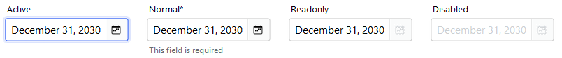
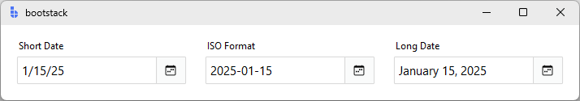
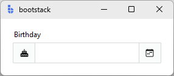
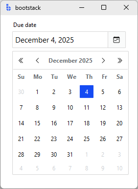

---
title: DateEntry
---

# DateEntry

`DateEntry` is a form-ready calendar date input that combines a text field with a picker popup.

It behaves like other v2 entry controls (message, validation, localization, events), while making date entry fast and consistent
using a calendar picker when needed. If you are building forms or dialogs, `DateEntry` is usually your **default date input**.

<figure markdown>

</figure>

---

## Quick start

```python
import bootstack as bs

app = bs.App()

due = bs.DateEntry(
    app,
    label="Due date",
    value="2025-12-31",
    message="Pick a date or type one",
)
due.pack(fill="x", padx=20, pady=10)

app.mainloop()
```

---

## When to use

Use `DateEntry` when:

- users need to enter calendar dates reliably

- you want both typing and a picker UI

- validation and formatting should be consistent with other field controls

Consider a different control when:

- you need time-of-day input — use [TimeEntry](timeentry.md)

- the value is "date-like" but not an actual calendar date — use [TextEntry](textentry.md)

- date selection should be modal (dialog-based) — use [DateDialog](../dialogs/datedialog.md)

---

## Appearance

### `accent`

```python
bs.DateEntry(app, label="Due date")  # primary (default)
bs.DateEntry(app, label="Due date", accent="secondary")
bs.DateEntry(app, label="Due date", accent="success")
bs.DateEntry(app, label="Due date", accent="warning")
```

!!! link "Design System"
    For a complete list of available colors and styling options, see the [Design System](../../design-system/index.md) documentation.

---

## Examples and patterns

### Value model

DateEntry uses the standard **text vs committed value** model.

| Concept | Meaning |
|---|---|
| Text | Raw, editable string while focused |
| Value | Parsed/validated date committed on blur, Enter, or picker selection |

```python
current = due.value
raw = due.get()
```

!!! tip "Commit semantics"
    Parsing, validation, and `value_format` are applied when the value is committed
    (blur/Enter or picker selection), not while typing.

### Common options

#### Formatting: `value_format`

Commit-time formatting shared with other field controls:

```python
bs.DateEntry(app, label="Short Date", value="March 14, 1981", value_format="shortDate").pack()
bs.DateEntry(app, label="ISO Format", value="2025-01-15", value_format="yyyy-MM-dd").pack()
```

<figure markdown>

</figure>

See [Guides → Formatting](../../guides/formatting.md) for all date presets and custom ICU patterns.

#### Add-ons

```python
d = bs.DateEntry(app, label="Birthday")
d.insert_addon(bs.Label, position="before", icon="cake-fill")
```

<figure markdown>

</figure>

### Events

DateEntry emits the standard field events:

- `<<Input>>` / `on_input`

- `<<Changed>>` / `on_changed`

- `<<Valid>>`, `<<Invalid>>`, `<<Validated>>`

```python
def handle_changed(event):
    print("changed:", event.data)

due.on_changed(handle_changed)
```

!!! tip "Live typing vs commit"
    Use `on_input(...)` for live typing, and `on_changed(...)` for committed values.

### Validation

Common validation patterns:

- required date

- not in the past

- within a window (e.g., next 90 days)

```python
d = bs.DateEntry(app, label="Date", required=True)
d.add_validation_rule("required", message="A date is required")
```

---

## Behavior

### Picker behavior

- Click the calendar button — opens the picker

- Click a day — commits the date and closes the popup

- Escape — closes the popup without committing

<figure markdown>

</figure>

---

## Localization

`DateEntry` supports locale-aware date formatting through the `value_format` option. Dates are displayed according to the current locale's conventions (date order, separators, month names).

!!! link "Localization"
    For complete localization configuration and supported formats, see the [Localization](../../guides/localization.md) documentation.

---

## Reactivity

`DateEntry` integrates with the signals system for reactive data binding. Changes to the field value can automatically propagate to other parts of your application.

!!! link "Signals"
    For details on reactive patterns and data binding, see the [Signals](../../guides/reactivity.md) documentation.

---

## Additional resources

### Related widgets

- [TimeEntry](timeentry.md) — time input control
- [TextEntry](textentry.md) — general field control with validation and formatting
- [DateDialog](../dialogs/datedialog.md) — modal date selection
- [Calendar](../selection/calendar.md) — standalone calendar widget
- [Form](../forms/form.md) — build forms from field definitions

### Framework concepts

- [Formatting](../../guides/formatting.md) — date presets and custom patterns
- [Localization](../../guides/localization.md) — internationalization and formatting
- [Signals](../../guides/reactivity.md) — reactive data binding

### API reference

- [`bootstack.DateEntry`](../../reference/widgets/DateEntry.md)