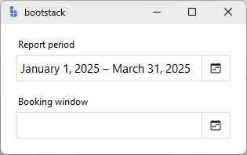

# DateEntry

`DateEntry` is a form-ready calendar date input that combines a text field with a picker popup. It supports both single-date and date-range selection.

It behaves like other entry controls (message, validation, localization, events), while making date entry fast and consistent using a calendar picker when needed.

---

## Quick start

```python
import bootstack as bs

app = bs.App()

due = bs.DateEntry(
    app,
    label="Due date",
    value="2025-12-31",
    message="Pick a date or type one",
)
due.pack(fill="x", padx=20, pady=10)

app.mainloop()
```

<div class="app-window">
    
</div>

---

## When to use

Use `DateEntry` when:

- users need to enter calendar dates reliably
- you want both typing and a picker UI in a single field
- you need a start/end date range in a compact field (`selection_mode='range'`)
- validation and formatting should be consistent with other field controls

Consider a different control when:

- you need time-of-day input — use [TimeEntry](timeentry.md)
- the value is "date-like" but not an actual calendar date — use [TextEntry](textentry.md)
- you need a standalone calendar embed — use [Calendar](../selection/calendar.md)
- date selection should be a standalone modal — use [DateDialog](../dialogs/datedialog.md)

---

## Appearance

### `accent`

```python
bs.DateEntry(app, label="Due date")                    # primary (default)
bs.DateEntry(app, label="Due date", accent="secondary")
bs.DateEntry(app, label="Due date", accent="success")
bs.DateEntry(app, label="Due date", accent="warning")
```

Use `density='compact'` for dense form layouts:

```python
bs.DateEntry(app, label="Date", density="compact")
```

!!! link "See [Design System](../../design-system/index.md) for a complete list of available colors and styling options."

---

## Examples and patterns

### Value model

| Concept | Meaning |
|---|---|
| Text | Raw, editable string while focused |
| Value | Parsed/validated date committed on blur, Enter, or picker selection |

```python
current = due.value   # date in single mode; tuple[date, date] in range mode
raw = due.get()       # raw display text
```

!!! tip "Commit semantics"
    In single mode, parsing, validation, and `value_format` are applied when the value is committed (blur/Enter or picker selection), not while typing. In range mode the field is readonly so the picker is the only path.

### Common options

#### Formatting: `value_format`

```python
bs.DateEntry(
    app, 
    label="Short Date", 
    value="2025-01-15", 
    value_format="shortDate"
)
bs.DateEntry(
    app, 
    label="ISO Format", 
    value="2025-01-15", 
    value_format="yyyy-MM-dd"
)
bs.DateEntry(
    app, 
    label="Long Date",  
    value="2025-01-15", 
    value_format="longDate"
)
```

<div class="app-window">
    
</div>

!!! link "See [Formatting](../../guides/formatting.md) for all date presets and custom ICU patterns."

#### `state`

```python
due = bs.DateEntry(app, label="Due date", state="disabled")

due.disable()       # prevent input
due.enable()        # restore input
due.readonly(True)  # allow reading, block editing
```

#### Picker options

Use `show_picker_button=False` to hide the calendar button when only typed input is needed:

```python
bs.DateEntry(app, label="Date", show_picker_button=False)
```

Customise the picker dialog title and first weekday:

```python
bs.DateEntry(
    app,
    label="Start date",
    picker_title="Select a start date",
    picker_first_weekday=0,   # 0 = Monday, 6 = Sunday (default)
)
```

### Range selection

Set `selection_mode='range'` to collect a start/end date pair in a single field. The field becomes readonly and displays the formatted range; clicking anywhere on it (or the calendar button) opens a dual-month picker.

```python
bs.DateEntry(
    app,
    label="Report period",
    selection_mode="range",
    start_date=date(2025, 1, 1),
    end_date=date(2025, 3, 31),
)

bs.DateEntry(
    app,
    label="Booking window",
    selection_mode="range",
    value_format="shortDate",
    min_date=date.today(),
)
```

<div class="app-window">
    
</div>


`value` returns a `tuple[date, date]` when both dates are picked, or `None` if the user has not yet made a selection:

```python
val = period.value
if val:
    start, end = val
    print(f"From {start} to {end}")
```

The range is displayed using the same `value_format` applied to each date individually, joined by an en-dash — e.g. `"January 1, 2025 – March 31, 2025"`. Provide an initial range via `start_date` and `end_date`:

```python
bs.DateEntry(
    app,
    label="Subscription period",
    selection_mode="range",
    start_date="2025-01-01",
    end_date="2025-12-31",
    value_format="shortDate",
)
```

#### Range picker behavior

- Click the calendar button — opens a dual-month picker
- Click a start date, then an end date — commits the range and closes
- Clicking again after a complete range resets and starts a new selection

### Date constraints

Use `min_date`, `max_date`, and `disabled_dates` to restrict which dates can be picked. These apply in both single and range mode.

```python
from datetime import date

bs.DateEntry(
    app,
    label="Appointment",
    min_date=date.today(),           # no past dates
)

bs.DateEntry(
    app,
    label="Fiscal year end",
    min_date=date(2025, 1, 1),
    max_date=date(2025, 12, 31),
)

bs.DateEntry(
    app,
    label="Booking",
    disabled_dates=[date(2025, 12, 25), date(2026, 1, 1)],
)
```

### Add-ons

```python
d = bs.DateEntry(app, label="Birthday")

d.insert_addon(
    bs.Label, 
    position="before", 
    icon="cake-fill", 
    name="icon"
)
```

<div class="app-window">
    
</div>


!!! link "See [TextEntry — Add-ons](textentry.md#add-ons) for the full add-on API."

### Events

**Change events** — callback receives a Tkinter event object:

```python
def on_change(event):
    print("value:", event.data["value"])
    # single mode: date object
    # range mode:  tuple[date, date] or None

due.on_input(on_change)    # <<Input>>  — live typing (single mode only)
due.on_changed(on_change)  # <<Change>> — committed (blur, Enter, picker, or range pick)
```

**Validation events** — callback receives a plain dict:

```python
def on_result(data):
    print("valid:", data["is_valid"])

due.on_valid(on_result)      # <<Valid>>
due.on_invalid(on_result)    # <<Invalid>>
due.on_validated(on_result)  # <<Validate>> — fires after any validation
```

### Validation

```python
d = bs.DateEntry(app, label="Date", required=True)
```

Use `required=True` to add the required rule. Add custom rules for business logic:

```python
from datetime import date

d.add_validation_rule("custom",
    func=lambda v: (v >= date.today(), "Date must be today or in the future"))
```

---

## Behavior

### Picker behavior

- Click the calendar button — opens the picker
- Click a day — commits the date and closes the popup
- Escape — closes the popup without committing

<div class="app-window">
    
</div>

---

## Localization

`DateEntry` supports locale-aware date formatting. The `value_format` option controls display format; dates adapt automatically to locale conventions (date order, separators, month names). In range mode the same format is applied to each date in the range.

Labels and messages are also localized when localization is active.

!!! link "See [Localization](../../guides/localization.md) for setup and language switching."

---

## Reactivity

```python
start = bs.Signal(None)
entry = bs.DateEntry(app, label="Start date", textsignal=start)
```

!!! link "See [Reactivity](../../guides/reactivity.md) for signal patterns and data binding."

---

## Additional resources

### Related widgets

- [TimeEntry](timeentry.md) — time input control
- [TextEntry](textentry.md) — general field control with validation and formatting
- [DateDialog](../dialogs/datedialog.md) — modal date selection
- [Calendar](../selection/calendar.md) — standalone calendar widget
- [Form](../forms/form.md) — build forms from field definitions

### Framework concepts

- [Formatting](../../guides/formatting.md) — date presets and custom patterns
- [Localization](../../guides/localization.md) — internationalization and formatting
- [Reactivity](../../guides/reactivity.md) — reactive data binding

### API reference

- [`bootstack.DateEntry`](../../reference/widgets/DateEntry.md)