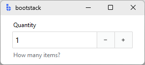
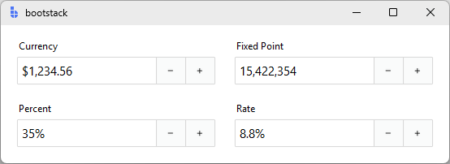
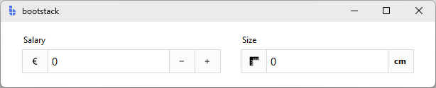

# NumericEntry

`NumericEntry` is a form-ready numeric input control that combines a **label**, **numeric field**, and **message region**.

It adds the behavior you almost always need for numeric data: bounds, stepping, formatting, validation, localization, and
consistent field events. If you are building forms or dialogs, `NumericEntry` is usually your **default numeric input**.

---

## Quick start

```python
import bootstack as bs

app = bs.App()

qty = bs.NumericEntry(
    app,
    label="Quantity",
    value=1,
    minvalue=0,
    maxvalue=999,
    increment=1,
    message="How many items?",
)
qty.pack(fill="x", padx=20, pady=10)

app.mainloop()
```

<div class="app-window">
    
</div>

---

## When to use

Use `NumericEntry` when:

- users type numbers and you want reliable parsing + validation
- bounds and stepping help prevent errors
- you want locale-aware display formatting on commit

### Consider a different control when...

- stepping is the primary interaction (visible step buttons matter) — use [SpinnerEntry](spinnerentry.md)
- users adjust by feel and live feedback matters — use [Scale](scale.md)
- you need the lowest-level spinbox primitive with full Tk option access — use [Spinbox](../primitives/spinbox.md)

---

## Appearance

### `accent`

```python
bs.NumericEntry(app, label="Quantity") # primary (default)
bs.NumericEntry(app, label="Quantity", accent="secondary")
bs.NumericEntry(app, label="Quantity", accent="success")
bs.NumericEntry(app, label="Quantity", accent="warning")
```

Use `density='compact'` for dense form layouts:

```python
bs.NumericEntry(app, label="Qty", density="compact")
```

!!! link "See [Design System](../../design-system/index.md) for a complete list of available colors and styling options."

---

## Examples and patterns

### Value model

All entry-based field controls separate **what the user is typing** from the **committed value**.

| Concept | Meaning |
|---|---|
| Text | Raw, editable string while focused |
| Value | Parsed/validated value committed on blur or Enter |

```python
current = qty.value      # committed value (int or float)
raw = qty.get()          # raw text at any time

qty.value = 42
```

!!! tip "Commit semantics"
    Parsing, validation, and `value_format` are applied **only when the value is committed**
    (blur/Enter), never on every keystroke.

### Common options

#### Bounds: `minvalue` / `maxvalue`

```python
age = bs.NumericEntry(app, label="Age", value=25, minvalue=0, maxvalue=120)
```

#### Stepping: `increment`

```python
price = bs.NumericEntry(
    app, 
    label="Unit Price", 
    value=9.99, 
    minvalue=0, 
    maxvalue=10000, 
    increment=0.01
)
```

Stepping is triggered by spin buttons, Up/Down arrow keys, and the mouse wheel.

#### `wrap`

By default values clamp at the min/max. Set `wrap=True` to cycle through the range.

```python
pct = bs.NumericEntry(
    app, 
    label="Percent", 
    value=50, 
    minvalue=0, 
    maxvalue=100, 
    increment=5, 
    wrap=True
)
```

#### Spin buttons: `show_spin_buttons`

```python
qty = bs.NumericEntry(app, label="Quantity", value=1, show_spin_buttons=False)
```

#### Formatting: `value_format`

Commit-time, locale-aware formatting using named presets, precision dicts, or custom ICU patterns:

```python
bs.NumericEntry(
    app,
    label="Currency",
    value=1234.56,
    value_format="currency",
)

bs.NumericEntry(
    app,
    label="Fixed Point",
    value=15422354,
    value_format="fixedPoint",
)

bs.NumericEntry(
    app,
    label="Percent",
    value=0.35,
    value_format="percent",
)

# value format precision control
bs.NumericEntry(
    app,
    label="Rate",
    value=0.0875,
    value_format={"type": "percent", "precision": 1}
)
```

<div class="app-window">
    
</div>


!!! link "See [Formatting](../../guides/formatting.md) for all number presets, precision control, and custom patterns."

#### `state`

```python
field = bs.NumericEntry(app, label="Amount", state="disabled")

field.disable()         # prevent input
field.enable()          # restore input
field.readonly(True)    # allow reading, block editing
```

### Events

`NumericEntry` emits two groups of events with different callback shapes.

**Change events** — callback receives a Tkinter event object:

```python
def on_change(event):
    print("value:", event.data["value"])

qty.on_input(on_change)    # <<Input>>  — fires on each keystroke
qty.on_changed(on_change)  # <<Change>> — fires on commit
```

**Step events** — also receive a Tkinter event object:

```python
def on_step(event):
    print("stepped to:", event.data["value"])

qty.on_increment(on_step)   # <<Increment>> — step-up fired
qty.on_decrement(on_step)   # <<Decrement>> — step-down fired
```

**Validation events** — callback receives a plain dict:

```python
def on_result(data):
    print("valid:", data["is_valid"], "value:", data["value"])

qty.on_valid(on_result)      # <<Valid>>    — validation passed
qty.on_invalid(on_result)    # <<Invalid>>  — validation failed
qty.on_validated(on_result)  # <<Validate>> — fires after any validation
```

All `on_*` methods return a bind ID for unsubscribing:

```python
bid = qty.on_changed(on_change)
qty.off_changed(bid)
```

### Programmatic stepping

Use `step(n)` to move by an arbitrary number of increments:

```python
qty.step(3)   # step up 3 increments
qty.step(-1)  # step down 1 increment
```

### Validation

```python
qty = bs.NumericEntry(app, label="Quantity", minvalue=0, maxvalue=999, required=True)
```

Use `required=True` to add the required rule at construction. Add additional rules for business logic:

```python
qty.add_validation_rule("custom",
    func=lambda v: (v % 5 == 0, "Must be a multiple of 5"))
```

---

## Add-ons

`NumericEntry` supports prefix and suffix add-ons via `insert_addon`. Pass `name=` to retrieve them later.

```python
salary = bs.NumericEntry(app, label="Salary")
salary.insert_addon(bs.Label, position="before", icon="currency-euro", name="icon")

size = bs.NumericEntry(app, label="Size", show_spin_buttons=False)
size.insert_addon(bs.Label, position="after", text="cm", name="unit")
```

<div class="app-window">
    
</div>

!!! link "See [TextEntry — Add-ons](textentry.md#add-ons) for the full add-on API including state inheritance and retrieval."

---

## Reactivity

Bind a signal to keep the field value in sync with other parts of your application:

```python
budget = bs.Signal(0.0)
entry = bs.NumericEntry(app, label="Budget", textsignal=budget)

budget.subscribe(lambda v: print("budget changed:", v))
```

---

## Additional resources

### Related widgets

- [TextEntry](textentry.md) — general field control with validation and formatting
- [SpinnerEntry](spinnerentry.md) — stepped field control
- [Spinbox](../primitives/spinbox.md) — low-level stepper primitive
- [Scale](scale.md) — slider-based numeric adjustment
- [Form](../forms/form.md) — build forms from field definitions

### Framework concepts

- [Formatting](../../guides/formatting.md) — number presets, precision, and custom patterns
- [Localization](../../guides/localization.md) — internationalization and formatting
- [Reactivity](../../guides/reactivity.md) — reactive data binding

### API reference

- [`bootstack.NumericEntry`](../../reference/widgets/NumericEntry.md)