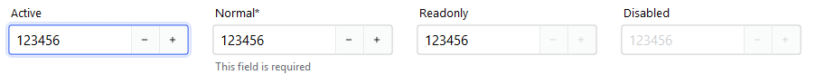

# NumericEntry

`NumericEntry` is a form-ready numeric input control that combines a **label**, **numeric field**, and **message region**.

It adds the behavior you almost always need for numeric data: bounds, stepping, formatting, validation, localization, and
consistent field events. If you are building forms or dialogs, `NumericEntry` is usually your **default numeric input**.

<figure markdown>

</figure>

---

## Quick start

```python
import bootstack as bs

app = bs.App()

qty = bs.NumericEntry(
    app,
    label="Quantity",
    value=1,
    minvalue=0,
    maxvalue=999,
    increment=1,
    message="How many items?",
)
qty.pack(fill="x", padx=20, pady=10)

app.mainloop()
```

---

## When to use

Use `NumericEntry` when:

- users type numbers and you want reliable parsing + validation

- bounds and stepping help prevent errors

- you want locale-aware display formatting on commit

Consider a different control when:

- stepping is the primary interaction (visible step buttons matter) — use [SpinnerEntry](spinnerentry.md)

- users adjust by feel and live feedback matters — use [Scale](scale.md)

- you need the lowest-level ttk spinbox behavior and options — use [Spinbox](../primitives/spinbox.md)

---

## Appearance

### `accent`

```python
bs.NumericEntry(app, label="Quantity")  # primary (default)
bs.NumericEntry(app, label="Quantity", accent="secondary")
bs.NumericEntry(app, label="Quantity", accent="success")
bs.NumericEntry(app, label="Quantity", accent="warning")
```

!!! link "Design System"
    For a complete list of available colors and styling options, see the [Design System](../../design-system/index.md) documentation.

---

## Examples and patterns

### Value model

All Entry-based field controls separate **what the user is typing** from the **committed value**.

| Concept | Meaning |
|---|---|
| Text | Raw, editable string while focused |
| Value | Parsed/validated value committed on blur or Enter |

```python
current = qty.value      # committed value (usually int/float)
raw = qty.get()          # raw text at any time

qty.value = 42
```

!!! tip "Commit semantics"
    Parsing, validation, and `value_format` are applied **only when the value is committed**
    (blur/Enter), never on every keystroke.

### Common options

#### Bounds: `minvalue` / `maxvalue`

```python
age = bs.NumericEntry(app, label="Age", value=25, minvalue=0, maxvalue=120)
```

#### Stepping: `increment`

Stepping is supported via:

- spin buttons (if enabled)

- Up/Down arrow keys

- mouse wheel (platform-dependent)

```python
price = bs.NumericEntry(
    app,
    label="Unit Price",
    value=9.99,
    minvalue=0,
    maxvalue=10000,
    increment=0.01,
)
```

#### `wrap`

- default behavior clamps at the min/max

- set `wrap=True` to cycle through the range

```python
percent = bs.NumericEntry(
    app,
    label="Percent",
    value=50,
    minvalue=0,
    maxvalue=100,
    increment=5,
    wrap=True,
)
```

#### Spin buttons: `show_spin_buttons`

```python
field = bs.NumericEntry(app, label="Quantity", value=1, show_spin_buttons=False)
```

#### Formatting: `value_format`

Commit-time, locale-aware formatting:

```python
bs.NumericEntry(app, label="Currency", value=1234.56, value_format="currency").pack()
bs.NumericEntry(app, label="Fixed Point", value=15422354, value_format="fixedPoint").pack()
bs.NumericEntry(app, label="Percent", value=0.35, value_format="percent").pack()
```

<figure markdown>

</figure>

See [Guides → Formatting](../../guides/formatting.md) for all number presets, precision control, and custom patterns.

### Events

`NumericEntry` emits standard field events:

- `<<Input>>` / `on_input` — live typing

- `<<Changed>>` / `on_changed` — committed value changed

- `<<Valid>>`, `<<Invalid>>`, `<<Validated>>` — validation lifecycle

It also emits step intent events:

- `<<Increment>>` / `on_increment`

- `<<Decrement>>` / `on_decrement`

```python
def handle_changed(event):
    print("changed:", event.data)

qty.on_changed(handle_changed)

def handle_increment(event):
    print("increment requested")

qty.on_increment(handle_increment)
```

!!! tip "Live typing"
    Use `on_input(...)` for live UX (previews), and `on_changed(...)` for committed values.

### Validation

Use numeric options for guardrails:

- `minvalue` / `maxvalue` for bounds

- `increment` for step size

Use validation rules for business logic:

```python
qty = bs.NumericEntry(app, label="Quantity", minvalue=0, maxvalue=999, required=True)
qty.add_validation_rule("required", message="Quantity is required")
```

---

## Behavior

### Add-ons

Like other field controls, `NumericEntry` supports prefix and suffix add-ons.

```python
salary = bs.NumericEntry(app, label="Salary")
salary.insert_addon(bs.Label, position="before", icon="currency-euro")

size = bs.NumericEntry(app, label="Size", show_spin_buttons=False)
size.insert_addon(bs.Label, position="after", text="cm", font="label[9]")
```

<figure markdown>

</figure>

---

## Localization

`NumericEntry` supports locale-aware number formatting through the `value_format` option. Formatting is applied at commit time, displaying numbers according to the current locale's conventions (decimal separators, grouping, currency symbols).

!!! link "Localization"
    For complete localization configuration and supported formats, see the [Localization](../../capabilities/localization.md) documentation.

---

## Reactivity

`NumericEntry` integrates with the signals system for reactive data binding. Changes to the field value can automatically propagate to other parts of your application.

!!! link "Signals"
    For details on reactive patterns and data binding, see the [Signals](../../capabilities/signals/signals.md) documentation.

---

## Additional resources

### Related widgets

- [TextEntry](textentry.md) — general field control with validation and formatting
- [SpinnerEntry](spinnerentry.md) — stepped field control
- [Spinbox](../primitives/spinbox.md) — low-level stepper primitive
- [Scale](scale.md) — slider-based numeric adjustment
- [Form](../forms/form.md) — build forms from field definitions

### Framework concepts

- [Formatting](../../guides/formatting.md) — number presets, precision, and custom patterns
- [Localization](../../capabilities/localization.md) — internationalization and formatting
- [Signals](../../capabilities/signals/signals.md) — reactive data binding

### API reference

- [`bootstack.NumericEntry`](../../reference/widgets/NumericEntry.md)