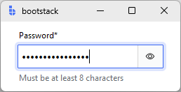

# PasswordEntry

`PasswordEntry` is a password input field with character masking and a built-in visibility toggle.

```python
import bootstack as bs

app = bs.App()

pwd = bs.PasswordEntry(
    app,
    label="Password",
    required=True,
    message="Must be at least 8 characters",
)
pwd.pack(fill="x", padx=20, pady=10)

app.mainloop()
```

<div class="app-window">
    
</div>

## When to use

Use `PasswordEntry` when:

- the input must not be displayed in clear text
- you want consistent form UX (label, message, validation, events)

### Consider a different control when...

- masking is not required — use [TextEntry](textentry.md)
- the input is a numeric PIN — use [TextEntry](textentry.md) with a `"pattern"` validation rule

## See also

**Examples:** [Login form](../../examples/forms/login.md) · [Registration form](../../examples/forms/registration.md) · [Password strength](../../examples/inputs/password-strength.md)  
**Guides:** [Forms & Input](../../guides/forms-and-input.md) · [Validation](../../guides/validation.md)  
**API reference:** [PasswordEntry](../../reference/widgets/passwordentry.md)

--8<-- "snippets/api/passwordentry.md"