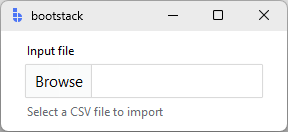

# PathEntry

`PathEntry` is a form-ready input control for selecting **files and folders**.

It combines a text field (type/paste paths) with a browse button (pick visually), while keeping the same label/message,
validation, and event model as other field controls.

---

## Quick start

```python
import bootstack as bs

app = bs.App()

path = bs.PathEntry(
    app,
    label="Input file",
    message="Select a CSV file to import",
)
path.pack(fill="x", padx=20, pady=10)

app.mainloop()
```

<div class="app-window">
    
</div>

---

## When to use

Use `PathEntry` when:

- users need to choose files/folders frequently
- you want both typing and browsing
- you want consistent field UX (message + validation)

### Consider a different control when...

- the value is not a filesystem path — use [TextEntry](textentry.md)
- you need a one-off selection with no persistent field — use a file dialog directly

---

## Examples and patterns

### Value model

| Concept | Meaning |
|---|---|
| Text | Raw text while editing |
| Value | Committed path after validation/commit |

```python
current = path.value
raw = path.get()

path.value = r"C:\data\input.csv"
```

Picker selections commit immediately. The raw dialog result is available via `path.dialog_result`.

### Dialog type: `dialog`

```python
bs.PathEntry(app, dialog="openfilename")   # choose existing file (default)
bs.PathEntry(app, dialog="directory")      # choose folder
bs.PathEntry(app, dialog="saveasfilename") # choose save-as path
bs.PathEntry(app, dialog="openfilenames")  # choose multiple files (returns list)
```

!!! note "`openfile` vs `openfilename`"
    `openfilename` returns a path string. `openfile` returns a file object. Use `openfilename` unless you specifically need a file handle.

### File type filters: `dialog_options`

```python
bs.PathEntry(
    app,
    label="Document",
    dialog="openfilename",
    dialog_options={
        "filetypes": [("PDF", "*.pdf"), ("Word Document", "*.docx"), ("All files", "*.*")],
        "title": "Select a document",
    },
)
```

Common `dialog_options` keys: `title`, `initialdir`, `initialfile`, `filetypes`, `defaultextension`.

`dialog` and `dialog_options` can also be changed at runtime:

```python
path.configure(dialog="directory")
path.configure(dialog_options={"title": "Choose output folder"})
```

### Button text: `button_text`

```python
bs.PathEntry(app, label="File",   button_text="Choose...")
bs.PathEntry(app, label="Folder", dialog="directory", button_text="Select Folder")

# Change at runtime
path.configure(button_text="Re-select...")
```

### `state`

```python
path = bs.PathEntry(app, label="File", state="disabled")

path.disable()       # prevent input and browsing
path.enable()        # restore
path.readonly(True)  # allow reading, block editing
```

### Add-ons

```python
p = bs.PathEntry(app, label="File")
p.insert_addon(bs.Button, position="after", text="Clear",
               command=lambda: setattr(p, "value", ""), name="clear")
```

!!! link "See [TextEntry — Add-ons](textentry.md#add-ons) for the full add-on API."

### Events

`PathEntry` emits `<<Change>>` from two distinct sources with different `event.data` shapes:

**Typed input** — bind directly on the widget via `widget.bind()`:

```python
def on_typed(event):
    print("typed path:", event.data["value"])
    print("previous:", event.data["prev_value"])

path.bind("<<Change>>", on_typed)
```

**Picker selection** — the composite-level `<<Change>>` carries the dialog result:

```python
def on_picked(event):
    print("picked path:", event.data["value"])
    print("dialog result:", event.data["dialog_result"])  # raw; tuple for multi-select

path.bind("<<Change>>", on_picked)
```

!!! note "`on_changed` and picker selections"
    `path.on_changed(callback)` only fires for typed-input commits — it binds to the inner text entry, not the composite. To receive both typed and picker changes, use `path.bind("<<Change>>", callback)` directly on the `PathEntry` instance.

**Validation events** — callback receives a plain dict:

```python
def on_result(data):
    print("valid:", data["is_valid"])

path.on_valid(on_result)
path.on_validated(on_result)
```

### Validation

Use `required=True` for required path fields. For existence and type checks, use a `"custom"` rule:

```python
import os

p = bs.PathEntry(app, label="Input file", required=True)

p.add_validation_rule("custom",
    func=os.path.isfile,
    message="File does not exist")

p.add_validation_rule("custom",
    func=lambda v: (v.endswith(".csv"), "Must be a CSV file"))
```

---

## Behavior

- Users can type or paste paths directly.
- Clicking the browse button opens the **OS-native file/folder chooser** — Windows Explorer on Windows, a Finder sheet on macOS, and the GTK file chooser on Linux. Its appearance is controlled by the OS, not by bootstack's theme.
- Picker selection commits the value immediately.
- For multi-file selection, paths are joined with `", "` for display; the raw result (list) is in `dialog_result`.

---

## Additional resources

### Related widgets

- [TextEntry](textentry.md) — general-purpose field control
- [SelectBox](../selection/selectbox.md) — choose from known values instead of browsing
- [Form](../forms/form.md) — build complete forms with path fields

### API reference

- [`bootstack.PathEntry`](../../reference/widgets/PathEntry.md)