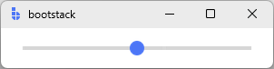

# Scale

`Scale` is a **direct-manipulation input control** for selecting a numeric value from a continuous range.

Unlike `NumericEntry`, which is optimized for precise typing, `Scale` is designed for **gesture-based adjustment** —
ideal for volume, zoom, thresholds, and any setting where users benefit from immediate visual feedback.

---

## Quick start

```python
import bootstack as bs

app = bs.App()

scale = bs.Scale(app, from_=0, to=100, value=50)
scale.pack(fill="x", padx=20, pady=10)

app.mainloop()
```

<div class="app-window">
    
</div>

---

## When to use

Use `Scale` when:

- users benefit from visual, continuous adjustment
- relative changes matter more than precision
- live feedback improves usability

### Consider a different control when...

- users must type exact values — use [NumericEntry](numericentry.md)
- values require strict validation — use [NumericEntry](numericentry.md)

---

## Appearance

### `orient`

```python
bs.Scale(app, from_=0, to=100, orient="horizontal")  # default
bs.Scale(app, from_=0, to=100, orient="vertical")
```

### `accent`

```python
bs.Scale(app, from_=0, to=100, accent="primary")
bs.Scale(app, from_=0, to=100, accent="success")
```

Use `length=` to set the track size in pixels:

```python
bs.Scale(app, from_=0, to=100, length=300)
```

!!! link "See [Design System](../../design-system/index.md) for customization options."

---

## Examples and patterns

### `from_`, `to`, `value`

```python
bs.Scale(app, from_=10, to=200)
bs.Scale(app, from_=0, to=100, value=25)
```

### Value access

Use the `value` property to read or set the current position:

```python
current = scale.value   # float
scale.value = 75.0
```

### Reacting to changes: `command=`

`Scale` notifies changes via the `command=` callback. The callback receives the new value as a **string** — convert explicitly when needed:

```python
def on_change(new_val):
    print("value:", float(new_val))

scale = bs.Scale(app, from_=0, to=100, command=on_change)
```

The `command=` fires continuously while the user drags. There is no separate "on release" event — if you only need the final committed value, read `scale.value` on a button press or form submit instead.

### Reactive binding: `signal=`

Bind a signal for reactive two-way sync with other widgets:

```python
volume = bs.Signal(50.0)
scale = bs.Scale(app, from_=0, to=100, signal=volume)

# Update a label reactively
volume.subscribe(lambda v: label.configure(text=f"{int(v)}%"))
```

`signal=` is the idiomatic approach when the value drives other UI state.

### Pairing with a value label

```python
value_label = bs.Label(app, text="50")

def on_change(new_val):
    value_label.configure(text=str(int(float(new_val))))

scale = bs.Scale(app, from_=0, to=100, value=50, command=on_change)
```

---

## Behavior

- Value changes are continuous while dragging.
- There is no step/increment constraint — `Scale` produces a continuous float.
- Keyboard: arrow keys move the thumb by a small amount; `Shift+Arrow` moves further.

!!! note "Planned: richer change API"
    `Scale` currently exposes `command=` (string callback) and `signal=` for change notification. A future API update may add `on_changed(callback)` with a normalized dict payload consistent with other input widgets.

---

## Additional resources

### Related widgets

- [NumericEntry](numericentry.md) — precise numeric input
- [SpinnerEntry](spinnerentry.md) — numeric stepping with typing
- [Progressbar](../data-display/progressbar.md) — displays progress, not user input
- [Meter](../data-display/meter.md) — displays proportional values

### API reference

- [`bootstack.Scale`](../../reference/widgets/Scale.md)