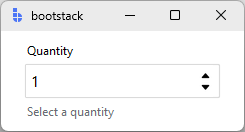
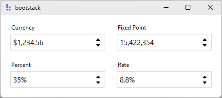
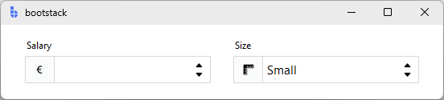

# SpinnerEntry

`SpinnerEntry` is a form-ready input control with integrated step buttons.

It operates in two modes: **numeric range** (bounded stepping between a min and max) and **value list** (cycling through
a fixed set of string options). Both modes support formatting, validation, localization, and consistent field events.

---

## Quick start

```python
import bootstack as bs

app = bs.App()

qty = bs.SpinnerEntry(
    app,
    label="Quantity",
    value=1,
    minvalue=0,
    maxvalue=10,
    increment=1,
    message="Select a quantity",
)
qty.pack(fill="x", padx=20, pady=10)

app.mainloop()
```

<div class="app-window">
    
</div>

---

## When to use

Use `SpinnerEntry` when:

- stepping is the primary interaction and visible step buttons improve UX
- users cycle through a small fixed list of options (sizes, priorities, directions)
- users frequently increment/decrement values

### Consider a different control when...

- users primarily type numbers and stepping is secondary — use [NumericEntry](numericentry.md)
- users adjust continuously by feel — use [Scale](scale.md)

---

## Examples and patterns

### Value model

SpinnerEntry uses the same **text vs committed value** model as other field controls.

```python
current = qty.value
raw = qty.get()

qty.value = 5
```

Commit-time parsing and formatting happens on blur or Enter.

### Numeric range mode

Use `minvalue`, `maxvalue`, and `increment` for bounded numeric stepping:

```python
# Integer stepping with bounds
qty = bs.SpinnerEntry(
    app, 
    label="Quantity", 
    value=1,
    minvalue=0, 
    maxvalue=100, 
    increment=1
)

# Float stepping
temp = bs.SpinnerEntry(
    app, 
    label="Temperature", 
    value=20.0,
    minvalue=-20.0, 
    maxvalue=50.0, 
    increment=0.5
)
```

Use `wrap=True` to cycle back to `minvalue` after reaching `maxvalue`:

```python
hour = bs.SpinnerEntry(
    app, 
    label="Hour", 
    value=12,
    minvalue=1, 
    maxvalue=12, 
    increment=1, 
    wrap=True
)
```

### Value list mode

Pass `values=` to cycle through a fixed set of string options:

```python
priority = bs.SpinnerEntry(
    app, 
    label="Priority",
    values=["Low", "Medium", "High", "Critical"],
    value="Medium"
)

size = bs.SpinnerEntry(
    app, 
    label="T-Shirt Size",
    values=["XS", "S", "M", "L", "XL", "XXL"]
)
```

The step buttons cycle forward and backward through the list. Typing is still allowed.

### `increment`

Controls step size in numeric mode.

```python
bs.SpinnerEntry(
    app, 
    label="Price", 
    value=9.99, 
    increment=0.01, 
    value_format="currency"
)
```

### Formatting: `value_format`

```python
bs.SpinnerEntry(
    app,
    label="Currency",
    value=1234.56,
    value_format="currency",
)

bs.SpinnerEntry(
    app,
    label="Fixed Point",
    value=15422354,
    value_format="fixedPoint",
)

bs.SpinnerEntry(
    app,
    label="Percent",
    value=0.35,
    value_format="percent",
)

bs.SpinnerEntry(
    app,
    label="Rate",
    value=0.0875,
    value_format={"type": "percent", "precision": 1}
)
```

<div class="app-window">
    
</div>

!!! link "See [Formatting](../../guides/formatting.md) for all number presets and custom patterns."

### `state`

```python
qty = bs.SpinnerEntry(app, label="Quantity", state="disabled")

qty.disable()       # prevent input
qty.enable()        # restore input
qty.readonly(True)  # allow reading, block editing
```

### Add-ons

```python
salary = bs.SpinnerEntry(app, label="Salary")
salary.insert_addon(bs.Label, position='before', icon='currency-euro')

size = bs.SpinnerEntry(app, label="Size", values=['Small', 'Med', 'Large'], value='Small')
size.insert_addon(bs.Button, position='before', icon='rulers')
```

<div class="app-window">
    
</div>

!!! link "See [TextEntry — Add-ons](textentry.md#add-ons) for the full add-on API."

### Events

**Change events** — callback receives a Tkinter event object:

```python
def on_change(event):
    print("new value:", event.data["value"])

qty.on_input(on_change)    # <<Input>>  — live typing
qty.on_changed(on_change)  # <<Change>> — committed value
```

**Validation events** — callback receives a plain dict:

```python
def on_result(data):
    print("valid:", data["is_valid"])

qty.on_valid(on_result)      # <<Valid>>
qty.on_invalid(on_result)    # <<Invalid>>
qty.on_validated(on_result)  # <<Validate>> — fires after any validation
```

### Validation

```python
limit = bs.SpinnerEntry(app, label="Retry limit", value=3,
                        minvalue=1, maxvalue=10, increment=1, required=True)
```

Use `required=True` to add the required rule. Additional business rules:

```python
limit.add_validation_rule("custom",
    func=lambda v: (v <= 5, "Maximum 5 retries recommended"))
```

---

## Behavior

SpinnerEntry supports stepping via:

- spin buttons
- Up/Down arrow keys
- mouse wheel (platform-dependent)

Typing is always allowed unless the field is set to readonly.

---

## Additional resources

### Related widgets

- [NumericEntry](numericentry.md) — validated numeric input with bounds
- [Spinbox](../primitives/spinbox.md) — low-level stepper primitive
- [TextEntry](textentry.md) — general field control
- [Scale](scale.md) — slider-based numeric adjustment
- [Form](../forms/form.md) — build forms from field definitions

### API reference

- [`bootstack.SpinnerEntry`](../../reference/widgets/SpinnerEntry.md)