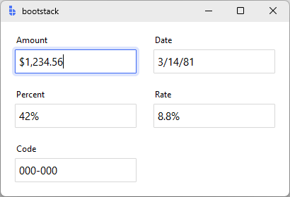
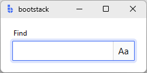

# TextEntry

`TextEntry` is a form-ready text input control that combines a **label**, **input field**, and **message region**.

It builds on `bs.Entry`, but adds the features you typically need in real applications: validation, messages, formatting,
localization, and consistent field events. If you're building forms or dialogs, `TextEntry` is usually your default text input.


---

## Quick start

```python
import bootstack as bs

app = bs.App()

name = bs.TextEntry(
    app,
    label="Name",
    message="Enter your full name",
    required=True,
)
name.pack(fill="x", padx=20, pady=10)

app.mainloop()
```

<div class="app-window">
    
</div>

---

## When to use

Use `TextEntry` when:

- you want a form-ready text field (label + message + validation)
- you want consistent events and commit semantics
- you want optional localization and formatting

Consider a different control when:

- you need the lowest-level `bs.Entry` behavior and options — use [Entry](../primitives/entry.md)
- you are building your own composite control — use [Entry](../primitives/entry.md)

---

## Appearance

### `accent`

```python
bs.TextEntry(app) # primary (default)
bs.TextEntry(app, accent="secondary")
bs.TextEntry(app, accent="success")
bs.TextEntry(app, accent="warning")
```

Use `density='compact'` for dense layouts such as toolbars or multi-column forms:

```python
bs.TextEntry(app, label="Search", density="compact")
```

!!! link "See [Design System](../../design-system/index.md) for a complete list of available colors and styling options."

---

## Examples and patterns

### Value model

Entry-based field controls separate **what the user is typing** from the **committed value**.

| Concept | Meaning |
|---|---|
| Text | Raw, editable string while the field is focused |
| Value | The committed value (after parsing/validation on blur or Enter) |

```python
current = name.value      # committed value
raw = name.get()          # raw text at any time

name.value = "Ada Lovelace"
```

!!! tip "Commit semantics"
    Parsing, validation, and `value_format` are applied only when the value is committed (blur or Enter),
    never on every keystroke.

### Common options

#### `label`, `message`, `required`

```python
bs.TextEntry(app, label="Email", message="We'll never share it.", required=True)
```

#### `state`

Set initial state at construction, or use the convenience methods at runtime:

```python
entry = bs.TextEntry(app, label="Notes", state="disabled")

entry.disable()         # prevent input
entry.enable()          # restore input
entry.readonly(True)    # allow reading, block editing
```

#### `value_format`

Commit-time formatting using named presets, precision dicts, or custom ICU patterns:

```python
# Named presets
bs.TextEntry(app, label="Amount",  value=1234.56,         value_format="currency").pack()
bs.TextEntry(app, label="Date",    value="March 14 1981", value_format="shortDate").pack()
bs.TextEntry(app, label="Percent", value=0.42,            value_format="percent").pack()

# Precision control via dict
bs.TextEntry(app, label="Rate", value=0.0875,
             value_format={"type": "percent", "precision": 1}).pack()

# Custom ICU pattern
bs.TextEntry(app, label="Code", value_format="000-000").pack()
```



!!! link "See [Formatting](../../guides/formatting.md) for all number, date, and time presets, dict options, and custom pattern syntax."

### Events

`TextEntry` emits virtual events with matching convenience methods. The two groups have different callback shapes:

**Change events** — callback receives a Tkinter event object:

```python
def on_change(event):
    print("value:", event.data["value"])      # committed value
    print("text:", event.data["text"])        # raw display string
    print("previous:", event.data["prev_value"])

name.on_input(on_change)    # <<Input>>  — fires on each keystroke
name.on_changed(on_change)  # <<Change>> — fires on commit (blur or Enter)
```

**Validation events** — callback receives a plain dict:

```python
def on_result(data):
    print("valid:", data["is_valid"])
    print("value:", data["value"])
    print("message:", data["message"])

name.on_valid(on_result)      # <<Valid>>    — validation passed
name.on_invalid(on_result)    # <<Invalid>>  — validation failed
name.on_validated(on_result)  # <<Validate>> — fires after any validation
```

All `on_*` methods return a bind ID. Pass it to the matching `off_*` to unsubscribe:

```python
bind_id = name.on_changed(on_change)
name.off_changed(bind_id)
```

!!! tip "Live typing vs committed values"
    Use `on_input` for live typing feedback (e.g. character count). Use `on_changed` when you only care about the final committed value.

### Validation

```python
email = bs.TextEntry(app, label="Email", required=True)
email.add_validation_rule("email", message="Enter a valid email address")
```

Available rule types: `"required"`, `"email"`, `"pattern"`, `"stringLength"`, `"compare"`, `"custom"`.

Validation results are reflected visually and via events.

```python
# Pattern rule
phone.add_validation_rule("pattern", pattern=r"^\d{3}-\d{4}$", message="Format: 555-1234")

# Length rule
bio.add_validation_rule("stringLength", min=10, max=500, message="10–500 characters")

# Custom rule
def check_username(value):
    return value.isalnum(), "Letters and numbers only"

username.add_validation_rule("custom", func=check_username)
```

!!! link "See [Forms & Input](../../guides/forms-and-input.md) for validation patterns, triggers, and cross-field rules."

---

## Add-ons

`insert_addon` places a widget inside the field container, to the left (`"before"`) or right (`"after"`) of the input. Add-ons share the field's focus ring and disable state automatically.

```python
# Icon label prefix
entry.insert_addon(bs.Label, position="before", icon="envelope")

# Action button suffix
entry.insert_addon(bs.Button, position="after", icon="x-circle", command=on_clear)
```


### Retrieving add-ons

Pass `name=` to register the add-on under a known key. Retrieve it later via `entry.addons`:

```python
search = bs.TextEntry(app, label="Search")
search.insert_addon(bs.Button, position="after", icon="search",
                    command=on_search, name="search-btn")

# Swap icon on state change
search.addons["search-btn"].configure(icon="x")
```

Without `name=`, the key is the widget's internal string representation — not stable enough to rely on.

### State inheritance

Add-ons automatically disable and re-enable with the field:

```python
search.disable()   # entry and search-btn both become disabled
search.enable()    # both restored
```

### Toggle add-ons

Use `bs.CheckToggle` as a toggle add-on. Pass `signal=` to link it to a reactive boolean value and `command=` to react on each toggle:

```python
app = bs.App()

search = bs.TextEntry(app, label="Find").pack(padx=16, pady=16)

case_sensitive = bs.Signal(True)

def toggle_case():
    print('Toggled:', case_sensitive.get())

search.insert_addon(
    bs.CheckToggle,
    position="after",
    text="Aa",
    name="case-btn",
    signal=case_sensitive,
    command=toggle_case,
)
```

<div class="app-window">
    
</div>

### Layout options

Use `pack_options=` to pass spacing arguments to the add-on's `pack()` call:

```python
entry.insert_addon(bs.Label, position="before", text="$",
                   pack_options={"padx": (6, 2)})
```

---

## Localization

If localization is enabled, any string passed as `label=`, `message=`, or `text=` is used as a gettext key and resolved through the active message catalog.

```python
bs.TextEntry(app, label="field.name", message="field.name.hint")
```

!!! link "See [Localization](../../guides/localization.md) for setup, domain configuration, and language switching."

---

## Reactivity

Bind a signal to keep the field value in sync with other parts of your application:

```python
username = bs.Signal("")

entry = bs.TextEntry(app, label="Username", textsignal=username)

# Read the current signal value anywhere
print(username.get())

# Drive the field from code
username.set("ada")
```

The `signal` property gives access to the underlying signal after construction:

```python
entry.signal.subscribe(lambda val: print("changed to:", val))
```

!!! link "See [Reactivity](../../guides/reactivity.md) for signal patterns and data binding."

---

## Additional resources

### Related widgets

- [Entry](../primitives/entry.md) — low-level primitive text input
- [NumericEntry](numericentry.md) — numeric input with bounds and stepping
- [PasswordEntry](passwordentry.md) — obscured text input
- [DateEntry](dateentry.md) — structured date input
- [TimeEntry](timeentry.md) — structured time input
- [Form](../forms/form.md) — build complete forms from field definitions

### Framework concepts

- [Forms & Input](../../guides/forms-and-input.md) — picking input widgets, layout, and submit handling
- [Formatting](../../guides/formatting.md) — value_format presets, patterns, and locale-aware formatting
- [Localization](../../guides/localization.md) — internationalization and language switching
- [Reactivity](../../guides/reactivity.md) — signals and reactive data binding

### API reference

- [`bootstack.TextEntry`](../../reference/widgets/TextEntry.md)