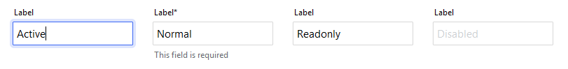
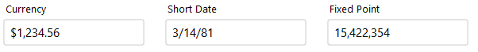
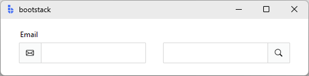

---
title: TextEntry
---

# TextEntry

`TextEntry` is a form-ready text input control that combines a **label**, **input field**, and **message region**.

It builds on `bs.Entry`, but adds the features you typically need in real applications: validation, messages, formatting,
localization, and consistent field events. If you're building forms or dialogs, `TextEntry` is usually your default text input.

<figure markdown>

</figure>

---

## Quick start

```python
import bootstack as bs

app = bs.App()

name = bs.TextEntry(
    app,
    label="Name",
    message="Enter your full name",
    required=True,
)
name.pack(fill="x", padx=20, pady=10)

app.mainloop()
```

---

## When to use

Use `TextEntry` when:

- you want a form-ready text field (label + message + validation)

- you want consistent events and commit semantics

- you want optional localization and formatting

Consider a different control when:

- you need the lowest-level `bs.Entry` behavior and options — use [Entry](../primitives/entry.md)

- you are building your own composite control — use [Entry](../primitives/entry.md)

---

## Appearance

### `accent`

```python
bs.TextEntry(app)  # primary (default)
bs.TextEntry(app, accent="secondary")
bs.TextEntry(app, accent="success")
bs.TextEntry(app, accent="warning")
```

!!! link "Design System"
    For a complete list of available colors and styling options, see the [Design System](../../design-system/index.md) documentation.

---

## Examples and patterns

### Value model

Entry-based field controls separate **what the user is typing** from the **committed value**.

| Concept | Meaning |
|---|---|
| Text | Raw, editable string while the field is focused |
| Value | The committed value (after parsing/validation on blur or Enter) |

```python
current = name.value      # committed value
raw = name.get()          # raw text at any time

name.value = "Ada Lovelace"
```

!!! tip "Commit semantics"
    Parsing, validation, and `value_format` are applied only when the value is committed (blur or Enter),
    never on every keystroke.

### Common options

#### `label`, `message`, `required`

```python
bs.TextEntry(app, label="Email", message="We'll never share it.", required=True)
```

#### `value_format`

Commit-time formatting using semantic format names.

```python
bs.TextEntry(app, label="Currency", value=1234.56, value_format="currency").pack()
bs.TextEntry(app, label="Short Date", value="March 14, 1981", value_format="shortDate").pack()
```

<figure markdown>

</figure>

### Events

`TextEntry` emits structured virtual events with matching convenience methods:

- `<<Input>>` — live typing

- `<<Changed>>` — committed value changed

- `<<Valid>>`, `<<Invalid>>`, `<<Validated>>`

```python
def on_event(event):
    print("new value:", event.data["value"])

name.on_input(on_event)
name.on_changed(on_event)
name.on_valid(on_event)
```

!!! tip "Live typing"
    Use `on_input(...)` when you want live typing behavior, and `on_changed(...)` when you care about committed values.

### Validation

Use validation rules when:

- the field is required

- values must match a pattern (email, phone, etc.)

- multiple fields must be consistent (cross-field rules)

```python
email = bs.TextEntry(app, label="Email", required=True)

email.add_validation_rule(
    "email",
    message="Enter a valid email address"
)
```

Validation results are reflected visually and via events.

If you need immediate, per-keystroke constraints, use low-level Tk validation on **Entry** instead.

---

## Behavior

### Prefix/suffix add-ons

You can insert widgets into the field as add-ons.

```python
email = bs.TextEntry(app, label="Email")
email.insert_addon(bs.Label, position="before", icon="envelope")

def handle_search():
    ...

search = bs.TextEntry(app)
search.insert_addon(bs.Button, position="after", icon="search", command=handle_search)
```

<figure markdown>

</figure>

!!! note "Power feature"
    Many specialized Entry widgets in v2 are built using this add-on mechanism.

---

## Localization

`TextEntry` supports locale-aware formatting through the `value_format` option. Formatting is applied at commit time (blur or Enter), ensuring consistent display across different locales.

!!! link "Localization"
    For complete localization configuration and supported formats, see the [Localization](../../guides/localization.md) documentation.

---

## Reactivity

`TextEntry` integrates with the signals system for reactive data binding. Changes to the field value can automatically propagate to other parts of your application.

!!! link "Signals"
    For details on reactive patterns and data binding, see the [Signals](../../guides/reactivity.md) documentation.

---

## Additional resources

### Related widgets

- [Entry](../primitives/entry.md) — low-level primitive text input
- [NumericEntry](numericentry.md) — numeric input with bounds and stepping
- [PasswordEntry](passwordentry.md) — obscured text input
- [DateEntry](dateentry.md) — structured date input
- [TimeEntry](timeentry.md) — structured time input
- [Form](../forms/form.md) — build complete forms from field definitions

### Framework concepts

- [Forms & Input](../../guides/forms-and-input.md) — picking input widgets, layout, and submit handling
- [Localization](../../guides/localization.md) — internationalization and formatting
- [Signals](../../guides/reactivity.md) — reactive data binding

### API reference

- [`bootstack.TextEntry`](../../reference/widgets/TextEntry.md)