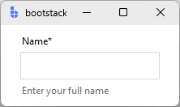

# TextEntry

`TextEntry` is a form-ready text input field with a label, input, and message area.

```python
import bootstack as bs

app = bs.App()

name = bs.TextEntry(
    app,
    label="Name",
    message="Enter your full name",
    required=True,
)
name.pack(fill="x", padx=20, pady=10)

app.mainloop()
```

<div class="app-window">
    
</div>

## When to use

Use `TextEntry` when:

- you want a form-ready text field with label, message area, and validation
- you want consistent events and commit semantics across a form
- you need value formatting (currency, dates, percentages) on commit

### Consider a different control when...

- you need the lowest-level text input without field chrome — use [Entry](../primitives/entry.md)
- you are building a custom composite control — use [Entry](../primitives/entry.md)

## See also

**Examples:** [Login form](../../examples/forms/login.md) · [Settings panel](../../examples/forms/settings.md) · [Search with add-ons](../../examples/inputs/search.md)  
**Guides:** [Forms & Input](../../guides/forms-and-input.md) · [Formatting](../../guides/formatting.md) · [Validation](../../guides/validation.md)  
**API reference:** [TextEntry](../../reference/widgets/textentry.md)

--8<-- "snippets/api/textentry.md"