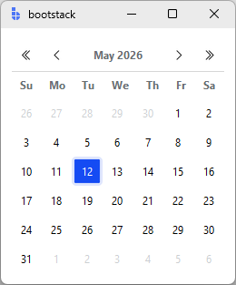
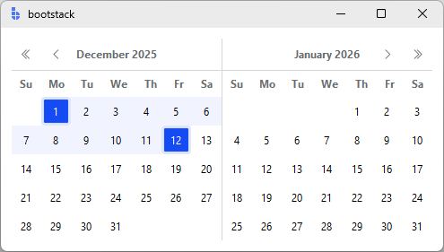

# Calendar

`Calendar` is an **inline date selection control** for choosing either a **single date** or a **date range**.

It produces `datetime.date` values and is commonly used for scheduling views, reporting filters, availability
selection, and any UI where users benefit from seeing dates in context instead of typing them.

If you want a compact, form-friendly input (typed + popup), prefer **DateEntry**. If you want an
always-visible picker embedded in a panel, use **Calendar**.

---

## Quick start

```python
from datetime import date
import bootstack as bs

app = bs.App()

cal = bs.Calendar(app, value=date.today(), accent="primary")
cal.pack(padx=12, pady=12)

def on_select(e):
    # e.data = {'date': date, 'range': (start, end|None)}
    print(e.data)

cal.on_date_selected(on_select)

app.mainloop()
```

<div class="app-window">
    
</div>

---

## When to use

Use Calendar when:

- you want an always-visible date picker embedded in a panel
- users benefit from seeing the whole month(s) while selecting
- you want a natural range-selection interaction

### Consider a different control when

- you need a compact form control or typing is a primary workflow — use [DateEntry](../inputs/dateentry.md)

---

## Appearance

### Variants

Calendar supports two selection models:

- **Single** (`selection_mode="single"`): selects exactly one `date`
- **Range** (`selection_mode="range"`): selects a start date then an end date; dates between are highlighted

Range mode displays **two months side-by-side**.

#### Single date

```python
bs.Calendar(app, value="2025-12-25")
```

#### Date range

```python
bs.Calendar(
    app, 
    selection_mode="range",
    start_date="2025-12-01", 
    end_date="2025-12-12"
)
```

<div class="app-window">
    
</div>

### Colors and styling

```python
bs.Calendar(app, accent="success")
bs.Calendar(app, selection_mode="range", accent="warning")
```

!!! link "See [Design System](../../design-system/index.md) for a complete overview of theming, colors, and style tokens."

---

## Examples and patterns

### Value API

**Single mode:**

```python
selected = cal.get()             # datetime.date or None
selected = cal.value             # same

cal.set(date(2025, 6, 15))
cal.set("2025-06-15")            # ISO string also works
cal.value = date(2025, 6, 15)
```

**Range mode:**

```python
start, end = cal.get_range()     # (date|None, date|None)
start, end = cal.range

cal.set_range(date(2025, 1, 10), date(2025, 1, 20))
cal.set_range("2025-01-10", "2025-01-20")
cal.range = (date(2025, 1, 10), date(2025, 1, 20))
```

!!! note "`set()` in range mode"
    Calling `set()` while in range mode sets a new start date and clears any existing end date.

!!! note "Programmatic vs user updates"
    `set()` and `set_range()` do **not** emit `<<DateSelect>>`. User interactions do.

!!! note "`set(None)` has no effect"
    Passing `None` to `set()` is accepted but does not change the selection. There is no way to
    programmatically clear the selection — the widget always holds a selected date.

### Common options

Selection:

- `selection_mode`: `"single"` (default) or `"range"`
- `value`: initial selected date for single mode (`date`, `datetime`, or ISO string)
- `start_date`, `end_date`: range start/end (range mode only)

Constraints:

- `min_date`, `max_date`: minimum and maximum selectable dates
- `disabled_dates`: iterable of dates that cannot be selected

Display:

- `show_outside_days`: show adjacent-month days (default `True` for single, `False` for range)
- `show_week_numbers`: show ISO week numbers (default `False`)
- `first_weekday`: `0=Monday` … `6=Sunday`, `None` for locale default

Style:

- `accent`: accent color for selection and highlights (default `"primary"`)
- `padding`: padding around the widget

### Binding to signals or variables

Calendar does not expose `variable=`/`textvariable=`. Use the selection event and update your own signal:

```python
def on_select(e):
    selected = e.data["date"]
    start, end = e.data["range"]
    my_signal.set(selected)
```

### Events

```python
bind_id = cal.on_date_selected(on_select)
cal.off_date_selected(bind_id)
```

Event name: `<<DateSelect>>`. Callback receives an event object with `e.data`:

- `date` — the selected date
- `range` — `(start, end|None)` tuple

---

## Behavior

- Month navigation via chevron buttons (single) or mirrored headers (range mode).
- Clicking the **month/year title label** (single mode only) navigates back to the initial month and restores the initial date selection, emitting `<<DateSelect>>`.
- Disabled dates and dates outside `min_date`/`max_date` cannot be selected.
- `show_outside_days=False` blanks out adjacent-month cells within mixed rows so they cannot be focused or selected; entire rows consisting only of outside-month days are removed from the grid entirely.
- Keyboard: day cells are focusable; disabled cells are not.

---

## Localization

Calendar localizes:

- weekday headers via `MessageCatalog` tokens (`day.mo`, `day.tu`, …)
- month/year header via Babel date formatting

It refreshes automatically when `<<LocaleChanged>>` is generated.

!!! link "See [Localization](../../guides/localization.md) for complete details on internationalization and locale configuration."

---

## Additional resources

### Related widgets

- [DateEntry](../inputs/dateentry.md) — compact typed date input with picker popup

### Framework concepts

- [Reactivity](../../guides/reactivity.md)
- [Localization](../../guides/localization.md)

### API reference

- [`bootstack.Calendar`](../../reference/widgets/Calendar.md)