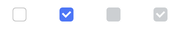
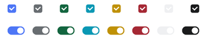

# CheckButton

`CheckButton` is a **selection control** that represents an option being **on** or **off**.

Use `CheckButton` when users can enable multiple options independently (settings, filters, feature flags).

<figure markdown>

</figure>

---

## Quick start

Use `value` to set the initial state.

```python
import bootstack as bs

app = bs.App()

bs.CheckButton(app, text="Enable notifications",      value=True).pack(padx=20, pady=6)
bs.CheckButton(app, text="Send anonymous usage data", value=False).pack(padx=20, pady=6)

app.mainloop()
```

---

## When to use

Use `CheckButton` when:

- multiple selections may be enabled at once
- the value is on/off
- you need independent option toggles

### Consider a different control when...

- only one choice is allowed in a group → use [RadioButton](radiobutton.md)
- you want a dropdown list → use [SelectBox](selectbox.md) or [OptionMenu](optionmenu.md)
- you want a button-like toggle → use [CheckToggle](checktoggle.md) or [ToggleGroup](togglegroup.md)
- you want a dedicated on/off switch → use [Switch](switch.md)

---

## Appearance

### Colors and styling

```python
bs.CheckButton(app)
bs.CheckButton(app, accent="secondary")
bs.CheckButton(app, accent="success")
bs.CheckButton(app, accent="warning")
bs.CheckButton(app, accent="danger")
```

<figure markdown>

</figure>

!!! link "See [Design System → Variants](../../design-system/variants.md) for how color tokens apply consistently across widgets."

---

## Examples & patterns

### How the value works

The `value` option sets the **initial state**:

- `True` → checked
- `False` → unchecked (default when `value=` is omitted)

`value=None` is equivalent to omitting `value=` — the widget starts unchecked. Indeterminate
(tri-state) visual state requires explicitly calling `cb.state(["alternate"])` after construction.

!!! note "Seeding a signal's initial value"
    `value=` is only applied when no `signal=` or `variable=` is passed. To seed a signal,
    set the initial value on the `Signal` itself: `bs.Signal(True)` rather than
    `bs.Signal(False)` with `value=True`.

### Common options

#### `text`

```python
bs.CheckButton(app, text="Auto-sync")
```

#### `command`

Callback with no arguments, fires on every toggle.

```python
cb = bs.CheckButton(app, text="Send notifications")

def on_toggle():
    print("now:", cb.value)

cb.configure(command=on_toggle)
```

#### Reading and setting state

```python
current = cb.value    # get committed value
cb.value = True       # set programmatically
cb.get()              # equivalent to cb.value
cb.set(False)         # equivalent to cb.value = False
```

#### `state`

```python
cb = bs.CheckButton(app, text="Locked", state="disabled")
cb.configure(state="normal")
```

#### `onvalue` / `offvalue`

Store non-boolean values instead of `True`/`False`:

```python
v = bs.Signal("no")
cb = bs.CheckButton(app, text="Enable feature", signal=v, onvalue="yes", offvalue="no")

# v.get() returns "yes" or "no"
v.subscribe(lambda val: print("feature:", val))
```

#### `padding`, `width`, `underline`

```python
bs.CheckButton(app, text="Wider",  padding=(10, 6), width=18).pack(pady=6)
bs.CheckButton(app, text="E_xport", underline=1).pack(pady=6)
```

### Reacting to changes

Use `command` for immediate callbacks, or subscribe to the signal for reactive updates.

```python
# Via command
cb = bs.CheckButton(app, text="Option", command=lambda: print("value:", cb.value))

# Via signal
enabled = bs.Signal(False)
cb = bs.CheckButton(app, text="Option", signal=enabled)
enabled.subscribe(lambda v: print("value:", v))
```

---

## Behavior

- Click toggles between checked and unchecked.
- Keyboard: Tab to focus, Space to toggle.

---

## Localization

Any string passed as `text=` is used as a gettext key when localization is active.

```python
bs.CheckButton(app, text="settings.notifications")
bs.CheckButton(app, text="settings.notifications", localize=True)
bs.CheckButton(app, text="Notifications",           localize=False)
```

!!! link "See [Localization](../../guides/localization.md) for configuring translations and message catalogs."

---

## Reactivity

```python
enabled = bs.Signal(False)
cb = bs.CheckButton(app, text="Option", signal=enabled)
enabled.subscribe(lambda v: print("value:", v))
```

!!! link "See [Reactivity](../../guides/reactivity.md) for reactive programming patterns."

---

## Additional resources

### Related widgets

- [Switch](switch.md) — dedicated on/off switch control
- [RadioButton](radiobutton.md) — choose one option from a group
- [RadioGroup](radiogroup.md) — manage a group of radio options as one control
- [CheckToggle](checktoggle.md) — button-like toggle presentation
- [ToggleGroup](togglegroup.md) — connected button-style multi or single selection
- [SelectBox](selectbox.md) — select one item from a list
- [Form](../forms/form.md) — build grouped selection controls declaratively

### Framework concepts

- [Reactivity](../../guides/reactivity.md) — reactive state management
- [Localization](../../guides/localization.md) — text translation
- [Design System → Variants](../../design-system/variants.md) — color tokens and variants

### API reference

- [`bootstack.CheckButton`](../../reference/widgets/CheckButton.md)