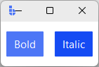

# CheckToggle

`CheckToggle` is a **selection control** for turning an option **on/off**, rendered with a
**Toolbutton-style toggle** appearance.

It behaves like `CheckButton`, but uses the toolbutton variant style so it reads more like a
pressed/unpressed control than a checkbox indicator.

Use `CheckToggle` when you want checkbox semantics in compact UI areas like toolbars, headers, and mode strips.

---

## Quick start

```python
import bootstack as bs

app = bs.App()

bs.CheckToggle(app, text="Bold",   value=False).pack(side="left", padx=4, pady=10)
bs.CheckToggle(app, text="Italic", value=True).pack(side="left", padx=4, pady=10)

app.mainloop()
```

<div class="app-window">
    
</div>

---

## When to use

Use `CheckToggle` when:

- you want on/off selection with a button-like presentation
- the control lives in a toolbar or compact header area

### Consider a different control when...

- classic checkbox indicators are expected in forms or settings panels — use [CheckButton](checkbutton.md)
- you want a slider-style on/off toggle — use [Switch](switch.md)
- only one option may be active in a group — use [RadioToggle](radiotoggle.md) or [ToggleGroup](togglegroup.md)

---

## Appearance

### Colors and styling

```python
bs.CheckToggle(app, accent="primary")
bs.CheckToggle(app, accent="secondary")
bs.CheckToggle(app, accent="success")
bs.CheckToggle(app, accent="warning")
bs.CheckToggle(app, accent="danger")
```

!!! link "See [Design System → Variants](../../design-system/variants.md) for how color tokens apply consistently across widgets."

### Density

Use `density='compact'` for toolbar contexts where space is tight:

```python
bs.CheckToggle(app, text="Bold", density="compact")
bs.CheckToggle(app, icon="type-bold", icon_only=True, density="compact")
```

---

## Examples and patterns

### How the value works

The `value` option sets the initial state:

- `True` → checked
- `False` → unchecked (default)

`value=None` (or omitting `value=`) is the same as `False` — the widget starts unchecked.
Indeterminate state requires explicitly calling `cb.state(["alternate"])` after construction.

!!! note "Seeding a signal's initial value"
    `value=` is only applied when no `signal=` or `variable=` is passed. To seed a signal,
    set the initial value on the `Signal` itself: `bs.Signal(True)` rather than
    `bs.Signal(False)` with `value=True`.

### Common options

- `text`, `textvariable`, `textsignal`
- `icon` — icon in the label area for all states (color shifts with selected state)
- `on_icon`, `off_icon` — different icons for selected / unselected states
- `icon_only`, `compound` — icon layout options
- `command` — callback with no arguments, fires on toggle
- `variable`, `signal`, `value`
- `onvalue`, `offvalue` — non-boolean on/off values
- `density` — `'default'` or `'compact'` (useful in toolbars)
- `accent`, `variant`, `surface`, `style_options`
- `padding`, `width`, `underline`
- `state`, `takefocus`
- `localize` — `'auto'`, `True`, or `False`

!!! link "See [Icons](../../guides/icons.md) for stateful icon specs, color overrides, size control, and the full `on_icon`/`off_icon` reference."

#### Reading and setting state

```python
current = t.value    # get current state
t.value = True       # set programmatically
t.get()              # equivalent to t.value
t.set(False)         # equivalent to t.value = False
```

### Events

Use `command=` for a per-toggle callback, or subscribe to the signal for reactive updates.

```python
# command= fires on every toggle (no arguments)
t = bs.CheckToggle(app, text="Bold", command=lambda: print("toggled:", t.value))

# signal subscription
enabled = bs.Signal(False)
t = bs.CheckToggle(app, text="Snap", signal=enabled)
enabled.subscribe(lambda v: print("value:", v))
```

### Binding to signals or variables

Bind a shared `signal` (preferred) or `variable` to enable reactive updates.

```python
enabled = bs.Signal(False)
t = bs.CheckToggle(app, text="Snap", signal=enabled)
t.pack(padx=20, pady=20)

enabled.subscribe(lambda v: print("Snap:", v))
```

---

## Behavior

- Independent on/off toggle through bound state.
- Visual emphasis matches toolbutton/badge styling rather than a classic indicator.
- Keyboard: Tab to focus, Space to toggle.

---

## Localization

`CheckToggle` text follows the same localization behavior as other widgets.

!!! link "See [Localization](../../guides/localization.md) for details on internationalizing widget text."

---

## Reactivity

!!! link "See [Reactivity](../../guides/reactivity.md) for reactive programming patterns and state management."

---

## Additional resources

### Related widgets

- [Switch](switch.md) — slider-style on/off toggle for settings
- [CheckButton](checkbutton.md) — classic checkbox indicator
- [RadioToggle](radiotoggle.md) — mutually exclusive button-like radios
- [ButtonGroup](../actions/buttongroup.md) — visually grouped controls for toolbars

### Framework concepts

- [Design System](../../design-system/index.md) — color tokens and theming
- [Reactivity](../../guides/reactivity.md) — reactive state management
- [Localization](../../guides/localization.md) — internationalizing widget text

### API reference

- [`bootstack.CheckToggle`](../../reference/widgets/CheckToggle.md)