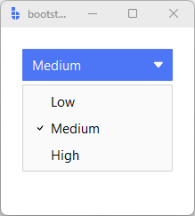

# OptionMenu

`OptionMenu` is a **selection control** that lets users pick **one value from a short list** using a
menu-style dropdown.

`OptionMenu` wraps `bs.MenuButton` and adds theming, icons, signals, and standardized change events.
It is best suited for **compact, known option sets**.

Use `OptionMenu` when the list is small and users already know the available choices.
For longer lists or search/filtering, prefer [SelectBox](selectbox.md).

---

## Quick start

```python
import bootstack as bs

app = bs.App()

menu = bs.OptionMenu(
    app,
    value="Medium",
    options=["Low", "Medium", "High"],
)
menu.pack(padx=20, pady=20)

app.mainloop()
```

<div class="app-window">
    
</div>

---

## When to use

Use `OptionMenu` when:

- the option list is short (up to ~8 items)
- the control should remain compact
- search or rich presentation is unnecessary

### Consider a different control when...

- the list is longer, search helps, or users may enter custom values → use [SelectBox](selectbox.md)
- there are very few options and showing them inline improves clarity → use [RadioButton](radiobutton.md) or [RadioGroup](radiogroup.md)
- you need a menu-driven button rather than a value selector → use [MenuButton](../actions/menubutton.md)

---

## Appearance

### Colors and styling

`OptionMenu` supports the same `accent` and `variant` options as `MenuButton` (`"solid"`, `"outline"`, `"ghost"`):

```python
bs.OptionMenu(app, value="A", options=["A", "B"], accent="primary")
bs.OptionMenu(app, value="A", options=["A", "B"], accent="primary", variant="outline")
bs.OptionMenu(app, value="A", options=["A", "B"], accent="primary", variant="ghost")
```

!!! link "See [Design System → Variants](../../design-system/variants.md) for how color tokens apply consistently across widgets."

### Icons

```python
bs.OptionMenu(
    app,
    value="Dark",
    options=["Light", "Dark", "Auto"],
    icon="palette",
)
```

!!! warning "Using `image=`"
    Passing a Tk `PhotoImage` via `image=` will not automatically recolor on theme changes.

---

## Examples and patterns

### How the value works

- `options` defines the list of valid values
- `value` is the currently selected option

```python
print(menu.value)
menu.value = "High"
menu.get()              # equivalent to menu.value
menu.set("Low")         # equivalent to menu.value = "Low"
```

### Common options

#### `options`

```python
menu.configure(options=["Apple", "Banana", "Cherry"])
```

#### `command`

Callback invoked on every selection change — no arguments:

```python
menu = bs.OptionMenu(
    app, 
    value="A", 
    options=["A", "B"],
                     
    command=lambda: print("selected:", menu.value)
)
```

#### `state`

```python
menu.configure(state="disabled")
menu.configure(state="normal")
```

#### `density`

```python
bs.OptionMenu(app, value="A", options=["A", "B"], density="compact")
```

#### `localize`

Control label localization per-widget:

```python
bs.OptionMenu(
    app, 
    value="menu.opt.a", 
    options=["menu.opt.a", "menu.opt.b"],
    localize=True
)
```

#### `width` and `padding`

```python
bs.OptionMenu(app, value="A", options=["A", "B"], width=20, padding=(10, 6))
```

#### Dropdown button options

```python
bs.OptionMenu(app, value="A", options=["A", "B"], show_dropdown_button=False)
bs.OptionMenu(app, value="A", options=["A", "B"], dropdown_button_icon="chevron-down")
```

### Events

```python
def on_changed(event):
    print("Selected:", event.data["value"])

bind_id = menu.on_changed(on_changed)
menu.off_changed(bind_id)
```

The event name is `<<Change>>`. The callback receives a Tkinter event object with `event.data["value"]`.

### Binding to signals or variables

#### Using a signal (preferred)

```python
selected = bs.Signal("Medium")

menu = bs.OptionMenu(
    app,
    textsignal=selected,
    options=["Low", "Medium", "High"],
)

selected.subscribe(lambda v: print("changed:", v))
```

#### Using a Tk variable

```python
color = bs.StringVar(value="Green")

menu = bs.OptionMenu(
    app,
    textvariable=color,
    options=["Red", "Green", "Blue"],
)
```

---

## Behavior

- Clicking the button opens a menu of options.
- Selecting an item immediately commits the value.
- The menu closes automatically after selection.
- Keyboard: standard menubutton navigation.

---

## Localization

`OptionMenu` text participates in localization. When `localize="auto"` (the default), untranslated keys fall back to literal text.

!!! link "See [Localization](../../guides/localization.md) for configuring translations and message catalogs."

---

## Reactivity

Bind a `textsignal=` to drive the selected value from outside, or subscribe to the signal to react to user changes:

```python
selected = bs.Signal("Medium")

menu = bs.OptionMenu(
    app, 
    textsignal=selected, 
    options=["Low", "Medium", "High"]
)
selected.subscribe(lambda v: print("changed:", v))
```

!!! link "See [Reactivity](../../guides/reactivity.md) for reactive programming patterns and state management."

---

## Additional resources

### Related widgets

- [SelectBox](selectbox.md) — dropdown selection with search and filtering
- [RadioButton](radiobutton.md) — inline mutually exclusive options
- [RadioGroup](radiogroup.md) — grouped radio options
- [MenuButton](../actions/menubutton.md) — base widget for menu-triggered buttons

### Framework concepts

- [Design System](../../design-system/index.md) — color tokens and theming
- [Reactivity](../../guides/reactivity.md) — reactive state management
- [Localization](../../guides/localization.md) — internationalizing widget text

### API reference

- [`bootstack.OptionMenu`](../../reference/widgets/OptionMenu.md)