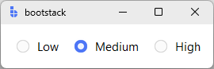

# RadioButton

`RadioButton` is a **selection control** that lets users choose **exactly one option** from a set of mutually exclusive choices.

Use `RadioButton` when all options are short and should be visible at once (settings, modes, priority levels).

---

## Quick start

Bind all buttons in a group to a shared `signal`. Each button's `value=` sets what the signal holds when that button is selected.

```python
import bootstack as bs

app = bs.App()

choice = bs.Signal("medium")

frame = bs.PackFrame(app, direction="horizontal", gap=16, padding=16).pack()

bs.RadioButton(frame, text="Low",    signal=choice, value="low").pack()
bs.RadioButton(frame, text="Medium", signal=choice, value="medium").pack()
bs.RadioButton(frame, text="High",   signal=choice, value="high").pack()

app.mainloop()
```

<div class="app-window">
    
</div>

---

## When to use

Use `RadioButton` when:

- exactly one option must be selected
- all options are short and visible
- users need to see all choices at once

### Consider a different control when...

- multiple selections are allowed → use [CheckButton](checkbutton.md)
- the list is long or space is limited → use [SelectBox](selectbox.md) or [OptionMenu](optionmenu.md)
- you want a button-like toggle appearance → use [RadioToggle](radiotoggle.md)
- you want a self-contained group widget → use [RadioGroup](radiogroup.md)

---

## Appearance

### Variants

#### RadioButton (default)

Classic radio indicator + label.

```python
bs.RadioButton(app, text="Option", signal=choice, value="opt")
```

#### With icon

RadioButton supports an icon in the label area alongside the text. The icon color shifts
automatically: foreground when unselected, accent when selected.

```python
# Same icon for both states — color change only
bs.RadioButton(app, text="Grid", icon="grid", signal=view, value="grid")

# Different icon per state
bs.RadioButton(app, text="Grid", off_icon="grid", on_icon="grid-fill", signal=view, value="grid")

# Icon only, no indicator
bs.RadioButton(app, icon="grid", icon_only=True, show_indicator=False, signal=view, value="grid")
```

!!! link "See [Icons](../../guides/icons.md) for stateful overrides, custom colors, size control, and `show_indicator` patterns."

#### RadioToggle

For a button-like badge appearance, use `RadioToggle`:

```python
bs.RadioToggle(app, text="Grid", signal=view, value="grid")
bs.RadioToggle(app, text="List", signal=view, value="list")
```

Use `density='compact'` on RadioToggle for toolbar contexts.

### Colors and styling

```python
bs.RadioButton(app, accent="primary")    # default
bs.RadioButton(app, accent="secondary")
bs.RadioButton(app, accent="success")
bs.RadioButton(app, accent="danger")
```

<div class="app-window">
    
</div>

!!! link "See [Design System → Variants](../../design-system/variants.md) for how color tokens apply consistently across widgets."

---

## Examples & patterns

### How the value works

Each `RadioButton` in a group shares a signal or variable. The selected option is the one whose `value=` matches the signal's current value.

```python
choice = bs.Signal("low")

bs.RadioButton(app, text="Low",  signal=choice, value="low")
bs.RadioButton(app, text="High", signal=choice, value="high")

# Drive programmatically
choice.set("high")

# Read the selection
print(choice.get())             # via signal
print(radio.get())              # via widget
print(radio.value)              # property form
radio.value = "low"             # set via widget
```

### `command`

Fires when the selection changes on this specific button.

```python
def on_change():
    print("selected:", choice.get())

bs.RadioButton(app, text="Low",  signal=choice, value="low",  command=on_change)
bs.RadioButton(app, text="High", signal=choice, value="high", command=on_change)
```

### `state`

```python
bs.RadioButton(app, text="Pro (unavailable)", signal=choice, value="pro", state="disabled")
```

### Reactive group updates

Subscribe to the signal to react to any button in the group:

```python
choice = bs.Signal("low")

bind_id = choice.subscribe(lambda v: print("selected:", v))
# Later: choice.unsubscribe(bind_id)
```

---

## Behavior

- Selecting an option sets the shared signal/variable to that option's `value`.
- Only one option may be selected at a time.
- Keyboard: Tab to focus, Space to select.

---

## Localization

Any string passed as `text=` is used as a gettext key when localization is active.

```python
bs.RadioButton(app, text="settings.mode.basic")
bs.RadioButton(app, text="Basic", localize=False)
```

!!! link "See [Localization](../../guides/localization.md) for configuring translations and message catalogs."

---

## Reactivity

Using a `variable=` (Tk variable) instead of `signal=`:

```python
choice = bs.StringVar(value="medium")

bs.RadioButton(app, text="Low",    variable=choice, value="low")
bs.RadioButton(app, text="Medium", variable=choice, value="medium")
bs.RadioButton(app, text="High",   variable=choice, value="high")
```

!!! link "See [Reactivity](../../guides/reactivity.md) for reactive programming patterns."

---

## Additional resources

### Related widgets

- [RadioGroup](radiogroup.md) — composite group builder
- [RadioToggle](radiotoggle.md) — button-like radio styling
- [CheckButton](checkbutton.md) — multiple independent selections
- [SelectBox](selectbox.md) — dropdown selection, optional search
- [OptionMenu](optionmenu.md) — simple menu-based selection

### Framework concepts

- [Reactivity](../../guides/reactivity.md) — reactive state management
- [Localization](../../guides/localization.md) — text translation
- [Design System → Variants](../../design-system/variants.md) — color tokens and variants

### API reference

- [`bootstack.RadioButton`](../../reference/widgets/RadioButton.md)