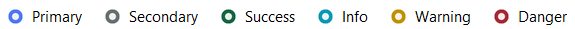

# RadioButton

`RadioButton` is a **selection control** that lets users choose **exactly one option** from a set of mutually exclusive choices.

Use `RadioButton` when all options are short and should be visible at once (settings, modes, priority levels).

<figure markdown>

</figure>

---

## Quick start

In bootstack v2, the shared value is typically managed using a `signal`.

```python
import bootstack as bs

app = bs.App()

choice = bs.Signal("medium")

bs.RadioButton(app, text="Low", signal=choice, value="low").pack(anchor="w", padx=20, pady=2)
bs.RadioButton(app, text="Medium", signal=choice, value="medium").pack(anchor="w", padx=20, pady=2)
bs.RadioButton(app, text="High", signal=choice, value="high").pack(anchor="w", padx=20, pady=2)

app.mainloop()
```

---

## When to use

Use `RadioButton` when:

- exactly **one option must be selected**
- all options are short and visible
- users need to see all choices at once

### Consider a different control when...

- multiple selections are allowed -> use [CheckButton](checkbutton.md)
- the list is long -> use [SelectBox](selectbox.md) or [OptionMenu](optionmenu.md)
- screen space is limited -> use [SelectBox](selectbox.md) or [OptionMenu](optionmenu.md)
- search or filtering is needed -> use [SelectBox](selectbox.md)
- you want a button-like toggle -> use [RadioToggle](radiotoggle.md)

---

## Appearance

### Variants

#### RadioButton (default)

The standard radio indicator + label.

```python
bs.RadioButton(app, text="Option", signal=choice, value="opt")
```

#### RadioToggle

If you want a button-like "badge" look for mutually exclusive choices, use `RadioToggle`.

```python
bs.RadioToggle(app, text="Grid", signal=view, value="grid")
bs.RadioToggle(app, text="List", signal=view, value="list")
```

### Colors and styling

RadioButtons support standard bootstack color tokens.

```python
bs.RadioButton(app)  # primary is default
bs.RadioButton(app, accent="secondary")
bs.RadioButton(app, accent="success")
bs.RadioButton(app, accent="info")
bs.RadioButton(app, accent="warning")
bs.RadioButton(app, accent="danger")
```

<figure markdown>

</figure>

!!! link "See [Design System → Variants](../../design-system/variants.md) for how color tokens apply consistently across widgets."

---

## Examples & patterns

### How the value works

A radio selection is defined by a **shared value** plus a distinct `value=` for each option:

- each `RadioButton` represents one possible value
- the selected option is the one whose `value` matches the shared **signal** or **variable**
- only one option can be selected at a time

`RadioButton` uses a **single shared value** to represent the selected option.

- each `RadioButton` defines its own `value`
- selection is the option whose `value` matches the shared signal or variable

```python
choice = bs.Signal("low")

bs.RadioButton(app, text="Low", signal=choice, value="low")
bs.RadioButton(app, text="High", signal=choice, value="high")
```

Updating the shared state changes the selected option:

```python
choice.set("high")
```

!!! note "Single source of truth"
    The shared signal or variable is the source of truth.
    Individual radio buttons do not store state independently.

### Common options

#### `command`

Use `command=` to react when the selection changes.

```python
choice = bs.Signal("low")

def on_change():
    print("selected:", choice.get())

bs.RadioButton(app, text="Low", signal=choice, value="low", command=on_change)
bs.RadioButton(app, text="High", signal=choice, value="high", command=on_change)
```

#### `state`

Disable individual options when they are not available.

```python
choice = bs.Signal("basic")

bs.RadioButton(app, text="Basic", signal=choice, value="basic")
bs.RadioButton(app, text="Pro (unavailable)", signal=choice, value="pro", state="disabled")
```

### Events

Use `command=` for per-button callbacks, or subscribe to the shared signal for group-level changes.

```python
choice = bs.Signal("low")

def on_selected(value):
    print("selected:", value)

bind_id = choice.subscribe(on_selected)
# Later: choice.unsubscribe(bind_id)
```

### Validation and constraints

Radio selections are inherently constrained to the set of options you provide.

Validation is most useful when:

- a selection is required before submitting a form
- certain options become unavailable based on other inputs

---

## Behavior

- Selecting an option sets the shared signal/variable to that option's `value`.
- Only one option may be selected at a time.
- Keyboard navigation follows standard ttk radiobutton behavior (focus + Space to select).

---

## Localization

By default, widgets use `localize="auto"`:

- if a translation key exists, it is used
- otherwise, the label is treated as a literal string

```python
bs.RadioButton(app, text="settings.mode.basic")
bs.RadioButton(app, text="settings.mode.basic", localize=True)
bs.RadioButton(app, text="Basic", localize=False)
```

!!! tip "Safe to pass literal text"
    With `localize="auto"`, passing literal text is safe when no translation exists.

!!! link "See [Localization](../../capabilities/localization.md) for configuring translations and message catalogs."

---

## Reactivity

Signals are generally preferred in v2 applications, but Tk variables are fully supported.

### Using a Signal (preferred)

```python
import bootstack as bs

app = bs.App()

choice = bs.Signal("medium")

bs.RadioButton(app, text="Low", signal=choice, value="low").pack(anchor="w", padx=20, pady=2)
bs.RadioButton(app, text="Medium", signal=choice, value="medium").pack(anchor="w", padx=20, pady=2)
bs.RadioButton(app, text="High", signal=choice, value="high").pack(anchor="w", padx=20, pady=2)

app.mainloop()
```

### Using a Tk variable

```python
import bootstack as bs

app = bs.App()

choice = bs.StringVar(value="medium")

bs.RadioButton(app, text="Low", variable=choice, value="low").pack(anchor="w", padx=20, pady=2)
bs.RadioButton(app, text="Medium", variable=choice, value="medium").pack(anchor="w", padx=20, pady=2)
bs.RadioButton(app, text="High", variable=choice, value="high").pack(anchor="w", padx=20, pady=2)

app.mainloop()
```

!!! link "See [Signals](../../capabilities/signals/index.md) for reactive programming patterns."

---

## Additional resources

### Related widgets

- [CheckButton](checkbutton.md) - multiple independent selections
- [SelectBox](selectbox.md) - dropdown selection, optional search
- [OptionMenu](optionmenu.md) - simple menu-based selection
- [RadioGroup](radiogroup.md) - composite control for managing radio options as one widget
- [RadioToggle](radiotoggle.md) - button-like radio styling

### Framework concepts

- [Signals](../../capabilities/signals/index.md) - reactive state management
- [Localization](../../capabilities/localization.md) - text translation
- [Design System](../../design-system/variants.md) - color tokens and variants

### API reference

- [`bootstack.RadioButton`](../../reference/widgets/RadioButton.md)