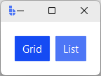
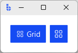

# RadioToggle

`RadioToggle` is a `RadioButton` variant that renders with a **toggle badge** style.

Use `RadioToggle` when you want mutually exclusive choices with a button-like presentation — common
in toolbars, view switches, and mode pickers.

---

## Quick start

```python
import bootstack as bs

app = bs.App()

view = bs.Signal("grid")

frm = bs.PackFrame(app, direction="horizontal", padding=16).pack()

bs.RadioToggle(frm, text="Grid", signal=view, value="grid").pack()
bs.RadioToggle(frm, text="List", signal=view, value="list").pack()

app.mainloop()
```

<div class="app-window">
    
</div>

---

## When to use

Use `RadioToggle` when:

- you want single selection with a button-like appearance
- the control is in a compact UI area (toolbar, header, mode strip)

Prefer **RadioButton** when classic form-style radio indicators are expected.

---

## Appearance

### Colors and styling

```python
bs.RadioToggle(app, accent="primary")
bs.RadioToggle(app, accent="secondary")
bs.RadioToggle(app, accent="success")
```

### Density

Use `density='compact'` for toolbar contexts where space is tight:

```python
bs.RadioToggle(app, text="Grid", signal=view, value="grid", density="compact")
bs.RadioToggle(app, icon="grid", icon_only=True, signal=view, value="grid", density="compact")
```

!!! link "See [Design System](../../design-system/index.md) for color tokens, theming, and styling guidelines."

---

## Examples and patterns

### How the value works

Same as `RadioButton`: the shared signal/variable holds the selected value; each toggle represents one option.

```python
mode = bs.Signal("basic")
bs.RadioToggle(app, text="Basic", signal=mode, value="basic")
bs.RadioToggle(app, text="Pro",   signal=mode, value="pro")

# Drive programmatically
mode.set("pro")
print(mode.get())       # via signal
print(toggle.get())     # via widget
print(toggle.value)     # property form
toggle.value = "basic"  # set via widget
```

### With icons

RadioToggle accepts the same `icon=`, `icon_only=`, and `compound=` params as RadioButton:

```python
bs.RadioToggle(app, text="Grid", icon="grid", signal=view, value="grid")
bs.RadioToggle(app, icon="grid", icon_only=True, signal=view, value="grid")
```

<div class="app-window">
    
</div>

### `command`

```python
def on_select():
    print("selected:", mode.get())

bs.RadioToggle(app, text="Pro", signal=mode, value="pro", command=on_select)
```

### Reactive label text

Use `textsignal=` for a reactive label:

```python
label = bs.Signal("Basic")
toggle = bs.RadioToggle(app, textsignal=label, signal=mode, value="basic")
label.set("Starter")   # label updates live
```

---

## Behavior

- Mutually exclusive selection through shared state.
- Visual emphasis matches toolbutton/badge styling.
- Keyboard: Tab to focus, Space to select.

---

## Localization

`RadioToggle` text follows the same localization behavior as other widgets.

!!! link "See [Localization](../../guides/localization.md) for details on internationalizing widget text."

---

## Reactivity

!!! link "See [Reactivity](../../guides/reactivity.md) for reactive programming patterns and state management."

---

## Additional resources

### Related widgets

- [RadioButton](radiobutton.md) — classic radio indicator
- [RadioGroup](radiogroup.md) — composite group builder
- [ToggleGroup](togglegroup.md) — grouped button-style selection patterns

### Framework concepts

- [Design System](../../design-system/index.md) — color tokens and theming
- [Reactivity](../../guides/reactivity.md) — reactive state management
- [Localization](../../guides/localization.md) — internationalizing widget text
