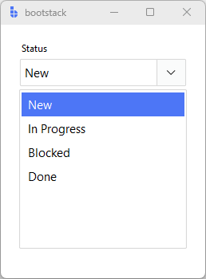

# SelectBox

`SelectBox` is a **selection control** that lets users pick **one value from a list** using a field-like dropdown.
It can optionally support **search filtering** and **custom (user-typed) values**.

Use `SelectBox` when you want a modern select experience (popup list + optional search) while keeping consistent
field patterns like labels, messages, and validation.

---

## Quick start

```python
import bootstack as bs

app = bs.App()

sb = bs.SelectBox(
    app,
    label="Status",
    items=["New", "In Progress", "Blocked", "Done"],
    value="New",
)
sb.pack(fill="x", padx=20, pady=20)

app.mainloop()
```

<div class="app-window">
    
</div>

---

## When to use

Use `SelectBox` when:

- users should pick one value from a known list
- search or filtering improves usability
- you want a field-like dropdown with consistent form patterns

### Consider a different control when...

- You want a simpler, menu-based selector — use [OptionMenu](optionmenu.md)
- You need single selection among visible options — use [RadioGroup](radiogroup.md)
- You need direct access to the low-level combobox primitive — use [Combobox](../primitives/combobox.md)

---

## Appearance

`SelectBox` is primarily a single pattern (field + popup list). The most meaningful variation is whether
it behaves as a strict picker or an editable picker — see **Allowing custom values** below.

```python
bs.SelectBox(app, label="Status", items=["New", "Done"], accent="secondary")
```

Use `density='compact'` for dense form layouts:

```python
bs.SelectBox(app, label="Status", items=["New", "Done"], density="compact")
```

!!! link "See [Design System](../../design-system/index.md) for theming details, color tokens, and styling guidelines."

---

## Examples and patterns

### How the value works

- `items` defines the available choices shown in the popup
- `value` is the committed selection

When the user selects from the popup, `SelectBox` updates `value` and emits `<<Change>>`.

```python
print("Current:", sb.value)
sb.value = "In Progress"
```

### Common options

#### `items`

```python
sb.configure(items=["Low", "Medium", "High"])
```

#### `value`

```python
sb.value = "Medium"
```

#### `selected_index`

Get or set selection by index.

```python
sb.selected_index = 2       # select third item
print(sb.selected_index)    # -1 if value not in items
```

!!! note "`selected_index` edge cases"
    Setting to `None` clears the selection. Setting to an out-of-range integer raises `IndexError`.

#### `enable_search`

```python
sb = bs.SelectBox(
    app, 
    label="Assignee",
    items=["Alice", "Bob", "Charlie", "Diana"],
    enable_search=True
)
```

#### `allow_custom_values`

```python
sb = bs.SelectBox(
    app, 
    label="Tag",
    items=["Bug", "Feature", "Docs"],
    allow_custom_values=True
)
```

Both `enable_search` and `allow_custom_values` can be toggled at runtime:

```python
sb.configure(enable_search=True)
sb.configure(allow_custom_values=True)
```

#### Dropdown button options

```python
sb = bs.SelectBox(
    app, 
    label="Priority", 
    items=["Low", "Medium", "High"],
    show_dropdown_button=True, 
    dropdown_button_icon="chevron-down"
)
```

!!! note "Using custom values"
    `show_dropdown_button` is forced on when `allow_custom_values=True`.
    The default icon is `"chevron-down"`.

### Events

```python
def on_changed(event):
    print("Changed:", event.data["value"])
    print("Previous:", event.data["prev_value"])

bind_id = sb.on_changed(on_changed)
sb.off_changed(bind_id)
```

The event name is `<<Change>>`. The callback receives a Tkinter event object with `event.data` keys:
`value`, `prev_value`, `text`.

### Binding to signals or variables

Use `textsignal=` for reactive two-way binding:

```python
status = bs.Signal("New")

sb = bs.SelectBox(
    app, 
    label="Status",
    items=["New", "In Progress", "Done"],
    textsignal=status
)

status.subscribe(lambda v: print("status:", v))
```

### Validation and constraints

When `allow_custom_values=False`, values are constrained to `items`. Additional rules:

```python
sb.add_validation_rule("required", message="Please select a status")
```

---

## Behavior

### Opening the popup

The popup opens when:

- the dropdown button is clicked
- the field is readonly and the user clicks the entry area (default when search and custom values are off)

### Search and filtering

When `enable_search=True`:

- typing filters the popup list
- the first matching item is highlighted automatically
- closing without explicit selection commits the first match (when `allow_custom_values=False`)

### Allowing custom values

When `allow_custom_values=True`:

- the entry becomes editable
- the dropdown button is always shown
- typed text is kept even if it doesn't match an item

### Keyboard navigation

When the popup is open:

- **Arrow Up/Down** — navigate items
- **Enter** — select highlighted item
- **Tab** — select highlighted item (search mode)
- **Escape** — close without selecting
- Clicking outside closes the popup

---

## Localization

The field label follows your global field localization rules.

!!! link "See [Localization](../../guides/localization.md) for details on internationalizing your application."

---

## Reactivity

Bind a `signal=` (preferred) or `variable=` to drive the selected value from outside, or subscribe to react to user changes:

```python
status = bs.Signal("New")

sb = bs.SelectBox(
    app, 
    label="Status", 
    items=["New", "Done"], 
    signal=status
)
status.subscribe(lambda v: print("status now:", v))
```

!!! link "See [Reactivity](../../guides/reactivity.md) for reactive programming patterns and state management."

---

## Additional resources

### Related widgets

- [OptionMenu](optionmenu.md) — simple menu-based selection control
- [Combobox](../primitives/combobox.md) — classic ttk dropdown + optional typing
- [RadioGroup](radiogroup.md) — single selection among visible options
- [CheckButton](checkbutton.md) — independent multi-selection
- [Form](../forms/form.md) — generate selection fields declaratively

### Framework concepts

- [Validation](../../guides/validation.md) — form and field validation patterns
- [Reactivity](../../guides/reactivity.md) — handling widget events

### API reference

- [`bootstack.SelectBox`](../../reference/widgets/SelectBox.md)