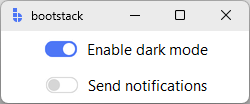
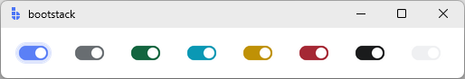

# Switch

`Switch` is a **selection control** for toggling a setting **on** or **off**, rendered with a distinctive
**switch/slider** appearance.

Use `Switch` when the control represents a single binary setting that takes effect immediately, such as enabling
a feature, turning on notifications, or activating a mode.

---

## Quick start

```python
import bootstack as bs

app = bs.App()

bs.Switch(app, text="Enable dark mode",    value=True).pack(padx=20, pady=6)
bs.Switch(app, text="Send notifications",  value=False).pack(padx=20, pady=6)

app.mainloop()
```

<div class="app-window">
    
</div>

---

## When to use

Use `Switch` when:

- the setting is binary (on/off)
- the change takes effect immediately
- you want a clear visual toggle indicator

### Consider a different control when...

- you need tri-state (indeterminate) support → use [CheckButton](checkbutton.md)
- multiple related options can be enabled → use [CheckButton](checkbutton.md) for each
- you want a compact button-like toggle → use [CheckToggle](checktoggle.md)
- only one choice is allowed in a group → use [RadioButton](radiobutton.md)

---

## Appearance

```python
bs.Switch(app, text="Primary",   accent="primary")
bs.Switch(app, text="Secondary", accent="secondary")
bs.Switch(app, text="Success",   accent="success")
bs.Switch(app, text="Info",      accent="info")
bs.Switch(app, text="Warning",   accent="warning")
bs.Switch(app, text="Danger",    accent="danger")
bs.Switch(app, text="Dark",      accent="dark")
bs.Switch(app, text="Light",     accent="light")
```

<div class="app-window">
    
</div>

!!! link "See [Design System → Variants](../../design-system/variants.md) for how color tokens apply consistently across widgets."

---

## Examples and patterns

### How the value works

`Switch` uses a boolean value model: `True` = on, `False` = off.

```python
current = sw.value    # bool
sw.value = True
sw.get()              # equivalent to sw.value
sw.set(False)         # equivalent to sw.value = False
```

!!! note "Seeding a signal's initial value"
    `value=` is only applied when no `signal=` or `variable=` is passed. To seed a signal,
    set the initial value on the `Signal` itself: `bs.Signal(True)` rather than
    `bs.Signal(False)` with `value=True`.

### `text`

```python
bs.Switch(app, text="Auto-save")
```

### `command`

Callback with no arguments, fires on every toggle.

```python
sw = bs.Switch(app, text="Enable feature")

def on_toggle():
    print("now:", sw.value)

sw.configure(command=on_toggle)
```

### `onvalue` / `offvalue`

Store non-boolean values:

```python
theme = bs.Signal("light")

sw = bs.Switch(
    app, 
    text="Dark mode", 
    signal=theme,
    onvalue="dark", 
    offvalue="light"
)

theme.subscribe(lambda v: print("theme:", v))
```

### `state`

```python
sw = bs.Switch(app, text="Locked", state="disabled")
sw.configure(state="normal")
```

### `padding`, `width`, `underline`

```python
bs.Switch(app, text="Wider",  padding=(10, 6), width=18).pack(pady=6)
bs.Switch(app, text="E_xport", underline=1).pack(pady=6)
```

### Reacting to changes

```python
# Via command (no arguments)
sw = bs.Switch(app, text="Feature", command=lambda: print("value:", sw.value))

# Via signal subscription
enabled = bs.Signal(False)
sw = bs.Switch(app, text="Feature", signal=enabled)
enabled.subscribe(lambda v: print("value:", v))
```

---

## Behavior

- Click toggles between on and off states.
- `Switch` does not support an indeterminate state.
- Keyboard: Tab to focus, Space to toggle.
- The visual design clearly communicates whether the setting is active.

---

## Localization

Any string passed as `text=` is used as a gettext key when localization is active.

```python
bs.Switch(app, text="settings.dark_mode")
bs.Switch(app, text="Dark Mode", localize=False)
```

!!! link "See [Localization](../../guides/localization.md) for configuring translations and message catalogs."

---

## Reactivity

```python
dark_mode = bs.Signal(False)

sw = bs.Switch(app, text="Dark mode", signal=dark_mode)
sw.pack(padx=20, pady=20)

dark_mode.subscribe(lambda v: print(f"Dark mode: {v}"))
```

!!! link "See [Reactivity](../../guides/reactivity.md) for reactive programming patterns."

---

## Switch vs CheckButton vs CheckToggle

| Widget | Appearance | Use case |
|--------|------------|----------|
| **Switch** | Slider/toggle track | Immediate on/off settings |
| **CheckButton** | Checkbox indicator | Multi-select, forms, tri-state |
| **CheckToggle** | Pressed button | Toolbars, compact UI areas |

---

## Additional resources

### Related widgets

- [CheckButton](checkbutton.md) — classic checkbox with tri-state support
- [CheckToggle](checktoggle.md) — button-like toggle presentation
- [RadioButton](radiobutton.md) — choose one option from a group
- [Form](../forms/form.md) — use `editor='switch'` or `editor='toggle'` for switch fields

### Framework concepts

- [Reactivity](../../guides/reactivity.md) — reactive state management
- [Localization](../../guides/localization.md) — text translation
- [Design System → Variants](../../design-system/variants.md) — color tokens and variants

### API reference

- [`bootstack.Switch`](../../reference/widgets/Switch.md)