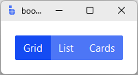

# ToggleGroup

`ToggleGroup` is a **composite selection control** that groups toggle buttons with **single** or **multi-selection** support.

Use `ToggleGroup` for segmented controls, mode switches, toolbar filters, and compact selection patterns where buttons should read as a connected unit.

---

## Quick start

```python
import bootstack as bs

app = bs.App()

group = bs.ToggleGroup(app, mode="single", value="grid")
group.add("Grid",  value="grid")
group.add("List",  value="list")
group.add("Cards", value="cards")
group.pack(padx=20, pady=20)

app.mainloop()
```

<div class="app-window">
    
</div>

---

## When to use

Use `ToggleGroup` when:

- you want a segmented control for mode switching
- you need a compact multi-selection pattern (tags, filters)
- buttons should appear visually connected

### Consider a different control when...

- options should look like classic radio buttons — use [RadioGroup](radiogroup.md)
- you have unrelated actions that shouldn't look connected — use separate [Button](../actions/button.md) widgets
- you need grouped action buttons (not selection) — use [ButtonGroup](../actions/buttongroup.md)

---

## Appearance

### Variants

#### Single selection mode

```python
group = bs.ToggleGroup(app, mode="single", value="day")
group.add("Day",   value="day")
group.add("Week",  value="week")
group.add("Month", value="month")
```

#### Multi-selection mode

```python
group = bs.ToggleGroup(app, mode="multi", value={"bold"})
group.add("Bold",      value="bold")
group.add("Italic",    value="italic")
group.add("Underline", value="underline")
```

#### Orientation

```python
bs.ToggleGroup(app, orient="horizontal")  # default
bs.ToggleGroup(app, orient="vertical")
```

### Colors and styling

```python
bs.ToggleGroup(app, accent="primary")
bs.ToggleGroup(app, accent="secondary", variant="outline")
bs.ToggleGroup(app, accent="success",   variant="ghost")
```

!!! link "See [Design System → Variants](../../design-system/variants.md) for how color tokens apply consistently across widgets."

---

## Examples and patterns

### How the value works

- **single mode**: `str` — the value of the selected option
- **multi mode**: `set[str]` — set of selected option values

```python
current = group.get()          # or group.value
group.set("week")              # single mode
group.set({"bold", "italic"})  # multi mode
group.value = "week"           # property form
```

### Common options

#### `mode`

Selection mode: `"single"` (default) or `"multi"`.

#### `orient`

Layout: `"horizontal"` (default) or `"vertical"`.

#### `accent`

```python
group = bs.ToggleGroup(app, accent="secondary")
```

#### `variant`

Controls the visual style of the child buttons: `"outline"`, `"ghost"`, or the default solid.

```python
group = bs.ToggleGroup(app, variant="ghost")
```

#### `add(text, value, key=None, **kwargs)`

Add an option. Extra `**kwargs` are forwarded to the underlying `RadioToggle` (single) or `CheckToggle` (multi) — including `icon=` and `icon_only=`:

```python
group.add("Grid",  value="grid")
group.add("List",  value="list", key="list-view")

# Icon-only toggles
group.add(icon="grid", icon_only=True, value="grid")
group.add(icon="list", icon_only=True, value="list")
```

Note: `text` defaults to `None` — useful for icon-only buttons.

!!! warning "`padding=` is not supported as a constructor kwarg"
    Due to a known source issue, passing `padding=` to `ToggleGroup()` raises a `TypeError`.
    Use the parent container for layout spacing instead.

### Item management

```python
group.add("Draft", value="draft", key="draft")

btn = group.item("draft")                      # retrieve by key
group.configure_item("draft", state="disabled") # reconfigure
group.remove("draft")                           # remove and destroy
group.keys()                                    # all keys in order
group.items()                                   # all widgets in order
```

### Events

```python
def on_change(value):
    print("Selected:", value)

sub_id = group.on_changed(on_change)
group.off_changed(sub_id)
```

Callbacks receive the new value directly (string in single mode, set in multi mode).

### Binding to signals or variables

```python
view = bs.Signal("grid")

group = bs.ToggleGroup(app, mode="single", signal=view)
group.add("Grid", value="grid")
group.add("List", value="list")
group.pack(padx=20, pady=20)
```

---

## Behavior

- In horizontal orientation, buttons are packed left-to-right; vertical stacks them top-to-bottom.
- In `mode="single"`, selecting one option deselects the others (radio semantics).
- In `mode="multi"`, options toggle independently (checkbox semantics).
- Buttons render as a connected unit with shared buttongroup styling.

---

## Localization

Per-option labels follow normal localization rules.

!!! link "See [Localization](../../guides/localization.md) for details on internationalizing widget text."

---

## Reactivity

Bind a `signal=` to control the group from outside:

```python
view = bs.Signal("grid")

group = bs.ToggleGroup(app, mode="single", signal=view)
group.add("Grid", value="grid")
group.add("List", value="list")
```

!!! link "See [Reactivity](../../guides/reactivity.md) for reactive programming patterns."

---

## Additional resources

### Related widgets

- [ButtonGroup](../actions/buttongroup.md) — grouped action buttons (no selection state)
- [RadioGroup](radiogroup.md) — grouped radio buttons with classic indicators
- [RadioToggle](radiotoggle.md) — individual toggle-style radio buttons
- [CheckToggle](checktoggle.md) — individual toggle-style checkboxes

### Framework concepts

- [Design System](../../design-system/index.md) — color tokens and theming
- [Reactivity](../../guides/reactivity.md) — reactive state management
- [Localization](../../guides/localization.md) — internationalizing widget text
